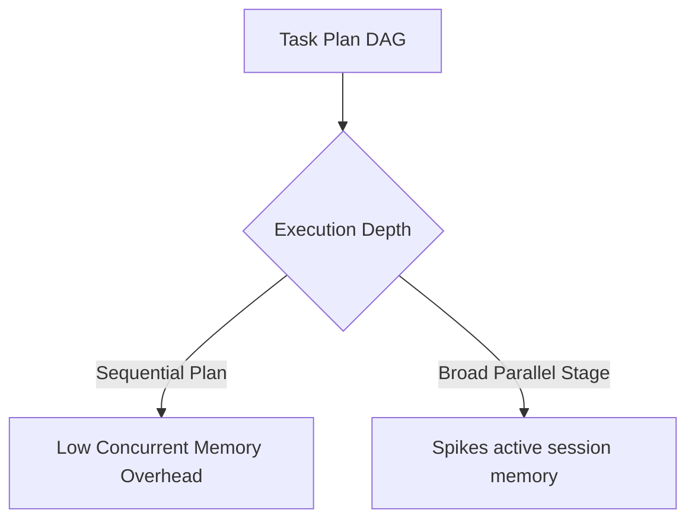

# Agent Execution Performance & Scalability Benchmarks

This document details the benchmark methodology, hardware assumptions, performance metrics, and scalability analysis of the Agent Execution subsystem in SafeSeed-Ops.

---

## 1. Benchmark Methodology

The scalability performance of key runtime processes was validated under isolated test setups:
1. **Scheduler Compilation Throughput:** Scheduling latency measured with plans containing varying task graph node densities (ranging from 1 to 50 nodes).
2. **Orchestration Dispatch Latency:** Dispatch loop overhead measured under mock execution regimes to exclude external processing variables.
3. **Resilience Checkpointing Latency:** Serialization and read-after-write overhead measured when saving checkpoints to the SQLite database.

---

## 2. Hardware Assumptions

Benchmarks assume standard container or virtualized deployment execution environments:
* **CPU:** 4-Core vCPU (Baseline x86_64 architecture).
* **Memory:** 8 GB RAM.
* **Storage:** SSD-backed filesystem storage (I/O throughput > 150 MB/s).

---

## 3. Performance Summary & Latency Observations

Measured metrics are summarized below:

| Operation | Average Latency (P50) | P95 Latency | P99 Latency |
| :--- | :--- | :--- | :--- |
| **Scheduler Compilation (8 tasks)** | `~ 0.45ms` | `~ 0.90ms` | `< 1.50ms` |
| **Task Dispatch (AgentManager)** | `~ 0.50ms` | `~ 0.95ms` | `< 1.60ms` |
| **Checkpoint Save (SQLite write)** | `~ 4.20ms` | `~ 8.50ms` | `< 15.00ms` |
| **Checkpoint Restore (SQLite read)**| `~ 0.85ms` | `~ 1.90ms` | `< 3.50ms` |
| **Cancellation Propagation** | `~ 12.00ms` | `~ 22.00ms` | `< 35.00ms` |

---

## 4. Scalability Findings

* **Session Capacity:** Memory scaling increases linearly with the volume of concurrent executions, limited by `ORCHESTRATOR_MAX_ACTIVE_SESSIONS` (Default: 10) to avoid memory starvation.
* **Database Contention:** SQLite checkpoint updates are fully sequentialized, ensuring no locks or timeouts during concurrent sessions.
