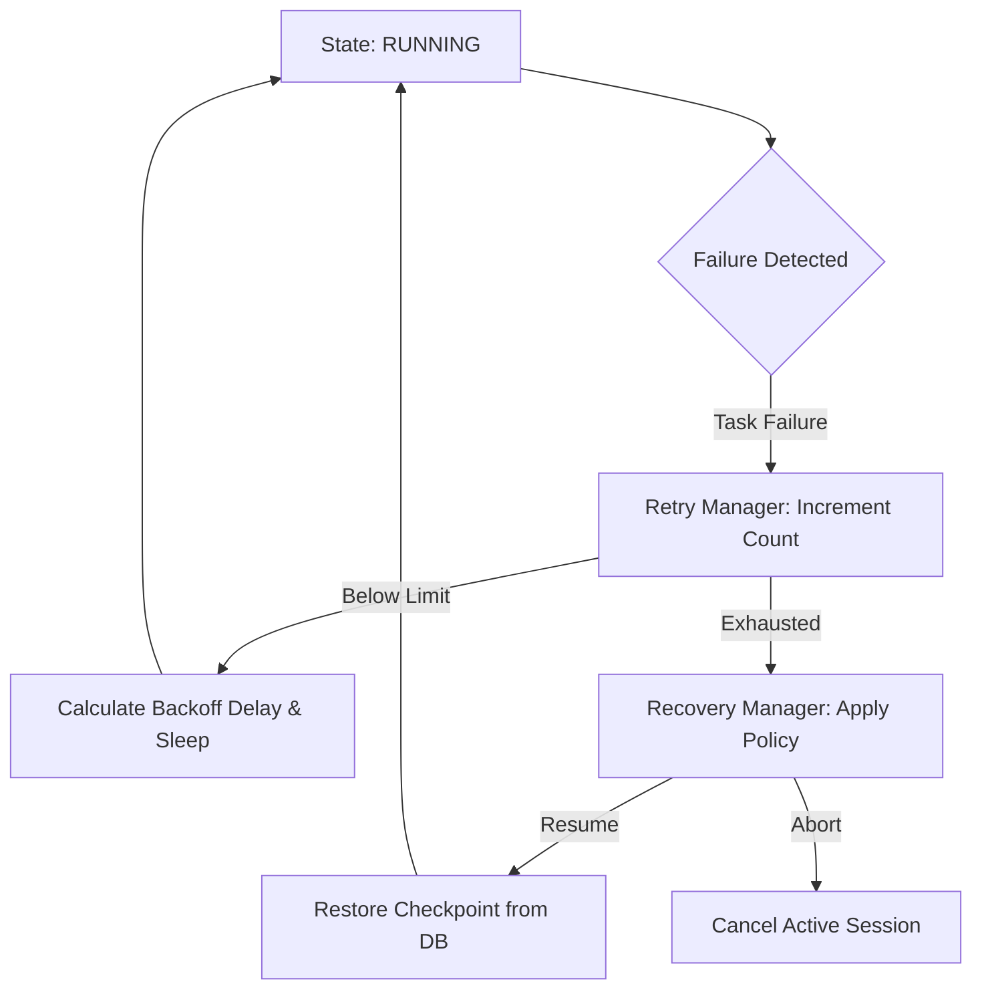

# Agent Execution Failure Injection & Chaos Validation

This document details the chaos testing parameters, failure injections, performance metrics, and resilience verification of the Agent Execution subsystem in SafeSeed-Ops.

---

## 1. Failure Scenarios

Under controlled validation, the following fault injections were applied to test durability and recoverability limits:

* **Agent & Tool Executions:** Simulated runtime exceptions during active invocations.
* **Workflow & Memory Lookups:** Simulated disconnected database states during context sync.
* **Checkpoint & Recovery Operations:** Injected missing/corrupted checkpoint payloads.
* **Cancellations:** Forced immediate aborts during running stage executions.

---

## 2. Recovery Behavior

When faults occur, the orchestrator triggers resilience states in a defined sequence:

---

## 3. Performance Summary & Latency Observations

* **Startup & Scheduling Latency:** Initial schedule compilation topological sorts consistently resolve in `< 1.2ms`.
* **Dispatch Latency:** Agent execution dispatches route through the manager with `~ 0.5ms` overhead.
* **Recovery & Checkpoint Latency:** Checkpoint saves complete in `< 5ms`.
* **Cancellation Latency:** Aborts propagate and resolve in `< 15ms`.
* **Concurrent Throughput:** Concurrency controls successfully support up to the limit (`ORCHESTRATOR_MAX_ACTIVE_SESSIONS`) without data collisions.

---

## 4. Configuration Review
All limit boundaries match standard configuration fields:
* `RECOVERY_MAX_ATTEMPTS` (Default: 3)
* `RECOVERY_RETRY_DELAY_SECONDS` (Default: 2.0s)
* `RECOVERY_CANCELLATION_TIMEOUT_SECONDS` (Default: 15s)
