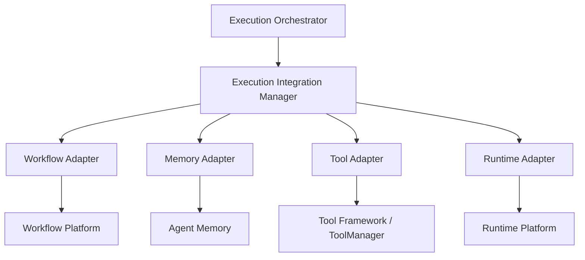
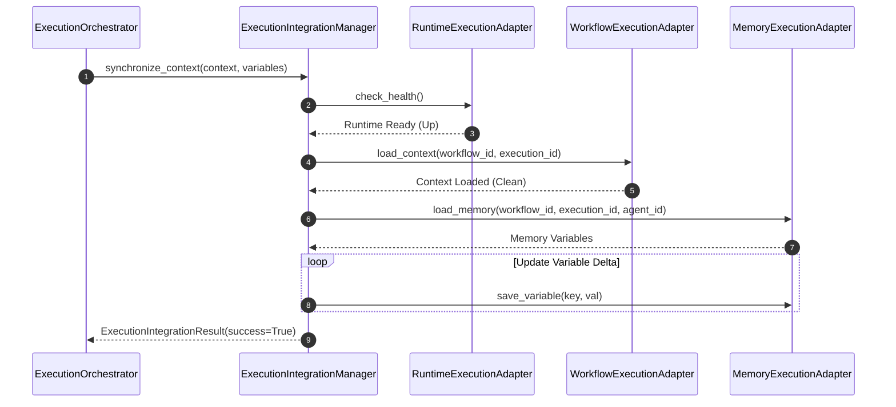

# Agent Execution Integration Layer

This document details the architecture, adapter designs, dynamic variable synchronizations, configurations, and validation rules for the Agent Execution Integration Layer in SafeSeed-Ops.

---

## 1. Architecture Overview

The Integration Layer bridges the execution orchestrator with external platform subsystems (Workflow Platform, Agent Memory, Tool Framework, and Runtime Platform):



---

## 2. Integration Flow

Variable synchronization and capability checks query database pool liveness, confirm workflow contexts, and update memory namespaces:



---

## 3. Subsystem Adapters

### Workflow Integration
The `WorkflowExecutionAdapter` resolves context parameters, asserts workflow existence using persistence providers, and propagates status updates.

### Memory Integration
The `MemoryExecutionAdapter` bridges execution context to versioned, isolated memory spaces using the `AgentMemoryManager` (loading sessions, restoring states, and creating snapshots).

### Tool Integration
The `ToolExecutionAdapter` routes execution requests securely through `ToolManager`, mapping input boundaries, checking registry permissions, and returning typed `ToolResponse` payloads.

### Runtime Integration
The `RuntimeExecutionAdapter` queries SQLite DB connection pool liveness to verify subsystem health, bypassing direct Redis caching layers.

---

## 4. Configuration Settings

Configurations are resolved via `PlatformSettings`:
* `platform_settings.INTEGRATION_SYNC_TIMEOUT_SECONDS` — Synchronization timeout limit (Default: 30s).
* `platform_settings.INTEGRATION_MAX_RETRIES` — Retries for transient adapter operations (Default: 3).
* `platform_settings.INTEGRATION_HEALTH_INTERVAL_SECONDS` — Health lookup interval (Default: 60s).

---

## 5. Examples

### Performing a Context Sync
```python
from app.agents.execution import (
    ExecutionIntegrationManager,
    ExecutionContext
)
from app.agents.memory import AgentMemoryManager
from app.agents.tools import ToolManager, ToolRegistry

# 1. Setup platform managers
memory_manager = AgentMemoryManager()
tool_manager = ToolManager(ToolRegistry())
integration_manager = ExecutionIntegrationManager(memory_manager, tool_manager)

# 2. Setup Context & variables to sync
ctx = ExecutionContext(
    execution_id="exec-101",
    workflow_id="wf-50",
    workflow_version="1.0.0",
    plan_id="plan-1",
    agent_id="agent-0",
    session_id="sess-1",
    memory_ref="mem-link"
)
variables = {"run_stage": "validation", "status": "active"}

# 3. Synchronize
res = await integration_manager.synchronize_context(ctx, variables)
print(f"Sync complete. Success: {res.success}, Latency: {res.latency:.4f}s")
```
