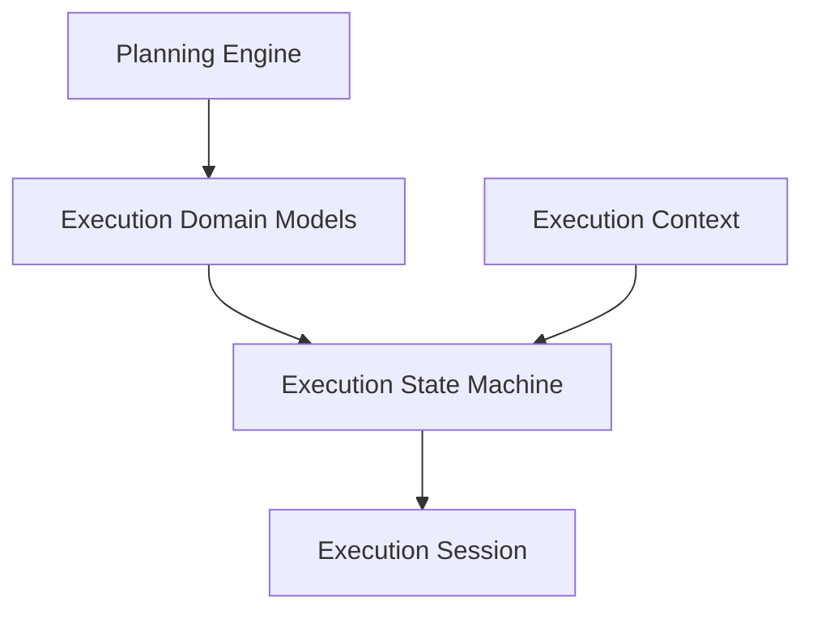
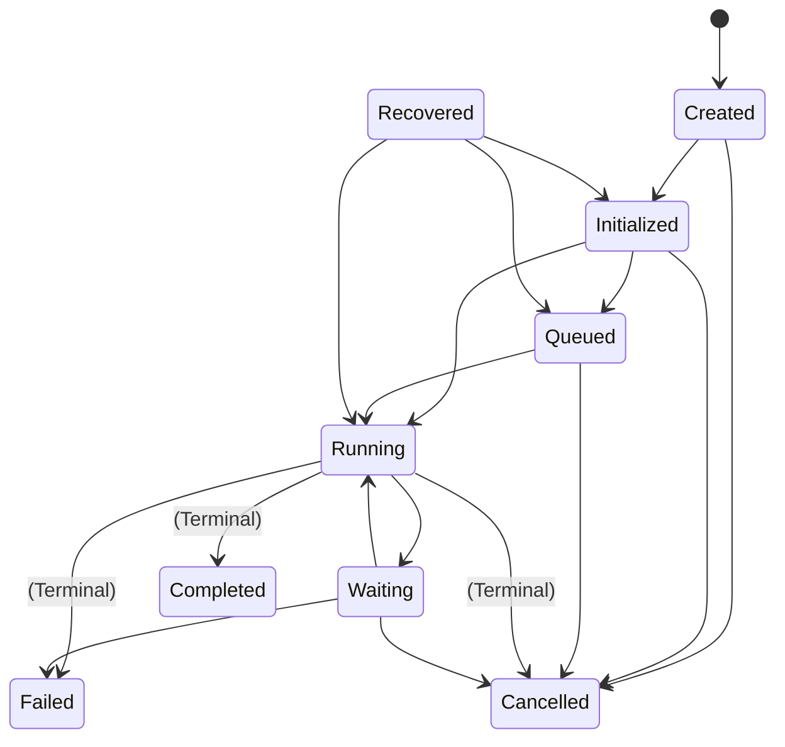

# Agent Execution Domain Models & State Machine

This document details the data contracts, events schema, statistics formulas, and state machine transitions for the Agent Execution lifecycle.

---

## 1. Architecture Overview

The Agent Execution layer governs the lifecycle states and execution tracking of compiled plans:



---

## 2. State Machine Lifecycle

The state machine strictly governs legal state transitions during execution:



### State Definitions:
* **Created:** Initial allocation of the session context.
* **Initialized:** Plan resolved and configuration settings parsed.
* **Queued:** Placed in the dispatcher queue awaiting slot availability.
* **Running:** Active CPU processing or worker execution.
* **Waiting:** Stopped awaiting async callbacks or manual approvals.
* **Completed:** Terminal state representing clean, successful run.
* **Failed:** Terminal state representing abortive errors or exceptions.
* **Cancelled:** Terminal state representing user-triggered aborts.
* **Recovered:** Session resurrected and state rehydrated from checkpoint.

---

## 3. Execution Events Schema

Lifecycle changes fire structured telemetry events mapping back to the baseline `ExecutionEvent` type:
* `ExecutionCreated` / `ExecutionStarted` — Lifecycle initiation milestones.
* `TaskStarted` / `TaskCompleted` / `TaskFailed` — Atomic task run telemetry.
* `ExecutionCompleted` / `ExecutionFailed` / `ExecutionCancelled` — Terminal session closures.
* `CheckpointCreated` / `CheckpointRestored` — Snapshot synchronization events.

---

## 4. Execution Context Model

The context holds the metadata and variables that persist across execution runs:
* `execution_id` / `workflow_id` / `plan_id` / `agent_id` / `session_id`
* `memory_ref` — Target directory mapping state snapshots.
* `runtime_metadata` — System environment environment settings.
* `variables` — Current dynamic variable map.
* `cancellation_token_ref` — Reference to cancellation tracking object.

---

## 5. Telemetry & Statistics

The `ExecutionStatistics` model monitors progress:
* `task_count` — Size of all nodes in plan.
* `completed_count` / `failed_count` / `skipped_count` / `retry_count`
* `execution_duration`
* **Average Task Duration Calculation:**
  $$\text{Average Task Duration} = \frac{\text{execution\_duration}}{\text{completed\_count}}$$

---

## 6. Examples

### Model Deserialization & Serialization
```python
from app.agents.execution import ExecutionSession, ExecutionContext, ExecutionState

# 1. Setup Context
ctx = ExecutionContext(
    execution_id="exec-001",
    workflow_id="wf-10",
    workflow_version="1.0.0",
    plan_id="plan-99",
    agent_id="agent-exec",
    session_id="sess-88",
    memory_ref="sqlite_provider_path"
)

# 2. Setup Session
session = ExecutionSession(
    session_id="sess-88",
    execution_id="exec-001",
    context=ctx,
    state=ExecutionState.CREATED
)

# 3. Dump JSON representation
print(session.model_dump_json())
```
