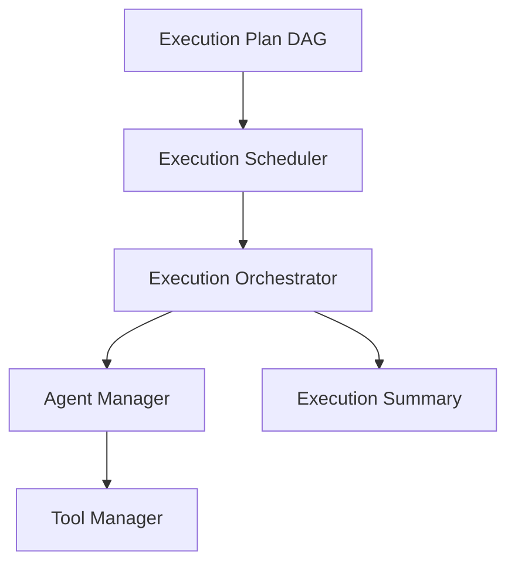
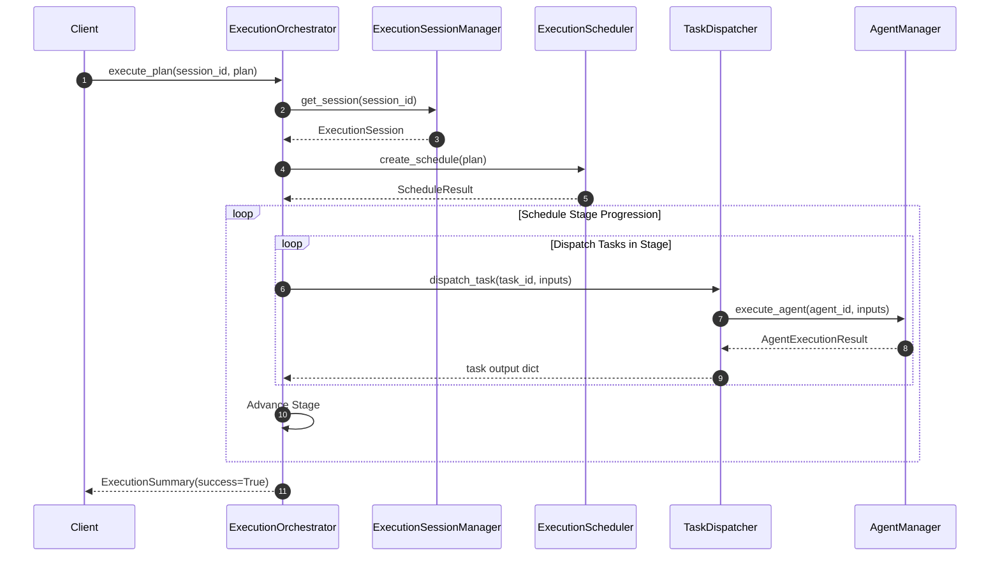

# Agent Execution Orchestrator

This document details the architecture, dynamic dispatch loops, state transitions, configurations, and event subscriptions for the Agent Execution Orchestrator in SafeSeed-Ops.

---

## 1. Architecture Overview

The Orchestrator ties planning and scheduling outputs to runtime execution contexts, ensuring all tasks dispatch sequentially or concurrently through the Agent Framework boundaries:



---

## 2. Dispatch Flow

The orchestrator moves through stages, fetching ready tasks from the queue and running them via `AgentManager`:



---

## 3. Lifecycle States & Events

Dynamic execution state transitions map cleanly through the state machine:
* `ExecutionStarted` — Published when the coordinator initiates plan runs.
* `StageStarted` / `StageCompleted` — Marks progression across parallel milestones.
* `TaskStarted` / `TaskCompleted` / `TaskFailed` — Atomic task run events.
* `ExecutionCompleted` / `ExecutionFailed` / `ExecutionCancelled` — Published upon session termination.

---

## 4. Configuration Settings

Orchestration rules are governed by settings in `PlatformSettings`:
* `platform_settings.ORCHESTRATOR_TIMEOUT_SECONDS` — Max session timeout (Default: 300s).
* `platform_settings.ORCHESTRATOR_EVENT_QUEUE_CAPACITY` — Memory limit for event logs (Default: 100).
* `platform_settings.ORCHESTRATOR_MAX_ACTIVE_SESSIONS` — Concurrent capacity check ceiling (Default: 10).

---

## 5. Examples

### Running an Orchestration Session
```python
from app.agents.planning import PlanningEngine, PlanningRequest, PlanningContext
from app.agents.execution import (
    ExecutionOrchestrator,
    ExecutionCoordinator,
    ExecutionSessionManager,
    ExecutionEventDispatcher,
    TaskDispatcher,
    ExecutionContext
)
from app.agents.framework import AgentManager

# 1. Setup managers
session_manager = ExecutionSessionManager()
event_dispatcher = ExecutionEventDispatcher()
task_dispatcher = TaskDispatcher(agent_manager)  # Injected AgentManager
coordinator = ExecutionCoordinator(session_manager, event_dispatcher, task_dispatcher)
orchestrator = ExecutionOrchestrator(coordinator)

# 2. Build session
ctx = ExecutionContext(
    execution_id="exec-10",
    workflow_id="wf-abc",
    workflow_version="1.0.0",
    plan_id="plan-4",
    agent_id="agent-0",
    session_id="sess-2",
    memory_ref="mem-dir"
)
session_manager.create_session("sess-2", "exec-10", ctx)

# 3. Trigger execution plan runs
summary = await orchestrator.execute_plan("sess-2", plan)
print(f"Orchestration completed. Success: {summary.success}, Terminal State: {summary.state}")
```
