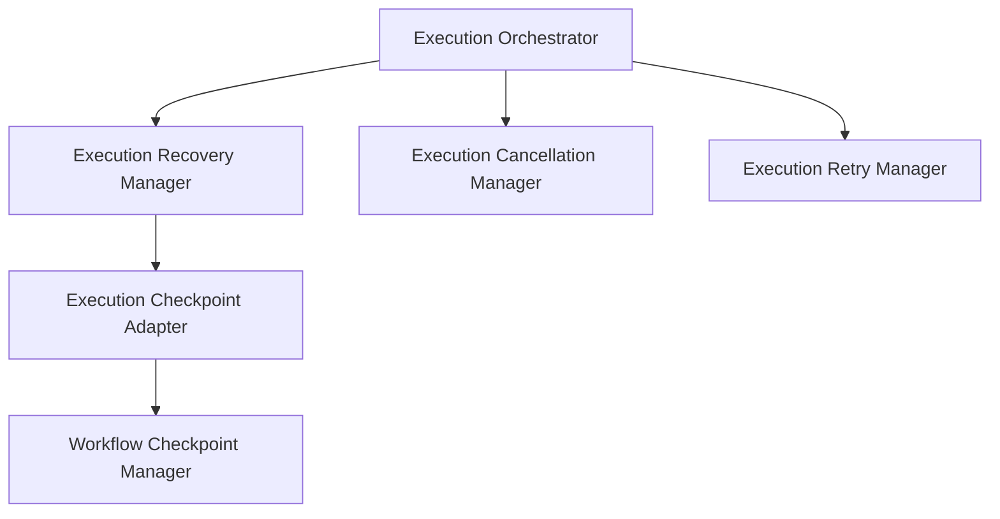
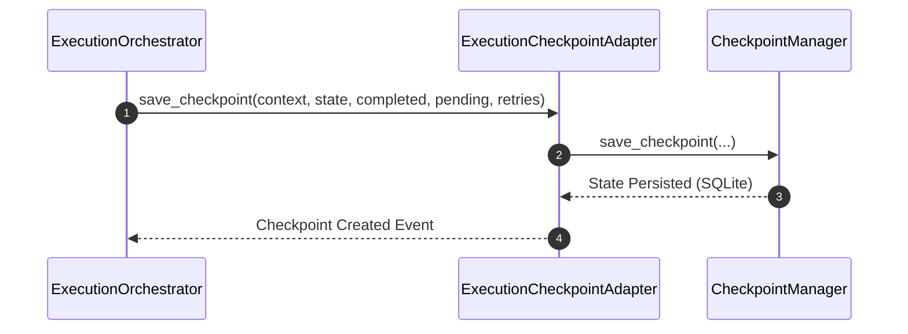
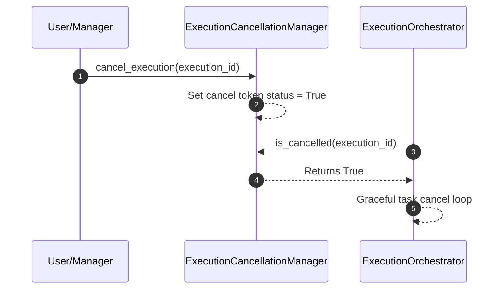

# Agent Execution Recovery, Cancellation & Checkpointing

This document details the architecture, flows, retry mechanics, configurations, and validation rules for the Agent Execution Recovery & Resilience subsystem in SafeSeed-Ops.

---

## 1. Architecture Overview

The Resilience layer adds checkpointers, retry backoff algorithms, and cancellation token propagation loops to the orchestrator execution path:



---

## 2. Checkpoint Flow

Checkpoints are serialized to SQLite tables when executing tasks, saving the step list, variables, and retry stats:



---

## 3. Cancellation Flow

Cancellations are registered and propagated to all running sessions to trigger clean abort operations:



---

## 4. Retry Policies & Backoff

Task retry routines check for limit exhaustions and calculate exponential delay backoffs:

* **Max Attempts:** Defined by `PlatformSettings.RECOVERY_MAX_ATTEMPTS`.
* **Formula:** `delay = platform_settings.RECOVERY_RETRY_DELAY_SECONDS * (2 ** (attempt - 1))`

---

## 5. Configuration Settings

Configurations are resolved via `PlatformSettings`:
* `platform_settings.RECOVERY_MAX_ATTEMPTS` — Max task retry attempts (Default: 3).
* `platform_settings.RECOVERY_CHECKPOINT_FREQUENCY` — Frequency of writing checkpoints (Default: 1).
* `platform_settings.RECOVERY_CANCELLATION_TIMEOUT_SECONDS` — Wait time during cancellation aborts (Default: 15s).
* `platform_settings.RECOVERY_TIMEOUT_SECONDS` — Recovery timeout limit (Default: 60s).
* `platform_settings.RECOVERY_RETRY_DELAY_SECONDS` — Baseline backoff multiplier (Default: 2.0s).

---

## 6. Examples

### Simulating a Checkpoint & Recovery Cycle
```python
from app.agents.execution import (
    ExecutionContext,
    ExecutionState,
    ExecutionCheckpointAdapter,
    ExecutionCancellationManager,
    ExecutionRecoveryManager
)

# 1. Setup Context & Checkpoint Adapter
ctx = ExecutionContext(
    execution_id="exec-rec-101",
    workflow_id="wf-rec-50",
    workflow_version="1.0.0",
    plan_id="plan-1",
    agent_id="agent-0",
    session_id="sess-1",
    memory_ref="mem-link"
)

# 2. Save a progress checkpoint
ExecutionCheckpointAdapter.save_checkpoint(
    context=ctx,
    state=ExecutionState.RUNNING,
    completed_tasks=["task_fetch"],
    pending_tasks=["task_verify"],
    retry_counters={"task_verify": 0},
    metadata={"stage": 0}
)

# 3. Recover progress later
cancel_mgr = ExecutionCancellationManager()
rec_mgr = ExecutionRecoveryManager(cancel_mgr)

res = await rec_mgr.recover_execution(ctx.execution_id, "Resume From Checkpoint")
if res.success:
    print(f"Recovery complete. Restored stage: {res.restored_stage}")
```
