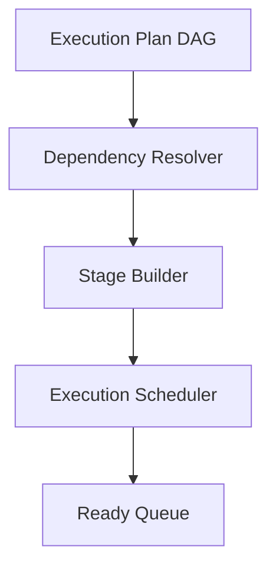
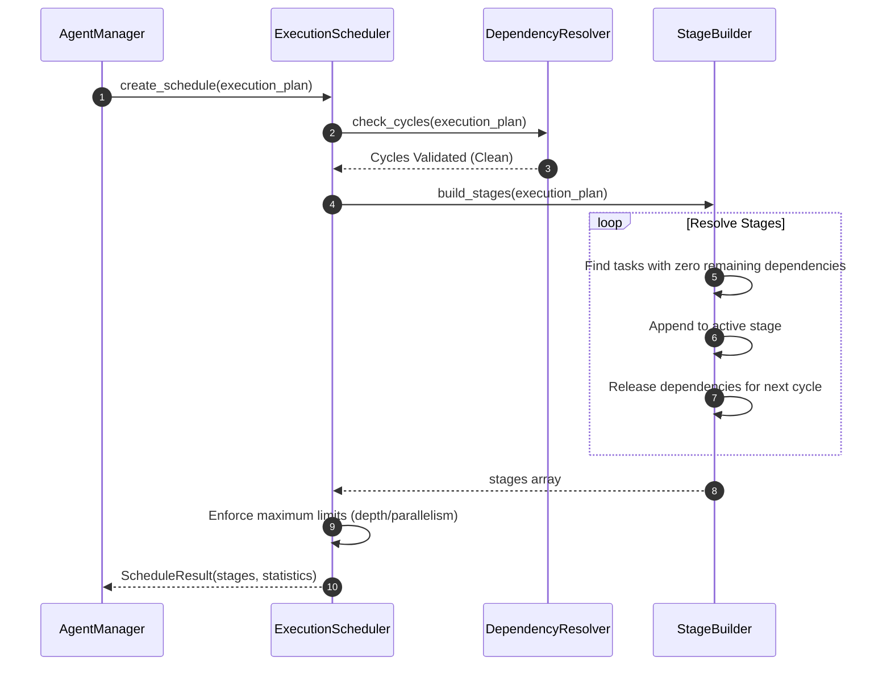

# Agent Execution Scheduler & Dependency Resolution

This document details the architecture, stages building, ready queue logic, configurations, and validation rules for the Agent Execution Scheduler in SafeSeed-Ops.

---

## 1. Architecture Overview

The Execution Scheduler resolves dependencies in the compiled Execution Plan DAG, compiles task groups into sequential stages, and populates the ready queue:



---

## 2. Dependency & Stage Generation Flow

The scheduler structures tasks into logical execution stages. Tasks inside the same stage have all upstream blocker dependencies satisfied and are eligible for parallel execution:



---

## 3. Ready Queue Execution State Machine

The `ReadyQueue` manages dynamic execution states during task runtimes:
* **get_ready_tasks:** Returns all tasks whose dependencies are completely satisfied (present in the completed set).
* **push_ready:** Registers task as scheduled, preventing duplicate execution runs.
* **start_task:** Transitions task state to active running.
* **remove_completed:** Releases the task dependency block and pushes newly unblocked downstreams into the ready pool.

---

## 4. Scheduling Policies

* **Sequential:** Disallows parallel branch grouping (running tasks strictly one-by-one).
* **Maximum Parallelism:** Group all independent tasks into the same stage to maximize concurrent execution bandwidth.
* **Balanced:** Standard trade-off between resource utilization and execution safety.
* **Priority First:** Orders tasks in the ready queue prioritizing higher priority metrics.
* **Critical Path First:** Focuses resource allocations to prioritize critical path bottlenecks.

---

## 5. Configuration Settings

Configuration limits are resolved dynamically via `PlatformSettings`:
* `platform_settings.SCHEDULER_MAX_DEPTH` — Maximum sequential stages depth allowed (Default: 15).
* `platform_settings.SCHEDULER_MAX_STAGES` — Maximum stages count limit (Default: 20).
* `platform_settings.SCHEDULER_MAX_PARALLEL_TASKS` — Maximum concurrent execution tasks cap (Default: 8).

---

## 6. Examples

### Scheduling a Plan
```python
from app.agents.planning import PlanningEngine, PlanningRequest, PlanningContext
from app.agents.execution import ExecutionScheduler

# 1. Compile Plan
engine = PlanningEngine()
context = PlanningContext(workflow_id="wf-1", execution_id="run-1", agent_id="agent-0")
request = PlanningRequest(goal="Sequential run.", context=context)
response = engine.generate_plan(request)

# 2. Schedule execution stages
if response.success:
    schedule = ExecutionScheduler.create_schedule(response.plan)
    print(f"Scheduled plan into {schedule.statistics.stage_count} stages.")
    for i, stage in enumerate(schedule.stages):
        print(f"Stage {i+1}: {stage}")
```
