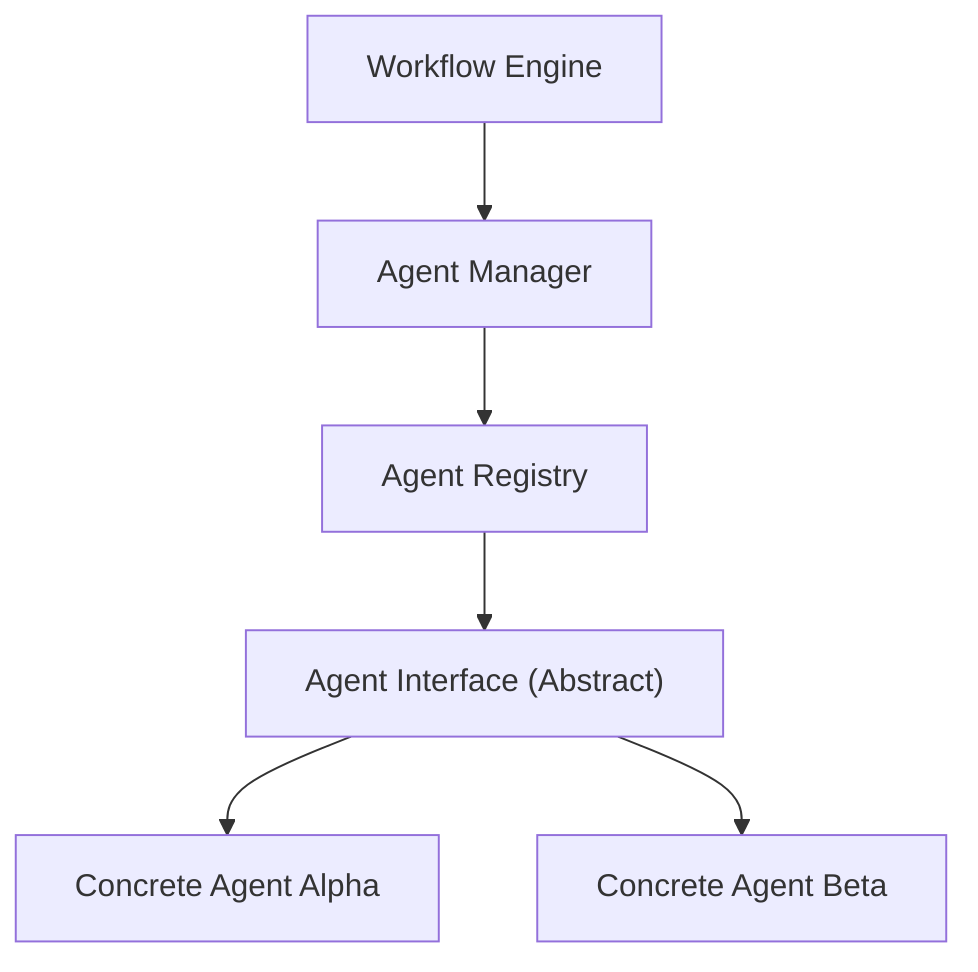
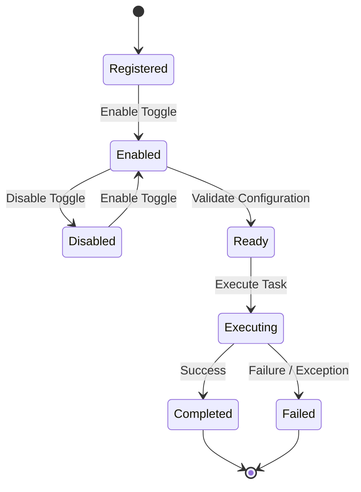
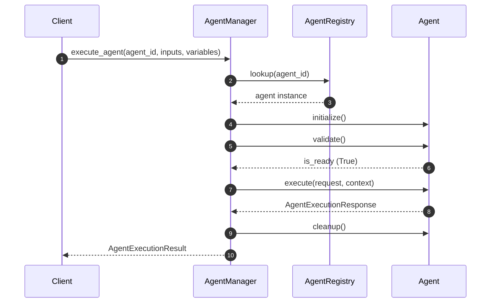

# AI Agent Framework & Registry

This document outlines the foundational architecture, models, lifecycle management, and execution design of the SafeSeed-Ops AI Agent Framework.

---

## 1. Architecture Overview

The Agent Framework is a provider-agnostic, extensible framework designed to allow custom AI agents to be registered, discovered, configured, and executed within SafeSeed-Ops pipelines.

The Workflow Execution Engine interacts with agents purely through interfaces, delegating lifecycle management, resolution, and execution handling to the `AgentManager` and `AgentRegistry`.

---

## 2. Agent Lifecycle

Concrete agents transition through defined lifecycle states during registration and execution:

* **Registered:** Loaded into the `AgentRegistry` and available for lookup.
* **Enabled / Disabled:** Active toggles indicating if the agent should accept new execution requests.
* **Ready:** Availability status for execution.
* **Busy / Executing:** Processing an active execution request.
* **Completed:** Successfully finished processing a task.
* **Failed:** Terminated due to errors or validation failures.

---

## 3. Registry & Discovery

The `AgentRegistry` acts as a central repository for finding and managing agents:
* **Register Agent:** Registers a concrete agent instance. Duplicate registration checks ensure identifier uniqueness.
* **Lookup by ID:** Retreives an agent matching a specific identifier.
* **Lookup by Capability:** Retreives all registered agents supporting a specified capability (e.g. Validation, Schema Generation).
* **Check Health:** Concurrently audits and queries health states across all active agents.

---

## 4. Capability Model

Capabilities describe the specialized skill sets concrete agents offer:
* **Schema Generation:** Constructing database schemas.
* **Validation:** Auditing schemas for flaws or violations.
* **Transformation:** Formatting/mapping payloads.
* **Documentation:** Generating user manuals/manifests.
* **Security Review:** Running risk and vulnerability checks.
* **Code Review:** Auditing programming structures.
* **Testing:** Generating testing suites.
* **Export:** Formatting output layouts.
* **Analysis:** Analytical data evaluation.
* **Planning:** Creating step sequencing execution plans.

---

## 5. Execution Flow

The `AgentManager` manages the execution sequence, logging telemetry events and tracking execution statistics:

---

## 6. Development Integration

To implement a new agent:
1. Inherit from the abstract `Agent` base class defined in `app.agents.framework.interface`.
2. Implement metadata, capabilities, execution logic, health probes, and cleanup overrides.
3. Register the agent instance with the global `AgentRegistry` to expose its capabilities to the platform.
