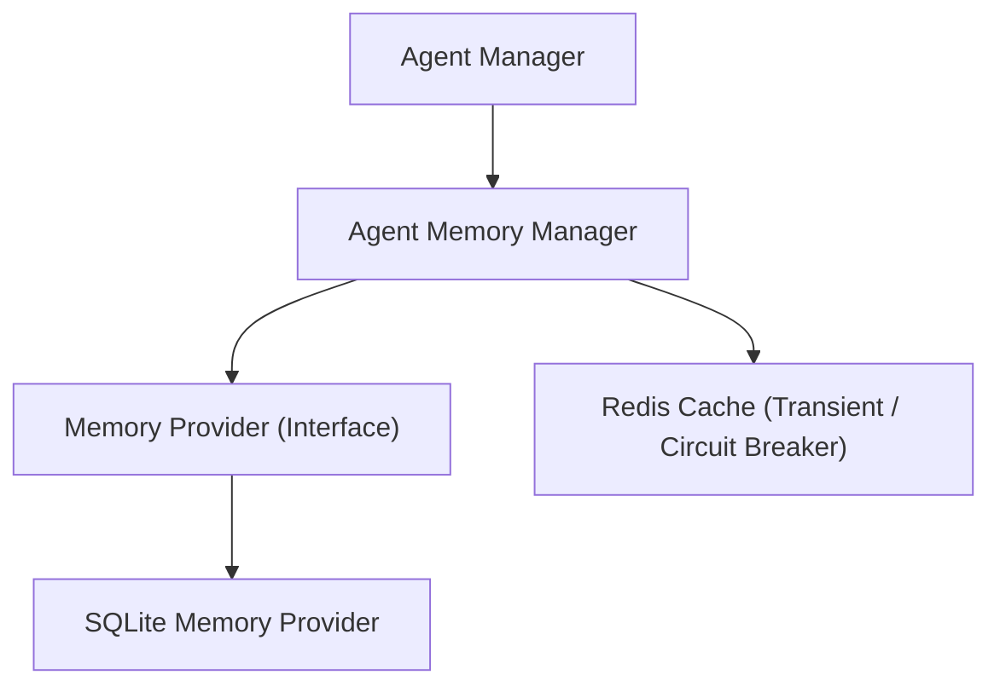
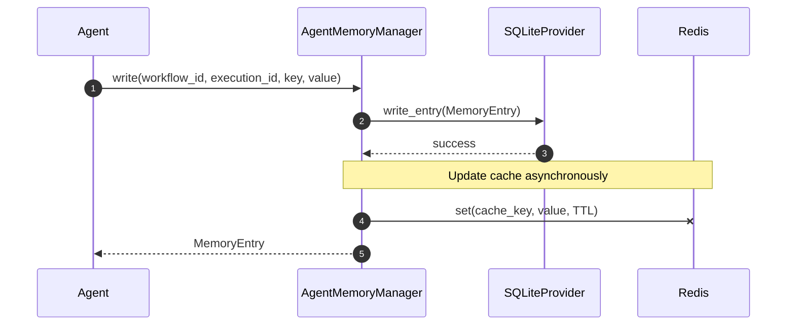
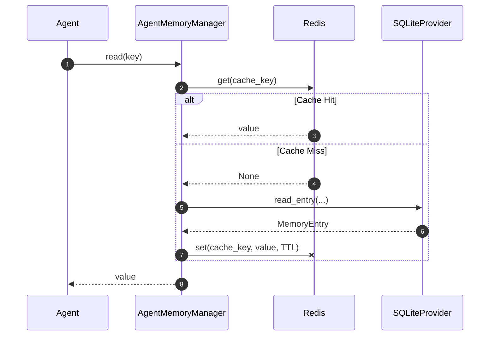

# Agent Memory & Context Management

This document details the architecture, isolation strategy, persistence flows, and policies for the Agent Memory & Context Management layer in SafeSeed-Ops.

---

## 1. Memory Architecture

The Agent Memory architecture supports five distinct categories of memory, ensuring concrete agents have access to isolated, structured context during execution runs.

---

## 2. Memory Types

* **Working Memory:** Local session execution workspace containing dynamic step inputs/parameters.
* **Short-Term Memory:** Scope containing data shared across the current workflow run.
* **Long-Term Memory:** Persistent agent knowledge that survives across multiple executions.
* **Shared Memory:** Read-only reference memory shared between multiple agents.
* **System Memory:** Configurations, thresholds, and execution metadata details.

---

## 3. Memory Isolation Strategy

To prevent memory leaks and state pollution across execution instances, entries are strictly scoped using a hierarchical index matching:
$$\text{Workflow ID} \rightarrow \text{Execution ID} \rightarrow \text{Agent ID} \rightarrow \text{Session ID}$$

The entry ID is generated deterministically by hashing the key parameters, ensuring update operations correctly resolve conflicts and prevent duplicate state replication:

$$\text{entry\_id} = \text{SHA256}(\text{workflow\_id} : \text{execution\_id} : \text{agent\_id} : \text{session\_id} : \text{memory\_type} : \text{key})$$

---

## 4. Persistence & Caching Flow

* **SQLite** acts as the authoritative source of truth for all memory writes.
* **Redis** (via `RuntimeManager`) acts as an optional transient cache to accelerate read lookups.

### Write Execution Flow:
1. Entry constraints and sizes are checked.
2. The entry is persisted to **SQLite**.
3. The cache is updated in **Redis** asynchronously in the background.

### Read Execution Flow:
1. Lookup checks the **Redis Cache**.
2. If hit: returns value instantly.
3. If miss: queries **SQLite**, re-populates **Redis Cache** in the background, and returns value.

---

## 5. Memory Management Policies

* **TTL Policy:** Memory entries carry dynamic TTL expiration timestamps. Expired entries are filtered during reads and cleaned periodically during database maintenance runs.
* **Overflow Eviction (FIFO):** If the database workspace reaches the maximum entry limit (`max_entries`), the oldest updated entry is evicted before writing new entries.
