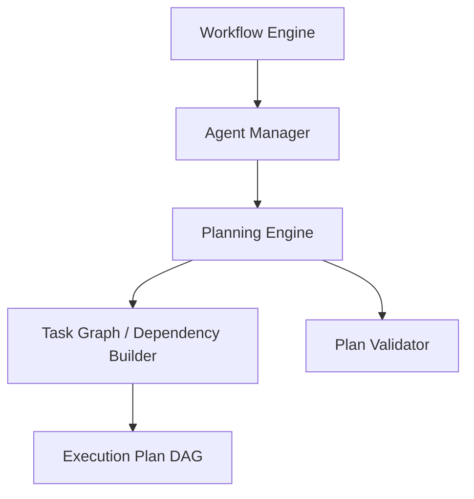
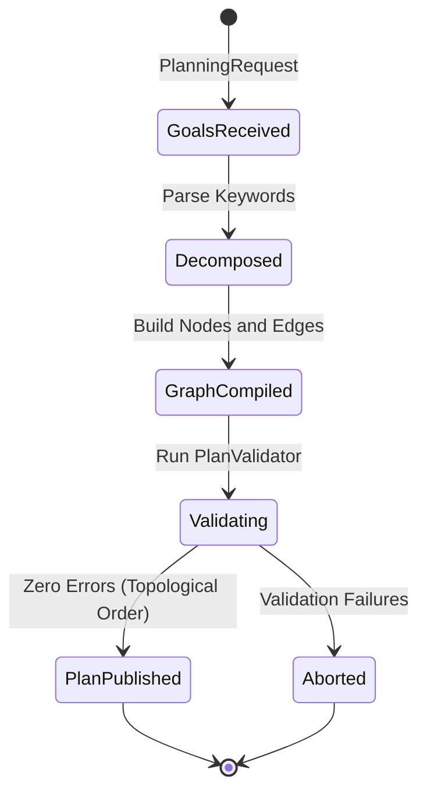

# Agent Planning & Task Decomposition

This document details the architecture, models, validation mechanisms, and structural lifecycles of the deterministic, provider-agnostic Agent Planning Engine in SafeSeed-Ops.

---

## 1. Architecture Overview

The Planning Engine decouples goal definition and task graph generation from task execution. Concrete agents analyze goals, check resource capabilities, resolve dependencies, and compile plans into validated Directed Acyclic Graphs (DAGs) before execution.



---

## 2. Planning Lifecycle

A planning transaction progresses through goal parsing, node generation, relational linkage, cycle check validations, and final immutable execution plan caching:



---

## 3. Planning Policies

Policies influence the metadata of the compiled task graph (priorities, estimated complexities, and duration factors):
* **CONSERVATIVE:** Skews task priorities to `LOW` to prevent resource bottlenecks.
* **AGGRESSIVE:** Sets task priorities to `CRITICAL` for high-throughput concurrency.
* **BALANCED:** Standard, middle-tier priorities and complexities.
* **FASTEST:** Configures task complexities to `EASY`.
* **LOWEST_COST / HIGHEST_QUALITY:** Elevates task complexity metrics to `COMPLEX`.

---

## 4. Task Graph Validation Rules

The `PlanValidator` enforces structural graph constraints to ensure plans are execution-safe:
* **Circular Dependencies:** Detects cycle paths in the graph edges using DFS topological sorting.
* **Invalid References:** Validates that all edges reference valid existing task IDs.
* **Capability & Tool Verification:** Asserts that all nodes require capabilities and tools available in the current context.
* **Graph Connectedness:** Verifies that no task node is completely disconnected from the rest of the execution flow.

---

## 5. Configuration Settings

Planning limits are defined in `PlatformSettings` to enforce resource bounds:
* `platform_settings.PLANNING_MAX_DEPTH` — Maximum depth of decomposed graphs (Default: 10).
* `platform_settings.PLANNING_MAX_TASKS` — Maximum node count limit per plan (Default: 50).
* `platform_settings.PLANNING_MAX_DEPENDENCY_DEPTH` — Maximum dependency chain size (Default: 15).
* `platform_settings.PLANNING_MAX_BRANCHING_FACTOR` — Limit for parallel paths (Default: 5).

---

## 6. Planning Compilation Example

To generate an execution plan programmatically:
```python
from app.agents.planning import PlanningEngine, PlanningRequest, PlanningContext, PlanningPolicy

# 1. Setup planning context
context = PlanningContext(
    workflow_id="wf-100",
    execution_id="run-5",
    agent_id="agent-planner",
    system_capabilities=["db_write", "file_read"],
    available_tools=["query-db"]
)

# 2. Build Request
request = PlanningRequest(
    goal="Parse system logs and transform results in parallel.",
    context=context,
    policy=PlanningPolicy.BALANCED
)

# 3. Generate Plan
engine = PlanningEngine()
response = engine.generate_plan(request)

if response.success:
    plan = response.plan
    print(f"Plan created successfully: {plan.id} with {len(plan.nodes)} nodes.")
    for edge in plan.edges:
        print(f"Dependency: {edge.from_id} -> {edge.to_id}")
else:
    print(f"Planning failed: {response.errors}")
```
