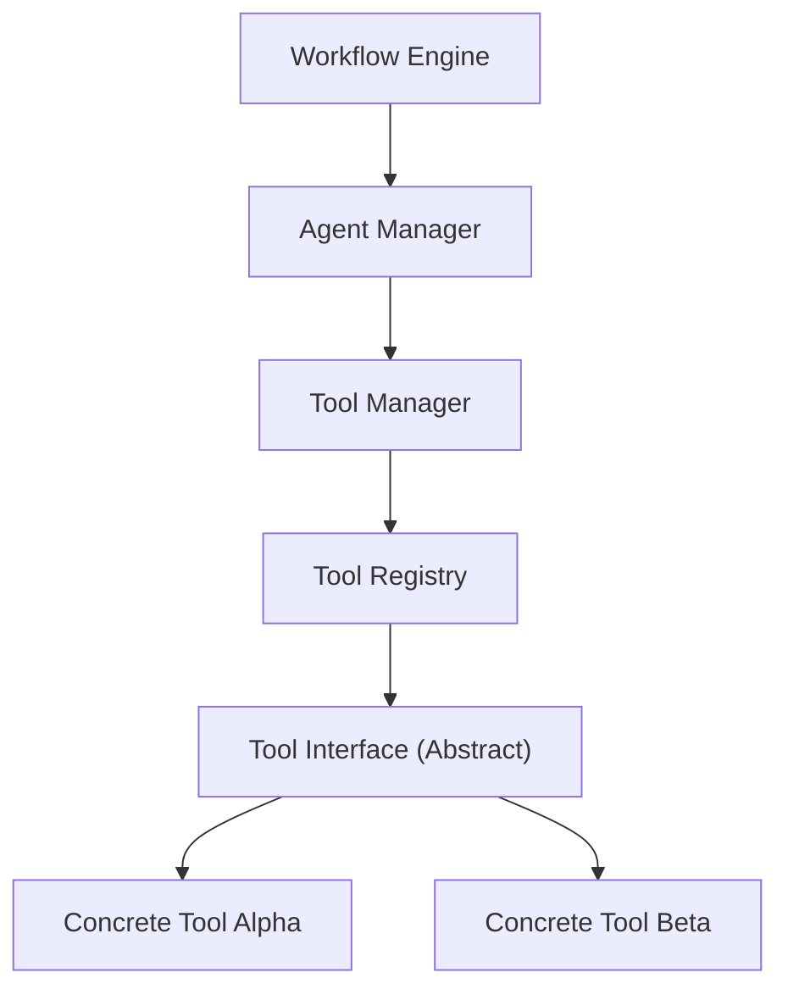
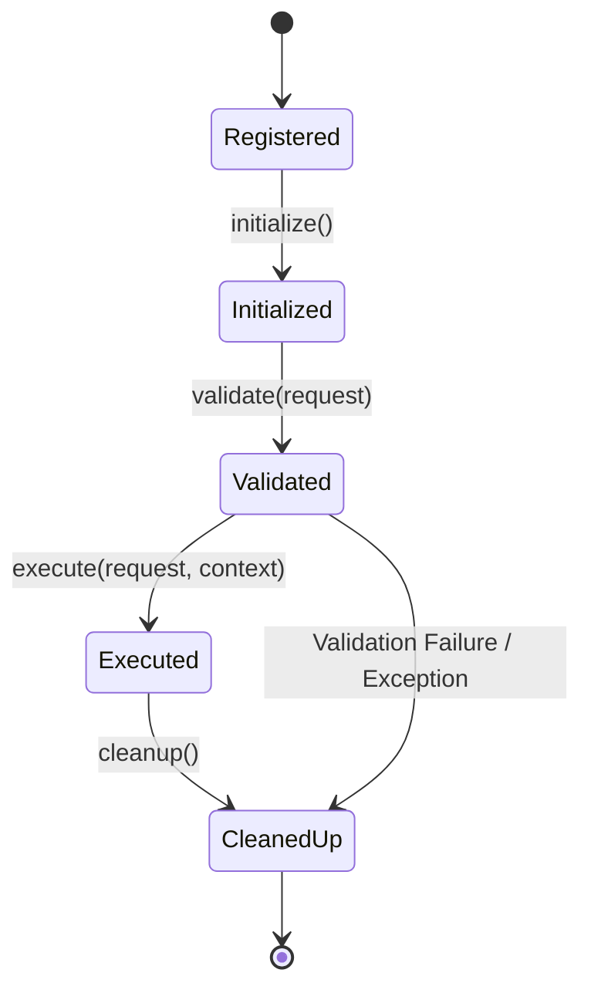
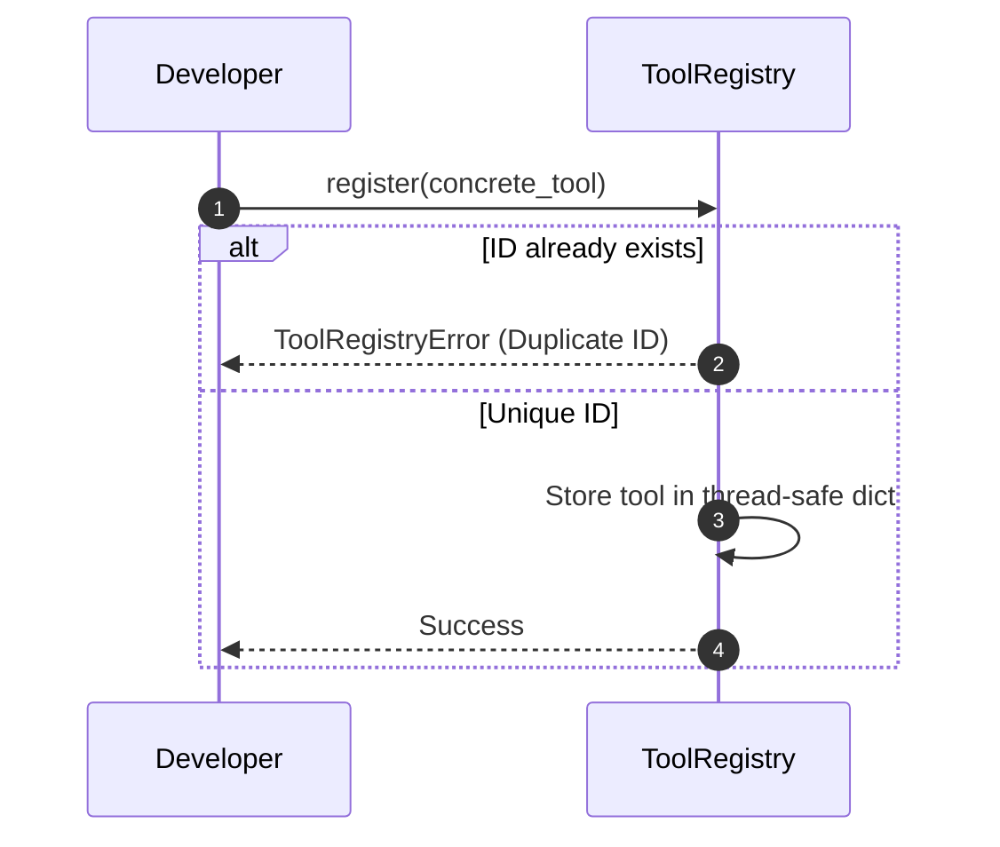
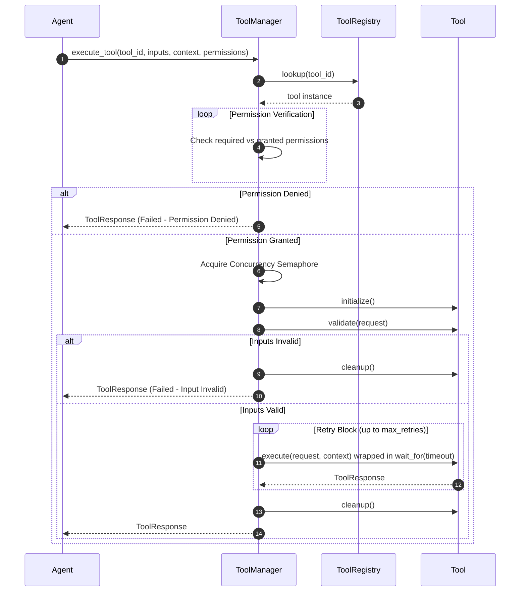

# Agent Tool Calling Framework

This document outlines the architecture, contracts, security, configuration, and execution lifecycle of the provider-agnostic Agent Tool Calling Framework in SafeSeed-Ops.

---

## 1. Architecture Overview

The Tool Calling Framework enables concrete agents to discover and invoke localized tools (e.g. database querying, filesystem access, HTTP clients) consistently. The Workflow Engine interacts with tools purely through abstract interfaces, ensuring decoupled security validation and lifecycle management.



---

## 2. Tool Lifecycle

Concrete tools transition through the following states during validation, execution, and resource cleanup:



---

## 3. Permission Model

To guarantee secure execution sandboxes, the framework enforces a role-based permission model. Concrete tools declare their required permissions in their metadata. The `ToolManager` inspects these requirements before initialization and blocks execution on missing permissions.

### Supported Permissions:
* **Read / Write:** Local storage read/write capabilities.
* **Execute:** Running script binaries or commands.
* **Admin:** Privileged administrative access.
* **Network:** External API requests and socket actions.
* **Filesystem:** Direct disk read/write access.
* **Database:** SQL/NoSQL transaction capabilities.
* **Environment:** Accessing process environment variables.

---

## 4. Registration Flow

The `ToolRegistry` manages the thread-safe lifecycle and capability grouping of active tools:



---

## 5. Execution Flow

The `ToolManager` coordinates resolving, permission checking, timeout enforcement, concurrency limits, and retry loops:



---

## 6. Configuration Settings

All runtime parameters are fetched dynamically from `PlatformSettings` (no hardcoded settings):
* `platform_settings.TOOLS_MAX_EXECUTION_TIMEOUT_SECONDS` — Ceiling limit for execution durations before throwing a timeout.
* `platform_settings.TOOLS_MAX_CONCURRENT_EXECUTIONS` — Maximum parallel tool runs allowed concurrently (semaphore size).
* `platform_settings.TOOLS_MAX_RETRIES` — Maximum retry attempts on transient step failures.

---

## 7. Development Integration Example

To create a custom tool:
```python
from app.agents.tools import Tool, ToolMetadata, ToolCategory, ToolCapability, ToolPermission, ToolRequest, ToolResponse, ToolContext

class QueryDatabaseTool(Tool):
    async def initialize(self) -> None:
        pass
        
    async def validate(self, request: ToolRequest) -> bool:
        return "query" in request.inputs
        
    async def execute(self, request: ToolRequest, context: ToolContext) -> ToolResponse:
        # DB Query execution
        return ToolResponse(success=True, outputs={"results": [...]}, duration=0.05)
        
    async def health(self) -> bool:
        return True
        
    async def cleanup(self) -> None:
        pass
        
    def metadata(self) -> ToolMetadata:
        return ToolMetadata(
            id="query-db",
            name="Database Query Tool",
            version="1.0.0",
            category=ToolCategory.DATABASE,
            capabilities=[ToolCapability.QUERY_DB],
            permissions_required=[ToolPermission.DATABASE, ToolPermission.READ]
        )
```
