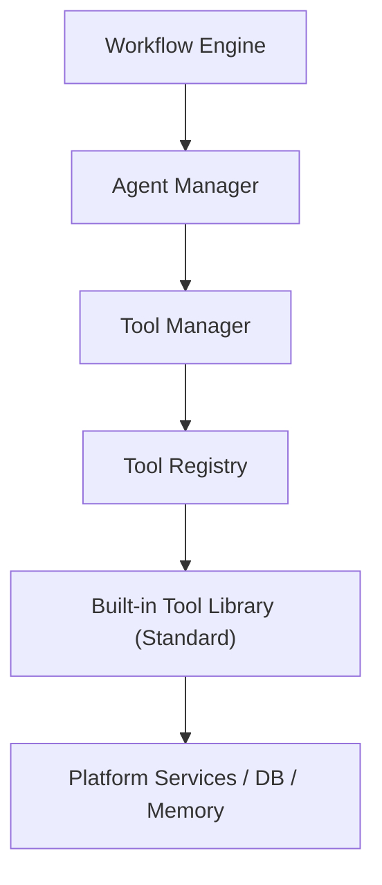
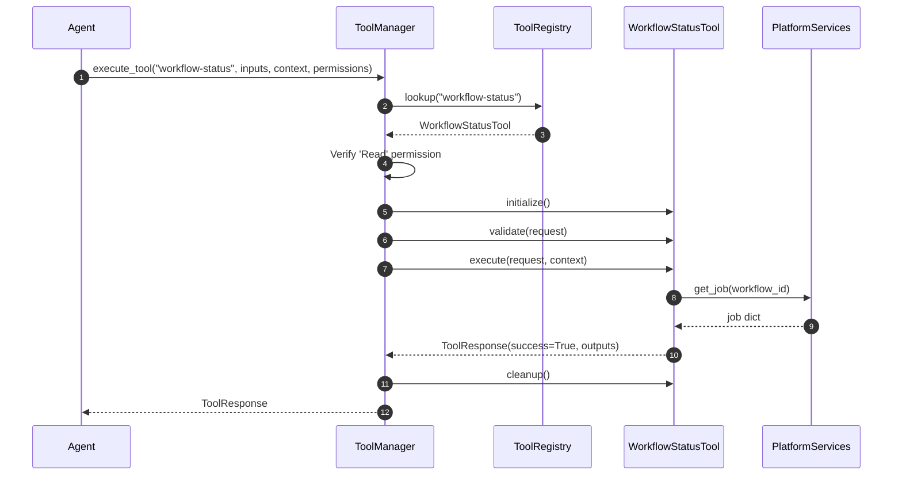

# Built-in Standard Tool Library

This document catalogues the architecture, capabilities, configurations, and permission mappings for the production-ready built-in standard tools available to AI Agents in SafeSeed-Ops.

---

## 1. Architecture Overview

Built-in tools run securely under the validation boundaries managed by the `ToolManager` and integrate directly with workflow persistence, database managers, and memory systems.



---

## 2. Built-in Tool Catalog & Permissions Matrix

The library includes 12 core tools across 10 functional categories:

| Tool ID | Name | Category | Required Permissions | Primary Capability |
| :--- | :--- | :--- | :--- | :--- |
| `workflow-status` | Workflow Status Lookup | Workflow | `Read` | `utility_run` |
| `workflow-execute` | Workflow Execution | Workflow | `Execute` | `utility_run` |
| `workflow-validation` | Workflow Validation | Workflow | `Read` | `validate_schema` |
| `runtime-health` | Runtime Health Check | Runtime | `Read` | `utility_run` |
| `memory-query` | Memory Query | Knowledge Base | `Read` | `read_file` |
| `memory-snapshot` | Memory Snapshot | Knowledge Base | `Write` | `write_file` |
| `document-generator`| Document Compiler | Transformation | `Write` | `export_data` |
| `markdown-export` | Markdown Export | Export | `Write` | `export_data` |
| `json-transform` | JSON Map & Transform | Transformation | `Read` | `utility_run` |
| `schema-validation` | Schema Validation | Validation | `Read` | `validate_schema` |
| `text-search` | Regex and Text Search | Search | `Read` | `query_db` |
| `variable-resolver` | Context Resolver | Utility | `Read` | `utility_run` |

---

## 3. Tool Registration & Execution Flow

All built-in tools are registered on startup. Agents lookup tools dynamically and invoke them via the manager:



---

## 4. Platform Configurations

All tool limitations and ceilings are defined in `PlatformSettings`:
* `platform_settings.TOOLS_MAX_EXPORT_SIZE` — Limits output bytes size for markdown exports (Default: 1MB).
* `platform_settings.TOOLS_MAX_DOCUMENT_SIZE` — Prevents document compilations from exceeding limits (Default: 1MB).
* `platform_settings.TOOLS_MAX_SEARCH_RESULTS` — Caps regex text search outcomes (Default: 100).

---

## 5. Execution Example

Using the `MarkdownExportTool` from an agent:
```python
from app.agents.tools.builtin import MarkdownExportTool
from app.agents.tools import ToolContext, ToolManager, ToolRegistry, ToolPermission

# 1. Initialize Registry & Register standard library
registry = ToolRegistry()
registry.register(MarkdownExportTool())

# 2. Setup Manager & execution inputs
manager = ToolManager(registry)
context = ToolContext(workflow_id="wf-100", execution_id="run-1", agent_id="agent-0")
inputs = {
    "title": "Agent Execution Summary",
    "content": "Execution runs completed successfully with zero validation warnings."
}

# 3. Secure Execution
response = await manager.execute_tool(
    tool_id="markdown-export",
    inputs=inputs,
    context=context,
    granted_permissions=[ToolPermission.WRITE]
)

print(response.outputs["markdown"])
```
