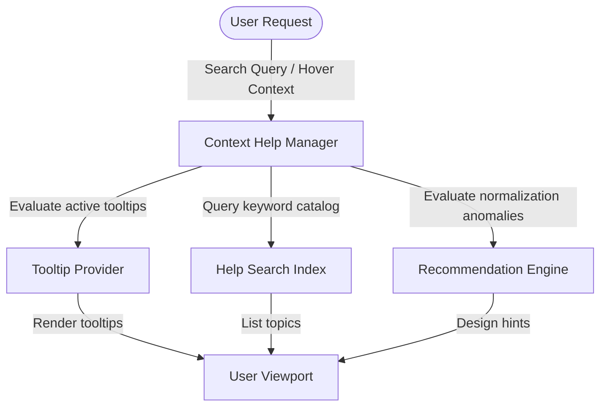

# Contextual Help & Smart Guidance Design

The contextual help system compiles documentation indexes, tracks interactive tooltips, and generates layout recommendations dynamically based on Schema models.

---

## Architecture

The Contextual Help engine evaluates current schema shapes and indexes inline document nodes:

---

## Configuration Settings

Global parameters are managed in `PlatformSettings`:
- `PLATFORM_HELP_MAX_TOOLTIP_LENGTH` (Default: `500` characters): Maximum tooltip text size.
- `PLATFORM_HELP_MAX_RECOMMENDATIONS` (Default: `10` items): Capped suggestions per view.
- `PLATFORM_HELP_SEARCH_LIMIT` (Default: `20` results): Capped search return limits.
- `PLATFORM_HELP_CACHE_SIZE` (Default: `100` pages): Documentation cache boundaries.

---

## Smart Recommendation Rules

1. **MissingPrimaryKey**: Flags any table defined without at least one primary key.
2. **UnreferencedTable**: Suggests relation references when a table is completely isolated from others.
