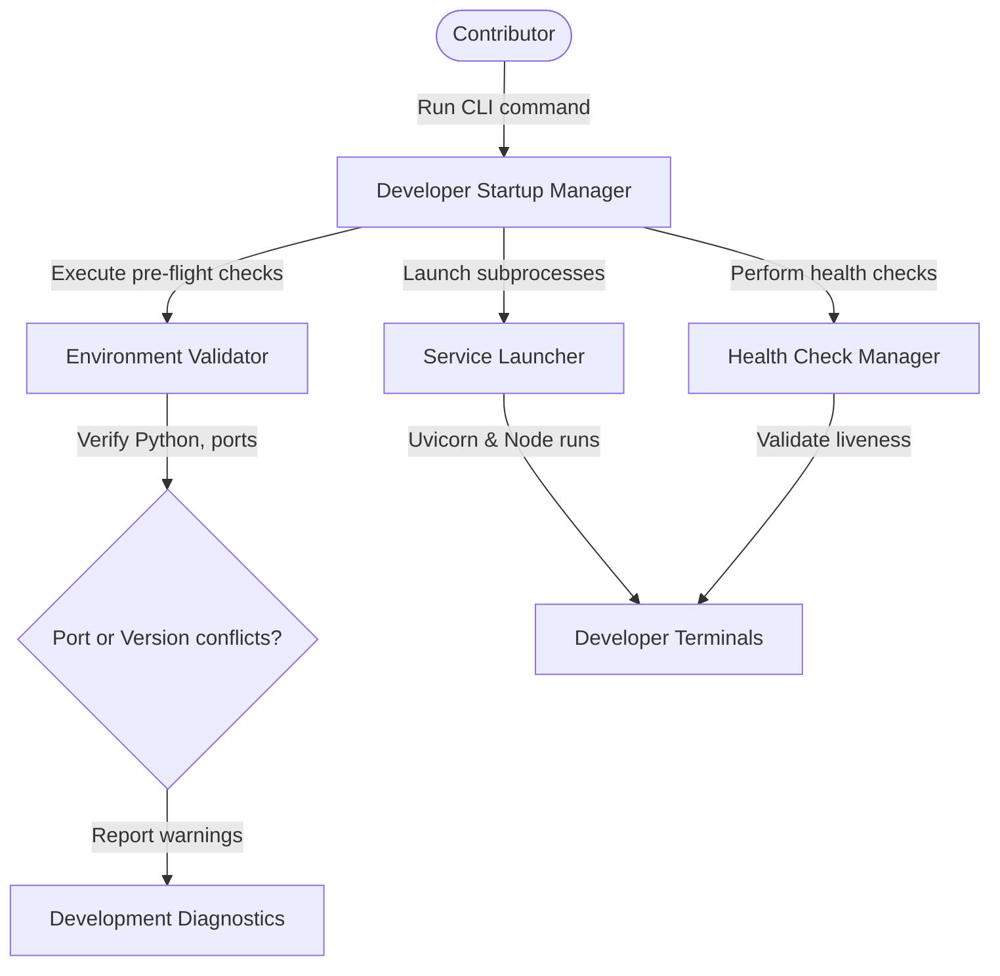

# Developer Startup & Environment Health Diagnostics

The developer startup module provisions local development servers and runs pre-flight diagnostic validation checks.

---

## Architecture

The Developer Startup manager validates local runtime requirements and orchestrates service orchestrators:

---

## Configuration Settings

Options are managed in `PlatformSettings`:
- `PLATFORM_DEV_PORT` (Default: `8000`): Port targeted for local backend server run.
- `PLATFORM_DEV_STARTUP_TIMEOUT_SECONDS` (Default: `30` seconds): Dev server start check timeout.
- `PLATFORM_DEV_HEALTH_CHECK_INTERVAL_SECONDS` (Default: `5` seconds): Liveness check polling delay.
- `PLATFORM_DEV_AUTO_SEED` (Default: `True`): Toggles seeding sample projects on first launch.

---

## Pre-flight Validations

1. **Python Version**: Checks that Python runtime version is `>= 3.10`.
2. **Port Availability**: Binds to `PLATFORM_DEV_PORT` to detect local collision conflicts.
