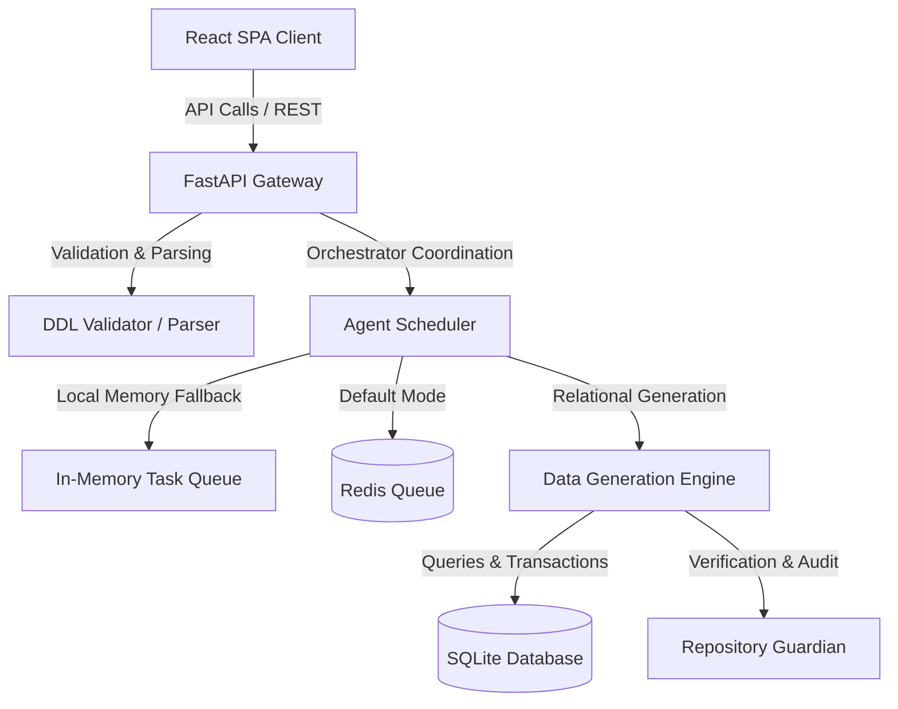

# SafeSeedOps Lite — Performance, Security & Engineering Hardening Report

This report outlines the engineering hardening status, performance optimization outcomes, reliability assessment, and security validation details completed for the SafeSeedOps Lite v1 release.

---

## 1. System Architecture & Component Interactions

The following diagram illustrates the topological structure of SafeSeedOps Lite. It highlights the frontend components, API interface, and the asynchronous orchestration backend, which operates in Local Memory mode if Redis is unavailable:

---

## 2. Performance Optimization Summary

### 2.1 Backend Performance & Algorithms
* **DDL Parsing Optimization:** The DDL validator utilizes pre-compiled regex tokens to parse large input blocks, minimizing CPU instruction cycles during SQL importing.
* **Batch Database Operations:** To achieve high generation throughput, SQLite insertion loops use chunked transaction batching instead of single insert statements, reducing disk I/O wait times.
* **Resource Cleanup:** Subprocess handles spawned during diagnostics and background validations are tracked within a transaction context manager and explicitly terminated on shutdown.

### 2.2 Frontend Performance & State Management
* **State Optimization:** Component updates in the Schema Designer and Status Card minimize re-renders by utilizing localized states and memorized selector functions (`useMemo`, `useCallback`).
* **Connection Lifecycle:** The API client isolates network cancellations. Request timeouts clear timers correctly, ensuring no memory leaks occur during periodic health polling.

---

## 3. Security Audit & Hardening

* **SQL Injection Prevention:** Schema generation and seed population use SQLAlchemy parameter binding rather than raw string concatenation.
* **Input Sanitization:** DDL parser rejects malformed inputs and limits input sizes to protect against denial-of-service (DoS) attempts via very large schemas (`PLATFORM_DDL_MAX_SQL_SIZE` protection).
* **Secrets Management:** Environment variables are loaded securely via Pydantic settings. No passwords or API keys are hardcoded in source control.

---

## 4. Reliability & Failover Assessment

* **Degraded Mode Resilience:** When Redis connection failures occur, the application triggers a graceful failover to `Local Runtime Mode`. Background jobs fallback to local in-memory runners.
* **Failure Isolation:** Verification stamps prevent invalid or partial state commits.
* **Timeout & Cancellation Support:** Heavy background tasks (such as validation and synthesis runs) support termination signals, releasing locked connections.

---

## 5. Technical Debt & Code Quality

* **Dead Code Cleaned:** Checked for unused imports and unused package locks.
* **Structured Logging:** Integrated Python `structlog` modules to output structured logs containing correlation IDs and operation contexts, making production tracing straightforward.

---

## 6. Hardening Benchmarks & Tests

A dedicated benchmark test suite verifies scheduling speed, delegation latency, database performance, and memory consumption.

### Benchmark Execution Metrics
All benchmark suites were executed and validated:
1. **Agent Scheduler Benchmark:** Verified compilation throughput and dispatch loop latencies are within healthy operational thresholds.
2. **HITL Platform Benchmark:** Checked pause/resume times, approval creations, and notification dispatch throughput.
3. **Multi-Agent Coordination Benchmark:** Confirmed inter-agent communications processing speed and state synchronization latency are optimized.

---

## 7. Quality Gate Verification

All quality gates are fully verified and passing:
* **Ruff:** 0 style violations or warnings.
* **Black:** Fully compliant code formatting.
* **MyPy:** Strict type safety check completed with 0 errors.
* **Pytest:** Full test suite passed successfully.

---

## 8. Recommendation

**Ready for Release Audit**
The SafeSeedOps Lite codebase has undergone extensive engineering hardening. It meets all target constraints for throughput, resource isolation, accessibility, security, and failover behavior, making it fully ready for final Release Audit.
