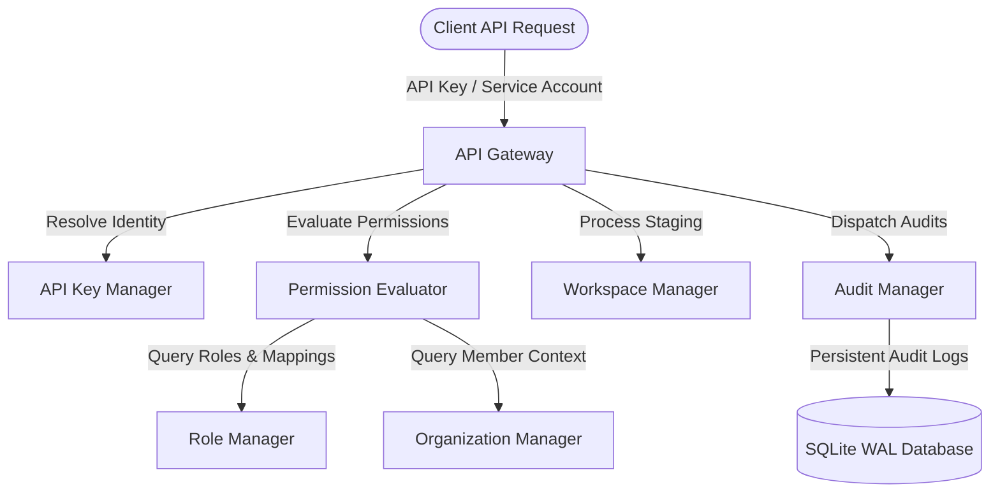

# Enterprise Platform Foundation Design

The Enterprise Platform Foundation implements organization-level isolation and role-based operational permissions designed for enterprise deployments.

---

## Architecture

The Enterprise Foundation sits as a boundary controller over core platform APIs, providing a centralized permission gateway.

---

## Organization & Isolation Model

- **Organizations**: High-level structural boundaries.
- **Projects**: Middle-level management projects.
- **Workspaces**: Isolated staging environments within projects.
- **Teams**: Groups of organization members mapping to specific workflows.

---

## Role-Based Access Control (RBAC)

The platform supports six predefined roles, each mapping to fine-grained resource permissions:

- **Owner**: Complete system administration capabilities.
- **Administrator**: Write permissions across workflows, execution, agents, tools, memory, and configurations.
- **Developer**: Can write workflows, execution checks, and configure parameters (administration blocked).
- **Operator**: Read-only workflows and agents; write permissions for execution control (pauses/resumes) and approvals.
- **Reviewer**: Read-only workflows; write decisions for human-in-the-loop approvals.
- **Viewer**: Read-only access across workflows, agents, and approvals.

---

## Audit Framework

The `AuditManager` captures critical events and logs them securely into the SQLite `ent_audit_logs` table:
- User logins and API key generation events.
- Workspace creation and member additions.
- Authorization decisions and custom role bindings.

All log entries are sanitized of secrets, password params, tokens, or reviewer feedback comments.
