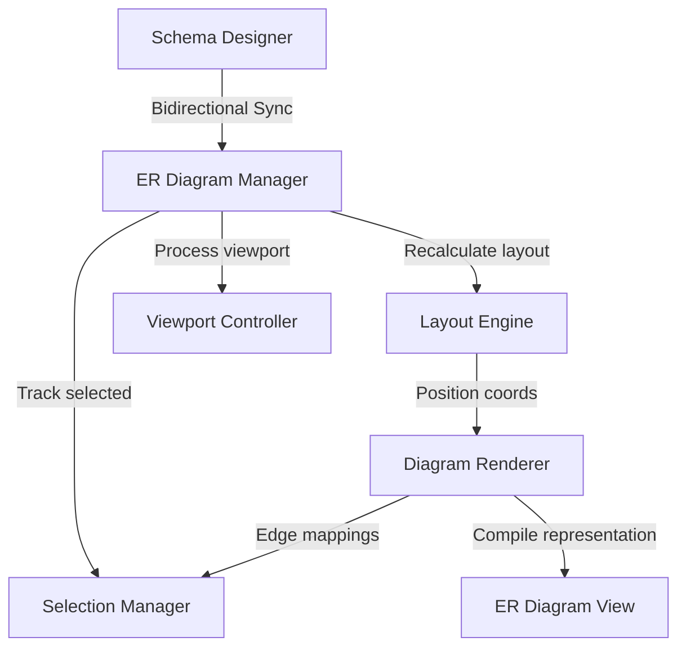

# Entity Relationship (ER) Diagram & Bidirectional Sync

The ER Diagram module calculates and renders model node coordinates for tables and relationship lines in the designer viewport space.

---

## Architecture

The ER Diagram behaves as a pure visualization and coordinate tracking layer mapping directly to the central `SchemaModel`.

---

## Layout Configurations

Layout calculations are managed in `PlatformSettings`:
- `PLATFORM_ER_MAX_TABLES` (Default: `100`): Capped tables count.
- `PLATFORM_ER_MAX_RELATIONSHIPS` (Default: `250`): Capped visible relationship lines.
- `PLATFORM_ER_DEFAULT_ZOOM` (Default: `1.0`): Viewport default scale.
- `PLATFORM_ER_LAYOUT_ALGORITHM` (Default: `hierarchical`): Selected algorithm grid or hierarchy tree.

---

## Bidirectional Synchronization

To prevent data drift or sync conflicts, changes between the visual diagram editor coordinates and schema designer updates pass through the `ERDiagramManager`:
1. Modifications in Schema Designer update tables lists.
2. Coordinate updates dynamically recalculate nodes while preserving manual positioning offsets.
3. If an update produces a broken relationship, synchronization rejects changes and reverts to keep the designer safe.
