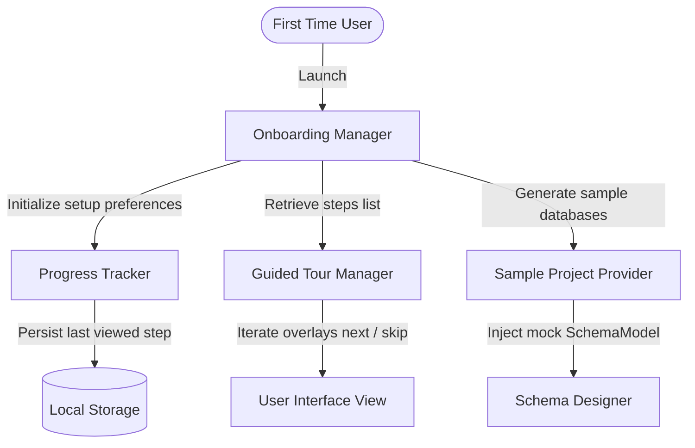

# First-Time User Experience, Guided Tour & Onboarding

The onboarding system implements guided tours and creates realistic relational sample projects to help new developers explore capabilities smoothly.

---

## Architecture

The onboarding manager interfaces with context parameters to track step progression and persist user preferences:

---

## Configuration Settings

Parameters are managed in `PlatformSettings`:
- `PLATFORM_ONBOARDING_MAX_STEPS` (Default: `15`): Maximum walkthrough steps list limit.
- `PLATFORM_ONBOARDING_AUTO_LAUNCH` (Default: `True`): Launches welcome dialog automatically if welcome was not previously dismissed.
- `PLATFORM_ONBOARDING_SAMPLE_SIZE` (Default: `100` rows): Limits generated sample record target bounds.
- `PLATFORM_ONBOARDING_HINT_LIMIT` (Default: `5` warnings): Max help hints display count.

---

## Sample Schema Definition

The `SampleProjectProvider` creates a relational schema containing:
- **`roles`**: Table defining system credentials.
- **`users`**: Table with foreign keys referencing `roles(id)`.
- **`categories`**: Table describing product divisions.
- **`products`**: Table referencing `categories(id)`.
