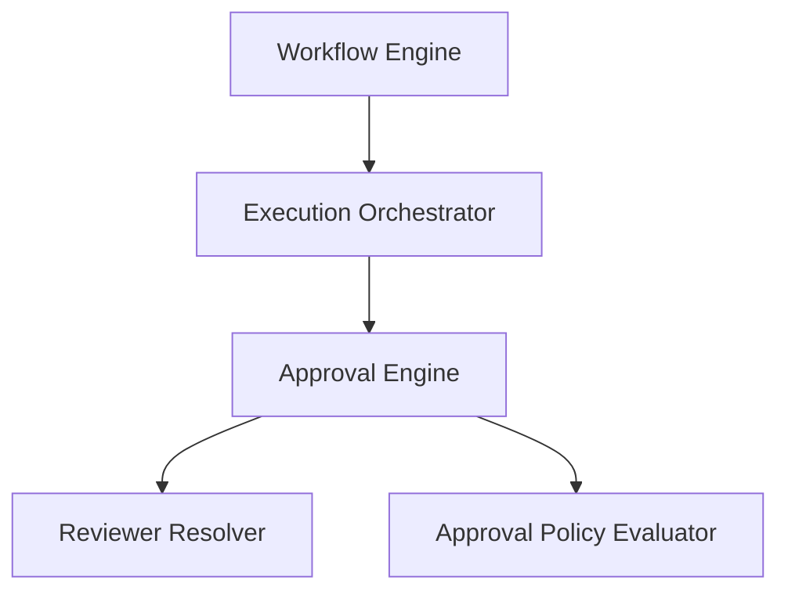

# Human-in-the-Loop Approval Workflow Engine

This document details the architecture, lifecycle tracking, reviewer resolving logic, consensus policy checks, and integration examples of the Human-in-the-Loop (HITL) Approval Engine in SafeSeed-Ops.

---

## 1. Architecture Overview

The Approval Engine coordinates human review requirements generated during workflow executions:



---

## 2. Reviewer Resolution
* **Reviewer ID Verification:** Validates identifiers and blocks empty definitions.
* **Registry Checks:** cross-checks candidates against the active platform user directory to enforce authorization constraints.
* **Uniqueness Filtering:** Removes duplicate review entities early.

---

## 3. Policy Evaluation

The `ApprovalPolicyEvaluator` computes consensus outcomes:

| Policy | Consensus Condition | Termination Outcome |
| :--- | :--- | :--- |
| **ANY_REVIEWER** | first APPROVED/REJECTED response | Resolves to first outcome |
| **ALL_REVIEWERS** | requires decisions from all assigned reviewers | Resolves to APPROVED only if all approve |
| **MAJORITY** | requires >50% matching decision direction | Resolves on majority match |
| **UNANIMOUS** | all reviewers must submit APPROVED | Resolves to Rejected if any reject |
| **FIRST_RESPONSE** | first response timestamp | Resolves on first answer |

---

## 4. Examples

### Initiating an Engine Session and Evaluating Decisions
```python
import time
from app.platform.hitl import (
    ApprovalEngine,
    ApprovalRequest,
    ApprovalContext,
    Reviewer,
    ReviewerType,
    ApprovalPolicy,
    ApprovalDecision,
    DecisionType
)

# 1. Instantiate engine
engine = ApprovalEngine()

# 2. Package request definition
context = ApprovalContext(
    workflow_id="wf-seed",
    execution_id="exec-seed",
    agent_id="agent-database",
    step_id="step-seed"
)
reviewer1 = Reviewer(reviewer_id="rev-1", reviewer_type=ReviewerType.USER, name="Lead Dev")
reviewer2 = Reviewer(reviewer_id="rev-2", reviewer_type=ReviewerType.USER, name="Sec Lead")

request = ApprovalRequest(
    approval_id="app-prod-seed",
    context=context,
    policy=ApprovalPolicy.ALL_REVIEWERS,
    reviewers=[reviewer1, reviewer2],
    created_at=time.time(),
    expires_at=time.time() + 3600
)

# 3. Create active session
engine.create_session("app-prod-seed", request)

# 4. Submit first decision
decision1 = ApprovalDecision(
    decision_id="dec-1",
    approval_id="app-prod-seed",
    reviewer_id="rev-1",
    decision_type=DecisionType.APPROVED,
    timestamp=time.time()
)
res = engine.submit_decision("app-prod-seed", decision1)
# Result status is IN_REVIEW as ALL_REVIEWERS requires decision 2

# 5. Submit second decision
decision2 = ApprovalDecision(
    decision_id="dec-2",
    approval_id="app-prod-seed",
    reviewer_id="rev-2",
    decision_type=DecisionType.APPROVED,
    timestamp=time.time()
)
res = engine.submit_decision("app-prod-seed", decision2)
# Result status is now APPROVED
```
