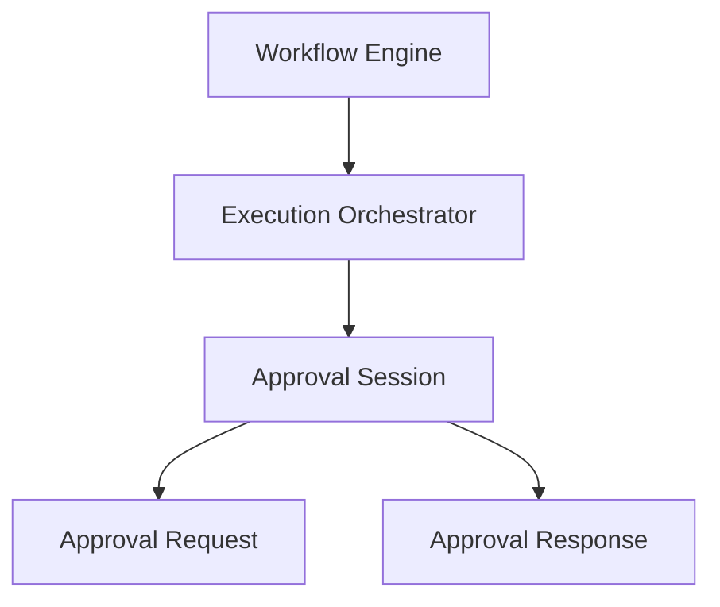
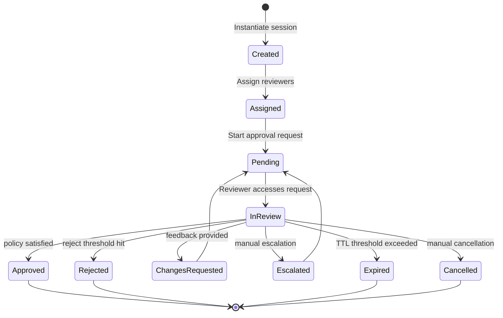

# Human-in-the-Loop (HITL) Domain Models & Approval Foundation

This document details the architecture, lifecycle states, decision models, synchronization policies, configurations, and implementation examples of the Human-in-the-Loop (HITL) domain models in SafeSeed-Ops.

---

## 1. Architecture Overview

The Human-in-the-Loop layer is integrated into the Workflow and Execution Platform layers:



---

## 2. Approval Lifecycle

Approval sessions progress through the following lifecycle states:



---

## 3. Decision Model
Reviewers submit decisions using the `ApprovalDecision` model:
* **APPROVED:** Accept the requested action.
* **REJECTED:** Reject the requested action.
* **CHANGES_REQUESTED:** Request edits or corrections.
* **ESCALATED:** Forward approval to parent supervisor reviewer groups.
* **EXPIRED:** Automatically mark request expired if TTL interval is hit.
* **CANCELLED:** Manually abort request session.

---

## 4. Policy Model
Consensus policies define when a step or session achieves final resolution:
* **ANY_REVIEWER:** Resolves on the first decision submitted.
* **ALL_REVIEWERS:** Requires decisions from all assigned reviewers.
* **MAJORITY:** Requires a majority of reviewers to agree.
* **UNANIMOUS:** Requires all reviewers to agree without rejection.
* **FIRST_RESPONSE:** First response completes the step.

---

## 5. Configuration Limits
Parameters are configured under `PlatformSettings`:
* `HITL_MAX_REVIEWERS` — Maximum reviewer count limit (Default: 16).
* `HITL_MAX_COMMENTS` — Maximum comments log history limit (Default: 100).
* `HITL_MAX_ATTACHMENT_METADATA_ENTRIES` — Maximum attachment files references (Default: 10).
* `HITL_DEFAULT_EXPIRATION_SECONDS` — Expiration lifespan seconds (Default: 86400.0s).

---

## 6. Examples

### Creating an Approval Session and Transitioning States
```python
import time
from app.platform.hitl import (
    ApprovalSession,
    ApprovalRequest,
    ApprovalContext,
    Reviewer,
    ReviewerType,
    ApprovalPolicy,
    ApprovalLifecycle
)

# 1. Package context
context = ApprovalContext(
    workflow_id="wf-1",
    execution_id="exec-1",
    agent_id="agent-coord",
    step_id="step-1",
    request_metadata={"action": "re-seed-users-table"}
)

# 2. Package reviewer
reviewer = Reviewer(
    reviewer_id="usr-1",
    reviewer_type=ReviewerType.USER,
    name="Lead Operator"
)

# 3. Create request
request = ApprovalRequest(
    approval_id="app-1",
    context=context,
    policy=ApprovalPolicy.ANY_REVIEWER,
    reviewers=[reviewer],
    created_at=time.time(),
    expires_at=time.time() + 86400
)

# 4. Initiate coordination session
session = ApprovalSession(
    approval_id="app-1",
    request=request
)

# 5. Transition state
session.transition_to(
    new_state=ApprovalLifecycle.PENDING,
    reason="Deploy approval request dispatched to dashboard."
)
```
