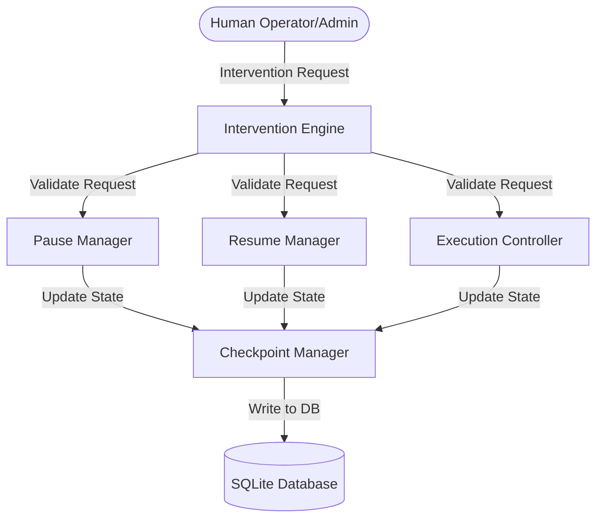
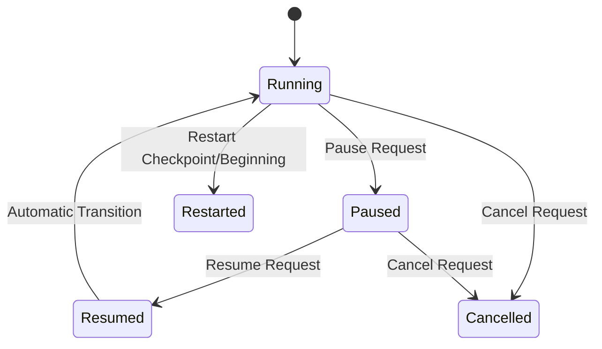

# HITL Intervention Engine

The Human-in-the-Loop (HITL) Intervention Engine governs the execution control and human supervision lifecycle of agentic workflows. It provides the core capabilities to pause, resume, cancel, or redirect executions safely while ensuring compliance with intervention policies.

---

## Architecture

The Intervention Engine integrates directly with the existing database infrastructure, orchestrating state updates via the Checkpoint Manager without bypassing security or auditing controls.



---

## Execution Lifecycle & Transitions

The intervention flow supports transitions between the following execution states:



- **Running**: The workflow is actively executing stages.
- **Paused**: The execution is suspended. Background tasks or actions wait for a resume token or administrative decision.
- **Resumed**: The transition state signifying that the workflow has received a signal to resume.
- **Cancelled**: The terminal state where execution is aborted.
- **Restarted**: The state where execution starts again either from the beginning or from a saved checkpoint.

---

## Flows

### Pause Flow
1. Operator submits a `Pause Execution` request.
2. The Intervention Engine validates that the execution exists and is currently in a running state.
3. The Intervention Engine verifies that the Operator is authorized.
4. `PauseManager` saves an updated checkpoint with the status set to `Paused` and writes a `paused_at` timestamp.
5. Emits an `ExecutionPaused` event.

### Resume Flow
1. Operator submits a `Resume Execution` request.
2. The Intervention Engine validates that the execution is in a `Paused` state.
3. `ResumeManager` updates the state to `Resumed`, calculates pause duration latency, and publishes an `ExecutionResumed` event.
4. The execution state is immediately updated back to `Running` to let the orchestrator continue stage processing.

### Restart Flow
1. Operator triggers a restart (either `Restart From Checkpoint` or `Restart From Beginning`).
2. The engine validates permissions and checkpoint availability.
3. `ExecutionController` updates the checkpoint status to `Restarted` or `Running` (resetting stage to `0` and clearing step outputs if restarting from the beginning).

---

## Policy Model

The following policies determine allowed intervention actions:

| Policy | Allowed Actions | Authorization Constraints |
| :--- | :--- | :--- |
| `MANUAL_ONLY` | All | Restricts to `Operator`, `Admin`, or `Engineer` roles. |
| `APPROVAL_REQUIRED` | All | Requires reference to a completed and `Approved` request in the Approval Engine. |
| `AUTO_RESUME` | Resume | Allows automated resume triggers when timeouts expire. |
| `ADMIN_OVERRIDE` | All | Restricts strictly to the `Admin` role. |
| `EMERGENCY_STOP` | Pause, Cancel | Bypasses standard rules to stop critical runs immediately. |

---

## Configuration

The Intervention Engine uses platform settings dynamically loaded from `PlatformSettings`:

- `HITL_PAUSE_TIMEOUT_SECONDS` (Default: `3600.0`): Maximum time an execution can remain paused.
- `HITL_RESUME_TIMEOUT_SECONDS` (Default: `3600.0`): Expiry limit for resume actions.
- `HITL_MAX_INTERVENTION_HISTORY` (Default: `1000`): Maximum records retained in history.
- `HITL_CHECKPOINT_RESTART_TIMEOUT_SECONDS` (Default: `600.0`): Expiration limit for checkpoint restarts.

---

## Examples

### Processing a Manual Pause Request
```python
from app.platform.hitl import InterventionEngine, InterventionRequest, InterventionAction, InterventionPolicy

engine = InterventionEngine()

request = InterventionRequest(
    execution_id="exec-123",
    action=InterventionAction.PAUSE,
    policy=InterventionPolicy.MANUAL_ONLY,
    user_id="user-456",
    user_role="Operator"
)

success = engine.process_intervention(request)
if success:
    print("Execution successfully paused.")
```

### Retrieving History & Metrics
```python
# Fetch metrics summary
metrics = engine.get_metrics()
print(f"Success Rate: {metrics.intervention_success_rate}%")
print(f"Avg Pause Duration: {metrics.average_pause_duration}s")

# Fetch history log
history = engine.get_history("exec-123")
for entry in history:
    print(f"[{entry.timestamp}] Action: {entry.action} by {entry.user_id} - Success: {entry.success}")
```
