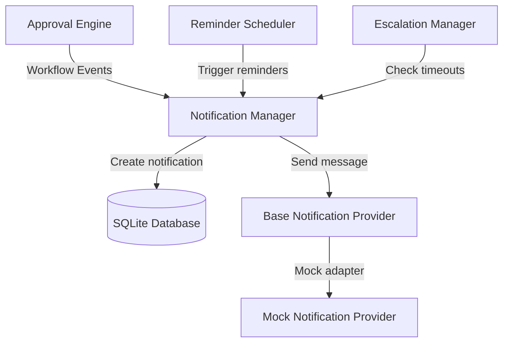
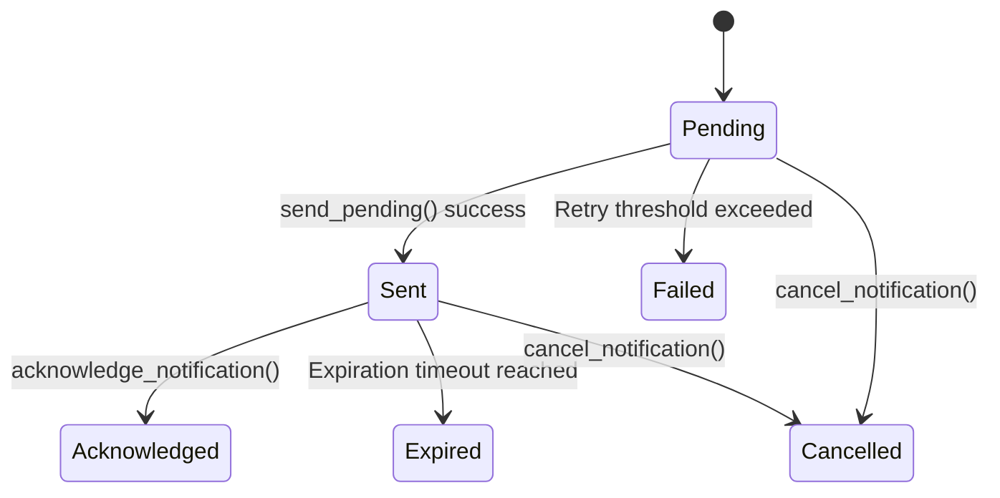

# HITL Notifications & Escalation Framework

The Human-in-the-Loop (HITL) Notifications and Escalation Framework handles delivery management, reminder recurrence rules, and timeout-based escalations for approval workflows.

---

## Architecture

The notifications framework is built to be delivery provider-agnostic, defining a base interface that delegates sending logic to custom adapters (e.g., Slack, Email, Teams) while keeping tracking, duplication checks, and metrics unified.



---

## Notification Lifecycle & Delivery States

A notification progresses through the following delivery states:



- **Pending**: Created and ready for delivery.
- **Scheduled**: Booked for a future reminder slot.
- **Sent**: Successfully delivered via the configured provider.
- **Acknowledged**: Reviewed and confirmed by the human actor.
- **Expired**: Dismissed or timed out.
- **Cancelled**: Manually cancelled.
- **Failed**: Exceeded maximum retries without a successful transmission.

---

## Reminder Scheduling

Reminders are sent periodically to ensure workflows do not stall. The `ReminderScheduler` supports three retry and interval policies:

- **Single Reminder**: Dispatches a single reminder notification.
- **Fixed Interval**: Dispatches reminders at a flat recurring interval (e.g., every 5 minutes).
- **Exponential Backoff**: Multiplies the interval dynamically after each attempt (e.g., $interval \times 2^{retry\_index}$) to prevent notifier fatigue.

Limits are defined by the `HITL_MAX_REMINDERS` parameter.

---

## Escalation Policies

When approvals remain pending past their timeout boundaries, the `EscalationManager` enforces escalation rules:

- `NO_ESCALATION`: Logs warning entries only; takes no action.
- `ESCALATE_TO_MANAGER`: Routes notifications to manager targets.
- `ESCALATE_TO_GROUP`: Broadcasts to a backup reviewer group.
- `ESCALATE_TO_ADMIN`: Escalates directly to system administrators.
- `AUTO_EXPIRE`: Automatically sets the approval session to `Expired`.

---

## Configuration

Settings are dynamically loaded from `PlatformSettings`:

- `HITL_REMINDER_INTERVAL_SECONDS` (Default: `300.0`): The base time delta between reminders.
- `HITL_MAX_REMINDERS` (Default: `5`): Maximum reminder attempts allowed.
- `HITL_ESCALATION_TIMEOUT_SECONDS` (Default: `1800.0`): Overdue threshold before escalations trigger.
- `HITL_NOTIFICATION_RETENTION_DAYS` (Default: `30`): Database cleanup threshold.

---

## Examples

### Creating and Delivering Notifications
```python
from app.platform.hitl import NotificationManager, NotificationRequest, NotificationType

manager = NotificationManager()

# Create notification request
req = NotificationRequest(
    approval_id="app-123",
    notification_type=NotificationType.APPROVAL_REQUESTED,
    target_id="reviewer-john",
    content="John, please approve seed action 123.",
    metadata={"bypass_approval_check": True}
)

# Enqueue
nid = manager.create_notification(req)

# Dispatch pending
manager.send_pending()
```

### Scheduling Reminders & Checking Escalations
```python
from app.platform.hitl import ReminderScheduler, EscalationManager, ReminderPolicy, EscalationPolicy

scheduler = ReminderScheduler(manager)
escalator = EscalationManager(manager)

# Schedule backoff reminder
scheduler.schedule_reminder(
    approval_id="app-123",
    target_id="reviewer-john",
    policy=ReminderPolicy.EXPONENTIAL_BACKOFF,
    reminder_count=1
)

# Run Escalation check loop
escalator.check_and_escalate(
    approval_id="app-123",
    policy=EscalationPolicy.ESCALATE_TO_ADMIN,
    created_at=time.time() - 2000.0 # timed out
)
```
