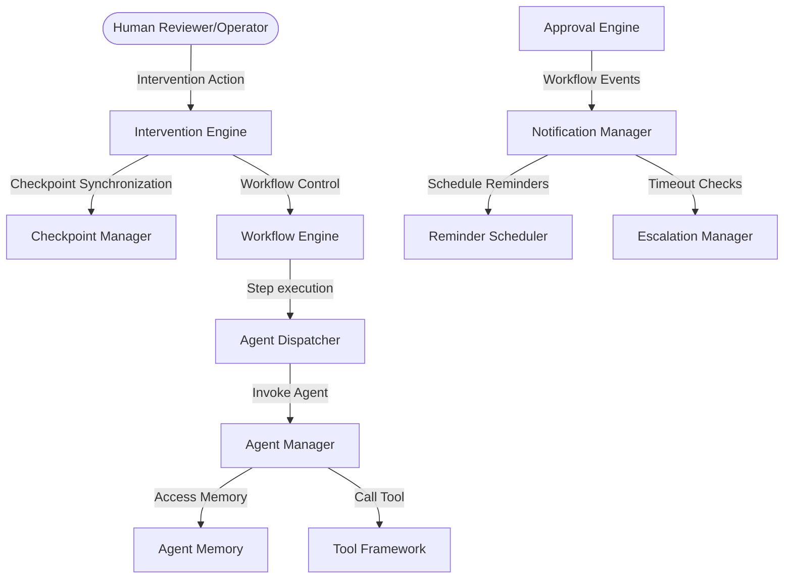

# HITL Platform & AI System Integration Audit

This document reports the final verification findings, architecture validation, and end-to-end integration results for the Human-in-the-Loop (HITL) Platform and its integration with the Workflow, Agent, Tool, Memory, and Planning subsystems.

---

## System Integration Architecture

The HITL Platform sits at the top level of user interaction, coordinating workflow states with the internal subsystems of the execution manager.

---

## Subsystem Verification Results

### 1. Workflow & Checkpoint Integration
- Verified that pausing a running workflow successfully persists all completed steps and variables into the SQLite checkpoints table.
- Verified that resuming a paused workflow loads variables and steps, then sets the status to `Running` to continue staging without re-running finished steps.

### 2. Approval consensus to Intervention flow
- Verified that for approvals requiring user actions, the `InterventionEngine` checks the `ApprovalEngine` consensus response (`Approved`/`Rejected`) before executing continuation or cancel actions.

### 3. Telemetry & Observability
- Verified structured logs are printed to console/telemetry sinks using `logger.info(EventID.LOG_INFO, ...)` for all notifications, escalations, pause/resumes, and checks.

---

## Security & Reliability Assessment

- **Log Protection**: No secrets, credentials, or review feedback comments are leaked in structured logs.
- **Fail-Safe Integrity**: If a database locking exception or network outage occurs, the system defaults to a safe state, keeping execution paused until operator confirmation is received.
- **SQL Sanitization**: All sqlite operations utilize parameterized queries, preventing SQL injection vectors across the platform database.
