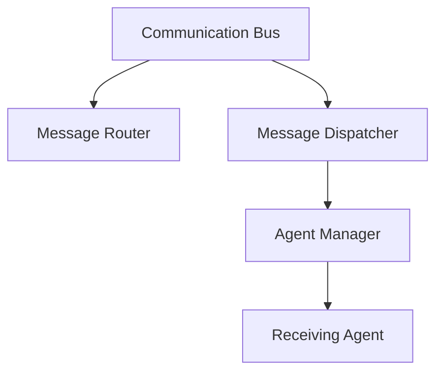
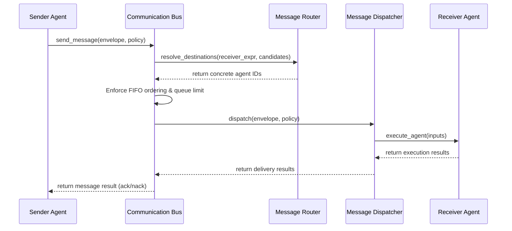

# Multi-Agent Inter-Agent Communication Bus

This document details the architecture, message types, routing policies, delivery guarantees, configurations, and implementation examples of the Inter-Agent Communication Bus in SafeSeed-Ops.

---

## 1. Architecture Overview

The Centralized Communication Bus is a transport-agnostic coordination layer allowing agents to exchange messages:



---

## 2. Communication Flow



---

## 3. Message Routing Expression Resolve
The `MessageRouter` parses destinations:
* **Direct Messaging:** Passes concrete destination `receiver_agent_id` (e.g. `"agent-exec-1"`).
* **Broadcast to Team:** Sends to all candidates using `"broadcast"`.
* **Role-Based Routing:** Routes to members matching a role category using `"role:Coordinator"`.
* **Capability-Based Routing:** Routes to members matching capability tags using `"capability:run-code"`.

---

## 4. Delivery Policies
* **FIRE_AND_FORGET:** Send immediately without waiting for execution confirmation.
* **ACKNOWLEDGED:** Waits for successful recipient execution returned result.
* **RETRY_ON_FAILURE / GUARANTEED_DELIVERY:** Re-dispatches message on errors up to `PlatformSettings.MULTI_AGENT_RETRY_ATTEMPTS` (Default: 3) before flagging failure.

---

## 5. Configuration Limits
Parameters are configured under `PlatformSettings`:
* `MULTI_AGENT_MAX_QUEUE_SIZE` — Maximum envelope depth per path pair (Default: 1000).
* `MULTI_AGENT_MAX_MESSAGE_SIZE` — Serialized payload size boundary limit in bytes (Default: 65536).
* `MULTI_AGENT_MESSAGE_TTL_SECONDS` — Message expiration age threshold (Default: 300.0s).

---

## 6. Examples

### Sending Structured Task Messages
```python
from app.agents.collaboration import (
    CommunicationBus,
    MessageEnvelope,
    MessageType,
    DeliveryPolicy
)
import time

# 1. Package message envelope
envelope = MessageEnvelope(
    message_id="msg-101",
    workflow_id="wf-abc",
    execution_id="exec-999",
    session_id="sess-alpha",
    sender_agent_id="agent-coord",
    receiver_agent_id="capability:run-code",
    correlation_id="corr-202",
    timestamp=time.time(),
    message_type=MessageType.TASK_REQUEST,
    payload={"command": "test", "params": []}
)

# 2. Setup team candidate mapping list
candidates = [
    {"agent_id": "agent-coord", "role": "Coordinator"},
    {"agent_id": "agent-executor-1", "role": "Executor"},
]

# 3. Dispatch through bus
bus = CommunicationBus(agent_manager)
res = await bus.send_message(
    envelope=envelope,
    policy=DeliveryPolicy.RETRY_ON_FAILURE,
    team_candidates=candidates
)

if res.delivered:
    print("Message dispatched and acknowledged by the receiver agent.")
else:
    print(f"Message delivery failed: {res.errors}")
```
