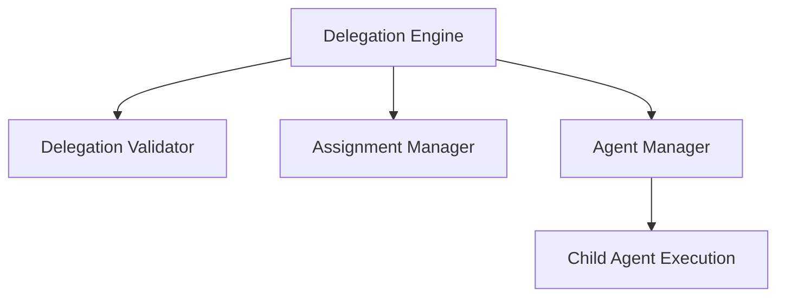
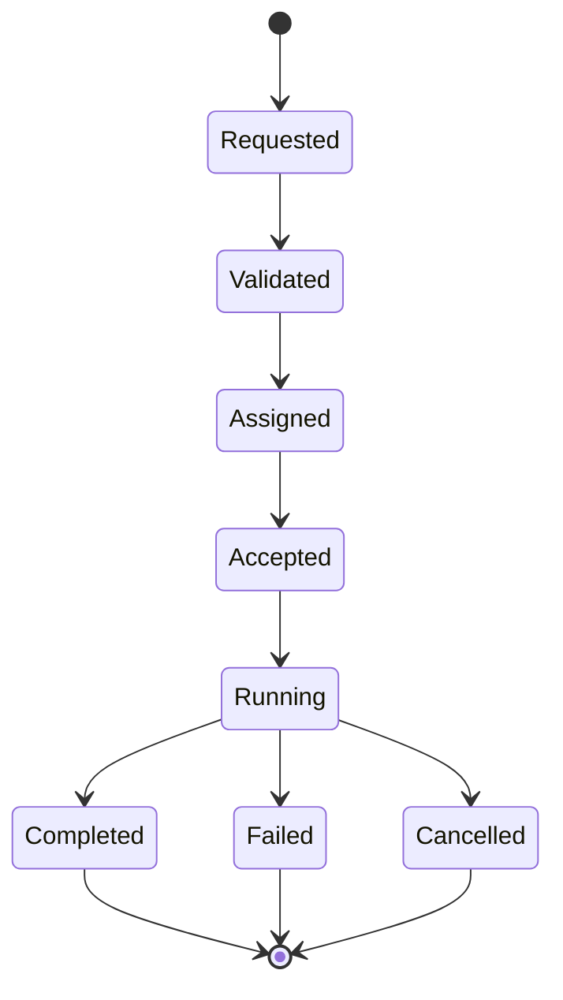

# Multi-Agent Delegation Engine

This document details the architecture, lifecycle states, selection algorithm, configuration limits, and delegation policies of the Multi-Agent Delegation Engine in SafeSeed-Ops.

---

## 1. Architecture Overview

The Delegation Engine facilitates task delegation from a parent agent to a child agent by validating capabilities, matching role metadata, and executing runs via the `AgentManager` API:



---

## 2. Delegation Lifecycle

Delegated tasks progress through lifecycle states synchronously during execution routing:



---

## 3. Assignment Policies

* **DIRECT_ASSIGNMENT:** Explicitly assigns a task to the `assigned_agent_id` parameter.
* **BEST_CAPABILITY:** Scans candidate capabilities and resolves to the agent with the highest count of matched capabilities.
* **ROUND_ROBIN:** Iterates sequentially through candidates list.
* **LEAST_BUSY:** Resolves to the candidate with the lowest historical `execution_count` metric.
* **FIRST_AVAILABLE:** Selects the first candidate from the provided list.

---

## 4. Assignment Validation Constraints
Prior to accepting a delegation request, `DelegationValidator` enforces the following safety controls:
* **Circular Delegation Check:** Rejects requests if the child agent exists in the active parent execution chain.
* **Delegation Depth Check:** Rejects requests exceeding `PlatformSettings.MULTI_AGENT_MAX_DELEGATION_DEPTH` (Default: 4).
* **Target Health & Availability:** Verifies candidate availability and checks `health_status == "Healthy"`.
* **Capability Validation:** Ensures child agent capabilities cover the required task capabilities list.

---

## 5. Examples

### Performing Capability-Based Delegation
```python
from app.agents.collaboration import (
    DelegationEngine,
    DelegationRequest,
    DelegationPolicy,
    AgentTask
)

# 1. Setup delegation task specifying required capabilities
task = AgentTask(
    task_id="t-909",
    title="Run Python Verification Script",
    assigned_agent_id="agent-coord",
    capabilities_required=["run-code"]
)

request = DelegationRequest(
    request_id="req-505",
    parent_agent_id="agent-coord",
    child_agent_id="agent-coord", # Placeholder updated by policy resolver
    delegated_task=task
)

# 2. Trigger delegation routing using BEST_CAPABILITY policy
engine = DelegationEngine(agent_manager)
res = await engine.delegate_task(
    request=request,
    policy=DelegationPolicy.BEST_CAPABILITY,
    candidates=["agent-coord", "agent-exec-1", "agent-exec-2"]
)

if res.success:
    print(f"Task executed successfully. Outputs collected: {res.outputs}")
else:
    print(f"Delegation failed: {res.errors}")
```
