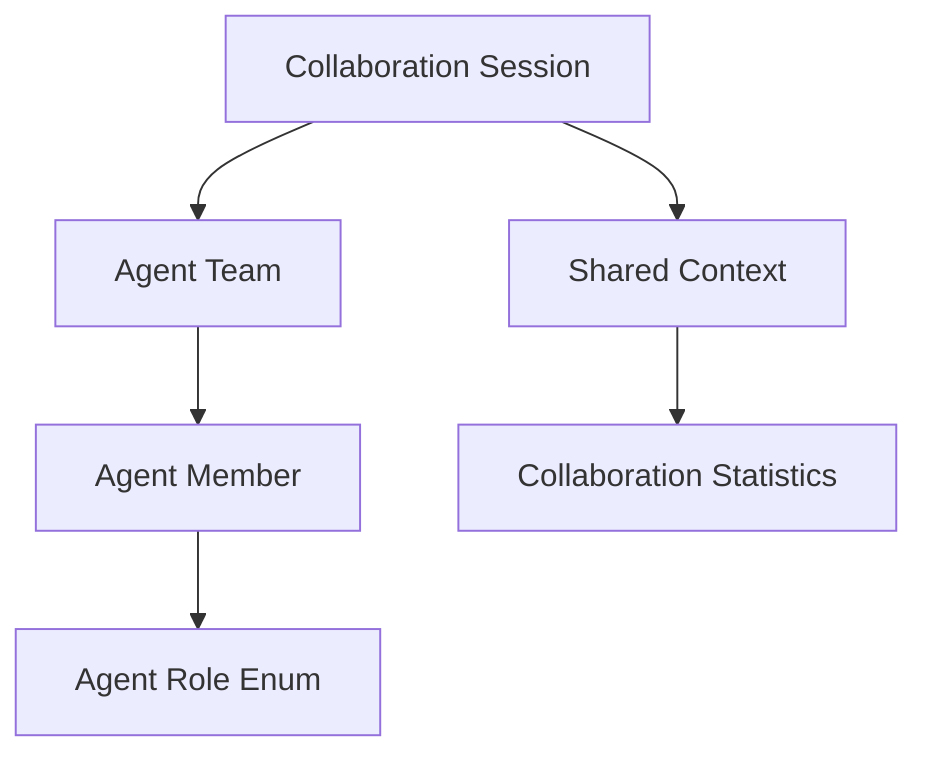
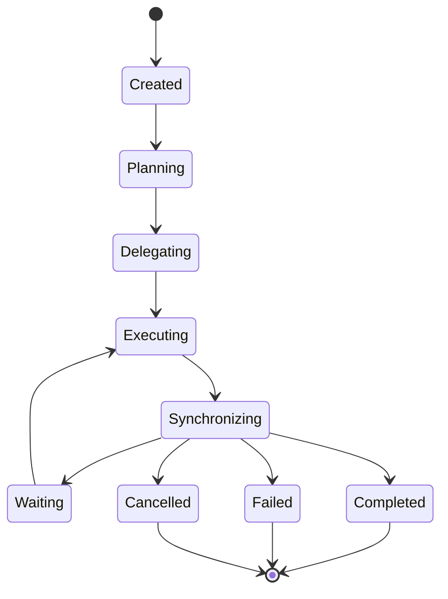

# Multi-Agent Domain Models & Collaboration Foundation

This document details the architecture, domain models, lifecycle states, roles, and delegation models for Multi-Agent Collaboration in SafeSeed-Ops.

---

## 1. Architecture Overview

The Multi-Agent Collaboration layer defines contracts and models to group cooperating agents, coordinate work task delegation, and share workspace variable contexts:



---

## 2. Collaboration Lifecycle

The state transition flow tracks team activities from instantiation to completion:



* **Created:** Initial state when session details are registered.
* **Planning:** Coordinator/planner member formulating schedules.
* **Delegating:** Dispatched tasks are delegated to specific executor agents.
* **Executing:** Target agent tasks are actively running.
* **Synchronizing:** Sharing variables, updates, or output parameters.
* **Waiting:** Awaiting parent/child dependencies.

---

## 3. Agent Roles

Roles are metadata parameters describing collaborative capabilities:
* **Coordinator:** Manages team assignments and delegation queues.
* **Planner:** Compiles topological execution schedules.
* **Executor:** Executes individual tasks and dispatches tools.
* **Reviewer / Validator:** Reviews outputs and runs verification checks.
* **Specialist / Observer:** Custom domain roles.

---

## 4. Shared Context & Variables

Shared workspaces map workflow variables, memory references, and metrics:
* `SharedContext.shared_variables` — Stores variable payloads globally visible to all team members, checked against `PlatformSettings.MULTI_AGENT_MAX_SHARED_VARIABLES` (Default: 128).
* `SharedContext.execution_statistics` — Aggregates tasks completed, failure rates, and execution run duration.

---

## 5. Delegation Model

Task delegation dispatches discrete tasks from parent to child agents:
* **DelegationRequest:** Tracks parent-child pairs, target task attributes, and required capabilities.
* **DelegationResult:** Encapsulates outcome metrics, return variables, and execution errors.

---

## 6. Examples

### Instantiating a Collaborating Agent Team
```python
from app.agents.collaboration import (
    AgentTeam,
    AgentMember,
    AgentRole,
    SharedContext,
    CollaborationSession
)

# 1. Register team members with roles
members = [
    AgentMember(agent_id="agent-coord", role=AgentRole.COORDINATOR, capabilities=["lead", "orchestrate"]),
    AgentMember(agent_id="agent-exec-1", role=AgentRole.EXECUTOR, capabilities=["filesystem", "read"]),
]

team = AgentTeam(team_id="team-alpha", name="Alpha Ops Team", members=members)

# 2. Setup shared variable workspace
ctx = SharedContext(
    workflow_id="wf-101",
    execution_id="exec-505",
    team_id="team-alpha",
    shared_variables={"run_status": "initializing"}
)

# 3. Create Collaboration Session
session = CollaborationSession(session_id="sess-99", team=team, context=ctx)
print(f"Session registered. Team name: {session.team.name}, variables: {session.context.shared_variables}")
```
