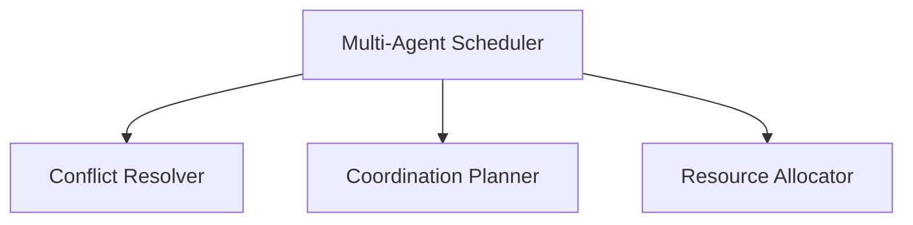
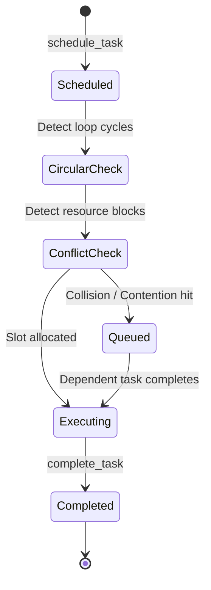

# Multi-Agent Scheduler & Conflict Resolution

This document details the architecture, scheduling lifecycle, conflict detection rules, resolution policies, resource allocations, and implementation examples of the Multi-Agent Scheduler in SafeSeed-Ops.

---

## 1. Architecture Overview

The Multi-Agent Scheduler coordinates task execution across agents while resolving runtime dependencies and conflicts:



---

## 2. Scheduling Lifecycle



---

## 3. Conflict Detection
* **Circular Dependency Check:** Resolves and validates if adding dependencies introduces dependency loops.
* **Contention Check:** Queues tasks when an assigned agent is busy.
* **Duplicate Execution Check:** Rejects requests trying to schedule active duplicate tasks.

---

## 4. Scheduling Policies
* **FIFO:** Task queue runs sequentially (oldest timestamp first).
* **PRIORITY:** Sorts queue using task priority integer (highest values first).

---

## 5. Resource Allocation
* **Execution Slots:** Limits active parallel runs according to `PlatformSettings.MULTI_AGENT_MAX_CONCURRENT_AGENTS` (Default: 8).
* **Scheduling Queue:** Restricts maximum backlog capacity up to `PlatformSettings.MULTI_AGENT_MAX_SCHEDULING_QUEUE_SIZE` (Default: 1000).

---

## 6. Examples

### Scheduling Tasks and Managing Dependencies
```python
from app.agents.collaboration import (
    MultiAgentScheduler,
    SchedulingPolicy
)

# 1. Initialize scheduler
scheduler = MultiAgentScheduler()

# 2. Schedule parent task
scheduler.schedule_task(
    task_id="t-parent",
    assigned_agent="agent-coord",
    priority=5
)

# 3. Schedule child task with dependencies
scheduler.schedule_task(
    task_id="t-child",
    assigned_agent="agent-executor",
    priority=10,
    dependencies=["t-parent"],
    policy=SchedulingPolicy.PRIORITY
)

# 4. Mark completion to progress dependent tasks
scheduler.complete_task("t-parent")
```
