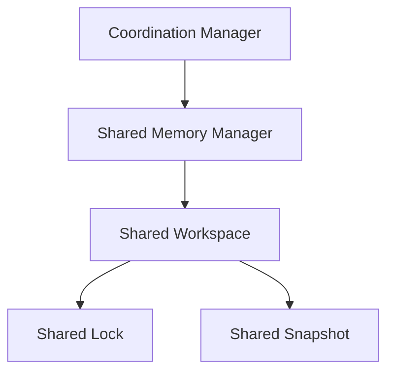
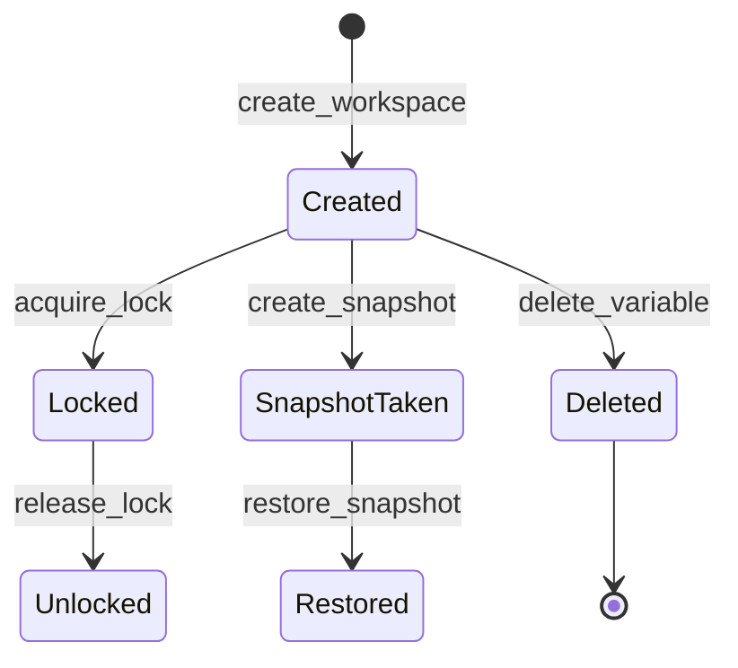

# Multi-Agent Shared Memory & Coordination

This document details the architecture, workspace scopes, isolation levels, synchronization policies, snapshots, and implementation examples of the Shared Memory Coordination layer in SafeSeed-Ops.

---

## 1. Architecture Overview

The Shared Memory Coordination layer coordinates access to workspace variables and outputs across agents:



---

## 2. Workspace Lifecycle Scopes



---

## 3. Synchronization Policies
* **READ_ONLY:** Restricts workspace to read operations.
* **EXCLUSIVE_WRITE:** Requires the agent to acquire an active non-expired `SharedLock` on the variable before writing.
* **LAST_WRITE_WINS:** Standard overwriting without lock checks.
* **OPTIMISTIC:** Uses version tracking variables to prevent conflicting updates.

---

## 4. Isolation & Safety Controls
To prevent multi-tenant and session leakage:
* **Tenant Isolation:** Separates workspace datasets via `tenant_id` namespace filters.
* **Session Isolation:** Scopes variables to active `session_id` session keys.
* **Execution & Workflow Isolation:** Prevents data crossover between concurrent workflow executions.

---

## 5. Configuration Limits
Parameters are configured under `PlatformSettings`:
* `MULTI_AGENT_MAX_SHARED_VARIABLES` — Max variables allowed in workspace (Default: 128).
* `MULTI_AGENT_WORKSPACE_TIMEOUT_SECONDS` — Connection timeout threshold (Default: 30.0s).
* `MULTI_AGENT_MAX_SNAPSHOT_HISTORY` — Maximum snapshot copies kept (Default: 10).

---

## 6. Examples

### Performing Optimistic and Exclusive Locking
```python
from app.agents.collaboration import (
    SharedMemoryManager,
    CoordinationManager,
    SynchronizationPolicy
)

# 1. Initialize manager structures
mem_manager = SharedMemoryManager()
coord_manager = CoordinationManager(mem_manager)

# 2. Create workspace
mem_manager.create_workspace(
    workspace_id="ws-999",
    workflow_id="wf-1",
    execution_id="exec-1",
    team_id="team-1",
    session_id="sess-1"
)

# 3. Exclusive write using lock coordination
lock = await coord_manager.acquire_lock("ws-999", "shared_var", "agent-executor-1")
if lock:
    success = mem_manager.write_variable(
        workspace_id="ws-999",
        key="shared_var",
        value="secured_value",
        agent_id="agent-executor-1",
        policy=SynchronizationPolicy.EXCLUSIVE_WRITE
    )
    await coord_manager.release_lock("ws-999", "shared_var", "agent-executor-1")
```
