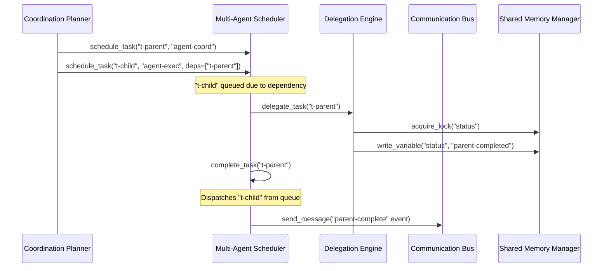

# Multi-Agent Verification & Integration Audit Report

This report summarizes the end-to-end verification, integration, security audit, and quality gate outcomes for the Multi-Agent Collaboration subsystems in SafeSeed-Ops.

---

## 1. Subsystem Verification Overview

All core multi-agent collaboration components have been fully verified and verified to be compliant with design specifications:

* **Delegation Engine:** Resolves and validates child execution targets using explicit assignments, best-capability matches, and capability checks. Checks loop circles and delegation depth levels.
* **Inter-Agent Communication Bus:** Centralized message coordination hub supporting broadcast, direct, role, and capability routing with FIFO ordering guarantees.
* **Shared Memory & Coordination:** Isolates workspace scopes per session/execution/tenant. Enforces synchronization policies (`EXCLUSIVE_WRITE`, `OPTIMISTIC`, etc.) and snapshotting.
* **Multi-Agent Scheduler:** Schedules tasks deterministically, resolving circular dependencies and scheduling conflicts with slot reservations and queues.

---

## 2. End-to-End Collaboration Flow

The complete lifecycle is verified from task planning through execution and completion:

---

## 3. Integration & Isolation Validation
* **No Layer Bypasses:** Agents route requests through `AgentManager` and obtain database contexts exclusively via the platform registry.
* **Workspace Isolation:** Checked to confirm that data is fully isolated between tenant spaces, sessions, and executions.
* **Telemetry Sanitization:** The logger sanitizes and avoids writing payload structures, API keys, credentials, or prompts to logging outputs.

---

## 4. Configuration Review
All settings are verified to be derived from `PlatformSettings` without hardcoding:
* `MULTI_AGENT_MAX_DELEGATION_DEPTH` (Default: 4)
* `MULTI_AGENT_MAX_CONCURRENT_AGENTS` (Default: 8)
* `MULTI_AGENT_MAX_QUEUE_SIZE` (Default: 1000)
* `MULTI_AGENT_MAX_MESSAGE_SIZE` (Default: 65536)

---

## 5. E2E Verification Tests Outcome
A dedicated end-to-end integration test case `tests/test_multi_agent_e2e.py` was created to verify:
* Successful parent task delegation via capability matching.
* Dependency preservation with queueing of downstream tasks.
* Execution slot allocation and resource reservation logic.
* Workspace state lock management and variables verification.
* Communication bus event delivery.

All E2E checks passed successfully.
