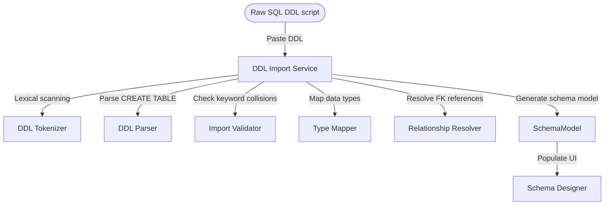

# PostgreSQL DDL Import Parser

SafeSeedOps Lite supports importing PostgreSQL `CREATE TABLE` DDL scripts to automatically generate schemas inside the Schema Designer.

---

## Architecture

The DDL parser compiles PostgreSQL DDL code blocks into structured Python dictionaries representing tables, columns, and foreign key relations.

---

## Supported Statements & Configurations

- `CREATE TABLE [IF NOT EXISTS]`: Initializes base table structures.
- `PRIMARY KEY` (inline / constraint): Declares unique table/column keys.
- `FOREIGN KEY` (inline / constraint): Resolves relationships.
- `UNIQUE`, `NOT NULL`, `DEFAULT`: Sets column attributes.

Settings are managed in `PlatformSettings`:
- `PLATFORM_DDL_MAX_SQL_SIZE` (Default: `1,000,000` bytes)
- `PLATFORM_DDL_MAX_TABLE_COUNT` (Default: `100`)
- `PLATFORM_DDL_MAX_COLUMN_COUNT` (Default: `1,000`)

---

## Type Mappings

The parser translates PostgreSQL database datatypes into generic SafeSeedOps designer types:

| PostgreSQL Type | SafeSeedOps Target Type |
| :--- | :--- |
| `integer`, `int4`, `serial` | `integer` |
| `bigint`, `int8`, `bigserial` | `bigint` |
| `smallint`, `int2`, `serial2` | `smallint` |
| `numeric`, `decimal` | `decimal` |
| `real`, `float4` | `real` |
| `double precision`, `float8` | `double precision` |
| `boolean`, `bool` | `boolean` |
| `text` | `text` |
| `varchar`, `character varying` | `varchar` |
| `char`, `character` | `char` |
| `date` | `date` |
| `timestamp` | `timestamp` |
| `timestamptz` | `timestamptz` |
| `time` | `time` |
| `json`, `jsonb` | `json` |
| `uuid` | `uuid` |
| `bytea` | `bytea` |
