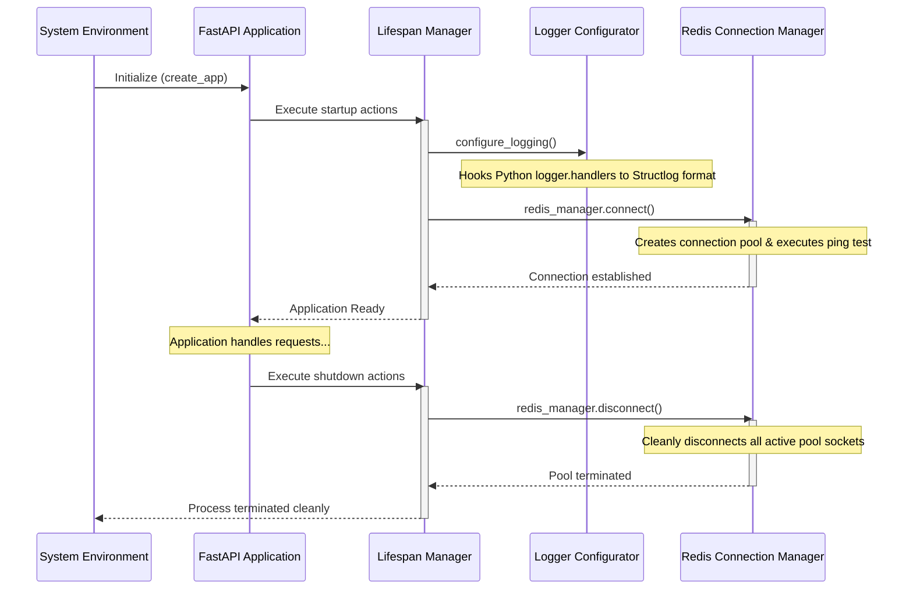

# SeedOps Lite - Backend Foundation

SeedOps Lite is an enterprise-grade synthetic relational database generator using a multi-agent architecture. This project provides the production-ready scaffolding and backend foundation for the platform.

---

## Folder Structure

The project follows a clean, modular architecture structure designed to scale as business logic is added:

```
safeseedops-lite/
├── app/                        # Application Source Code
│   ├── api/                    # HTTP Interfaces, Routes, Middleware, & Dependency Injection
│   │   ├── endpoints/          # Route controller logic (e.g., health checks)
│   │   ├── deps.py             # Dependency injection providers (e.g., Redis client)
│   │   ├── middleware.py       # Global logging, exception mapping, & Correlation ID middlewares
│   │   └── router.py           # Endpoint routers aggregation
│   ├── core/                   # Shared system utilities & core configuration
│   │   ├── config.py           # Pydantic v2 configuration settings loader
│   │   ├── exceptions.py       # Standard domain-driven exception classes
│   │   ├── logging.py          # Structured JSON & console log configurations (Structlog)
│   │   └── redis.py            # Redis Async connection pool manager
│   ├── agents/                 # Multi-agent orchestrators & base agents (future phase)
│   ├── skills/                 # Seeder & tester execution scripts (future phase)
│   ├── workflow/               # State machine & workflow engine (future phase)
│   ├── services/               # Internal business logic (future phase)
│   ├── models/                 # Database/relational storage models (future phase)
│   ├── schemas/                # API request/response validation schemas (future phase)
│   ├── storage/                # File systems & target connection pools (future phase)
│   ├── telemetry/              # Metrics, Tracing, & Monitoring hooks (future phase)
│   ├── resilience/             # Circuit Breakers & Retry handlers (future phase)
│   ├── binding/                # Schema bindings engine (future phase)
│   ├── exporter/               # File exporters (CSV, SQL, JSON) (future phase)
│   └── utils/                  # Helper functions
├── configs/                    # Application and system configuration files
├── docker/                     # Dockerfiles & container runtime scripts
│   └── Dockerfile              # Multi-stage production runtime container configuration
├── docs/                       # Design documents & technical specification manuals
├── logs/                       # Application local standard output files
├── prompts/                    # LLM Prompt Templates for agent instructions
├── scripts/                    # Management & utility automation scripts
├── tests/                      # Testing Suite
│   ├── conftest.py             # Test-scoped fixtures (app instance, AsyncClient, event loop)
│   ├── test_health.py          # Integration tests for health route
│   └── test_redis.py           # Unit tests for RedisConnectionManager
├── .dockerignore               # Docker context-ignore rules
├── .env                        # Local runtime environment file (ignored by Git)
├── .env.example                # Example environment template
├── .gitignore                  # Git-ignore rules
├── docker-compose.yml          # Local container orchestration file
└── pyproject.toml              # Build tool, dependency configuration, and QA settings
```

---

## Architectural Decisions

### 1. Async-First Infrastructure
By leveraging `FastAPI` and async `redis-py`, the foundation handles high I/O workloads with high concurrency and low overhead. This is crucial for multi-agent workloads where the application will spawn multiple background execution tasks and wait on remote models or processes.

### 2. Standardized Custom Exceptions
Domain exceptions inherit from a base `SeedOpsError` and specify semantic HTTP status codes. Uncaught domain exceptions are intercepted globally in the middleware layer, yielding standardized error messages instead of leaking internal traces to clients.

### 3. Structured Contextual Logging (Structlog)
Logs are routed through `Structlog` to provide structured JSON outputs in staging and production environments, and human-readable, colorized output in local development. A thread-safe, async-safe `ContextVar` carries a `Correlation ID` throughout the request lifecycle, ensuring all log messages triggered by a request carry the exact same ID for traceback analysis.

### 4. Non-Blocking Connection Pooling (Redis)
Rather than opening and closing connection streams per request, a managed connection pool runs under the app lifespan, initializing at startup and terminating gracefully at shutdown.

---

## Startup Flow

The lifecycle of the FastAPI application is managed using the modern async lifespan context manager:



---

## Configuration Strategy

Configuration settings are loaded dynamically using **Pydantic v2 Settings** (`BaseSettings`):
- **Validation**: Ensures that crucial configuration keys (such as `REDIS_PORT` and `APP_PORT`) are typed correctly (e.g., as integers).
- **Environment Matching**: Environment variables are fetched from the OS, fallback to `.env` local file values, and default values are defined directly in code.
- **Fail-Fast**: If invalid settings are provided (e.g., incorrect formats), the application will immediately fail to start up, pointing out the configuration error.

---

## Export & Data Delivery Workflow

The **Export & Data Delivery** module allows users to compile and download generated mock datasets.

### 1. Supported Export Formats
The system supports the following formats out-of-the-box:
- **JSON**: Serializes table entities into a unified JSON document structure.
- **CSV**: Compiles individual database tables into separate comma-separated values files.
- **SQL**: Generates a clean script of SQL standard `INSERT` statements with proper string escaping.

The design utilizes a **Registry Pattern** via `SerializerRegistry` allowing future serialization formats (e.g. Parquet, Excel) to be added without modifying the core export engine.

### 2. Export Configuration Settings
Through the UI, users can configure:
- **Tables to Export**: Multi-select database entities to include in the output.
- **File Consolidation**: Export as a single unified file or multiple separate files.
- **ZIP Compression**: Pack final outputs into a compressed `.zip` archive.
- **Schema Metadata**: Optionally include a `metadata.json` detailing row counts, formats, and export timestamps.
- **Naming Conventions**: Define default naming conventions or timestamp-suffixed files.

### 3. Job Lifecycle Integration
All export operations run as background tasks and integrate directly with the **Job History** registry:
- **Queued**: Export task is registered and scheduled.
- **Running (Preparing)**: Retrieve generated datasets from Redis (`generation:{id}:records`).
- **Running (Exporting)**: Serialize records using the designated format serializer.
- **Running (Packaging)**: Package multiple files, zip-compress, or inject metadata.
- **Completed**: Generate SHA-256 integrity checksums, store file payload in Redis, and transition status to complete.
- **Failed**: Gracefully halt and log failure messages to the audit log details.

---

## QA and Development

To format and check code quality:

```bash
# Code Formatting (Black)
black app/ tests/

# Linting & Import Sorting (Ruff)
ruff check app/ tests/

# Type Checking (MyPy)
mypy app/

# Run Tests (Pytest)
pytest
```

---

## Development Workflow

### What is Seed?

Seed is the official engineering workflow for SafeSeed-Ops. Seed standardizes repository validation, quality gates, security checks, Git operations and release discipline to ensure only verified code reaches the shared repository.

Note that "Repository Guardian" is the internal implementation name of this system, while "Seed" is the developer-facing public brand.

This project enforces strict code quality checks using the Seed workflow. Developers must check status, commit, and freeze phases using the Seed CLI.

---

## Documentation

* **Workflow Guide**: [GIT_WORKFLOW.md](file:///C:/Users/lovea/Documents/hackathon/safeseedops-lite/docs/GIT_WORKFLOW.md)
* **Onboarding & Contribution Guidelines**: [CONTRIBUTING.md](file:///C:/Users/lovea/Documents/hackathon/safeseedops-lite/CONTRIBUTING.md)
* **Architecture Design**: [Architecture Guide](file:///C:/Users/lovea/Documents/hackathon/safeseedops-lite/docs/architecture/ai_platform_architecture.md)
* **Phase Roadmap**: [Roadmap](file:///C:/Users/lovea/Documents/hackathon/safeseedops-lite/docs/GIT_WORKFLOW.md#versioning-policy)
* **License**: [LICENSE](file:///C:/Users/lovea/Documents/hackathon/safeseedops-lite/LICENSE) (Apache License 2.0)

---

## License

This project is licensed under the Apache License 2.0.

See the [LICENSE](file:///C:/Users/lovea/Documents/hackathon/safeseedops-lite/LICENSE) file for details.

