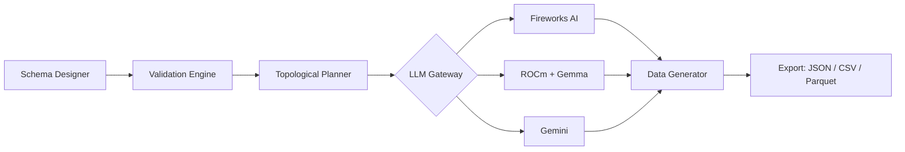

# SafeSeedOps Lite

SafeSeedOps Lite is an enterprise-grade synthetic relational database generator using a multi-agent architecture — **winner of the AMD Developer Hackathon 2026 Track 3 (Unicorn)**. This project provides the backend foundation, schema visualizer, and relational synthesis suites with native AMD ROCm support.

---

## Quick Start

### 1. Environment Configuration

Copy the example environment file and set at least your Fireworks AI API key:

```bash
cp .env.example .env
```

Edit `.env` and set `FIREWORKS_API_KEY=your_key_here`. See the [Deployment](#deployment) section for all supported environment variables.

### 2. Developer Environment Bootstrap

**Prerequisites:** Ensure [Python 3.10+](https://www.python.org/downloads/) and [uv](https://docs.astral.sh/uv/#installation) are installed:
```bash
pip install uv
```

If `uv` is not recognized after installing (Windows), add the Python Scripts folder to your PATH:
```powershell
$scripts = "$(python -m site --user-base)\Python310\Scripts"
[Environment]::SetEnvironmentVariable("Path", "$env:Path;$scripts", "User")
```
Then restart your terminal, or run `$env:Path += ";$scripts"` in the current session.

Install project dependencies:
```bash
uv sync
```

### 3. Unified Developer Startup
Launch both frontend and backend development environments automatically:
```bash
uv run seed dev
```

### 4. Advanced Alternative (Manual Startup)
If you prefer running the processes in separate terminal instances manually:
*   **Start the Backend:**
    ```bash
    uvicorn app.main:app --reload --port 8000
    ```
*   **Start the Frontend:**
    ```bash
    cd frontend
    npm install
    npm run dev
    ```
*   **Run the Demo Wizard:**
    ```bash
    uv run python scripts/demo_wizard.py
    ```

---

## AMD Integration

SafeSeedOps Lite was built for and **won the AMD Developer Hackathon 2026 Track 3 (Unicorn)**. It supports three LLM backends auto-routed in priority order:

1. **ROCm + Gemma (local)** — fastest, zero API cost
2. **Fireworks AI (cloud)** — Mixtral 8x7B for high-throughput
3. **Fallback** — Gemini / OpenAI / Anthropic

### Fireworks AI (Cloud)

Set your API key in `.env`:

```env
FIREWORKS_API_KEY=your_key_here
```

The default cloud provider uses Mixtral 8x7B via Fireworks AI for scalable generation.

### ROCm Local Inference

Requires an AMD GPU on Linux with ROCm 5.7+ installed. Auto-detected via `rocm-smi` at startup — if the command is available and returns GPU data, the local inference path is enabled automatically.

Download Gemma models for local inference:

```bash
uv run python scripts/download_model.py download gemma-2-2b-it
```

**Supported local models:**

| Model | Parameters | Min VRAM |
|-------|-----------|----------|
| Gemma 2 2B | 2.5B | 4 GB |
| Gemma 2 9B | 9B | 8 GB |
| Gemma 3 12B | 12B | 12 GB |
| Llama 3.2 3B | 3.2B | 4 GB |

### Auto-Routing Logic

At generation time, the LLM Gateway selects the best available provider:

```
Gemma models requested  →  ROCm (if available)
                              ↓
                           Fireworks AI (if key set)
                              ↓
                           Fallback provider
```

---

## Key Features

*   **Interactive Schema Designer:** Build and configure schemas locally.
*   **PostgreSQL DDL Import:** Parse and convert SQL scripts into structured relational definitions.
*   **Cost-Aware Topological Planner:** Computes sequence validation gates and execution plans for database generation.
*   **Diagnostics Health Panel:** System pre-flight warnings and fallback checks.
*   **Multi-Provider LLM Support:** Fireworks AI, ROCm + Gemma, Gemini, OpenAI, and Anthropic.
*   **AMD ROCm Integration:** Native local Gemma inference on AMD GPUs via ROCm stack.
*   **Interactive Demo Wizard:** `uv run python scripts/demo_wizard.py` for a guided generation walkthrough.

---

## Architecture

SafeSeedOps Lite uses a multi-agent pipeline where each stage is independently scalable:



1. **Schema Designer** — Parse DDL or use the visual schema builder
2. **Validation Engine** — Check column types, PK/FK constraints, nullability
3. **Topological Planner** — Compute table dependency DAG (parents before children)
4. **LLM Gateway** — Route to the best available provider (ROCm → Fireworks → Fallback)
5. **Data Generator** — PK-first, relationship-aware row generation with streaming
6. **Export** — JSON, CSV, or Parquet output

---

## Project Structure

*   `app/`: FastAPI Backend routing, validation, planning, and generation services.
*   `frontend/`: React SPA user interface.
*   `tests/`: Verification suites and performance benchmark scripts.
*   `docs/`: Design documents and technical manuals.

---

## Testing & Quality Check

```bash
# Format verification
black app/ tests/

# Linter checks
ruff check app/ tests/

# Strict type checks
mypy app/

# Unit & integration tests
pytest

# AMD end-to-end validation
uv run python scripts/e2e_amd_check.py

# Provider benchmarks
uv run python scripts/bench_providers.py
```

---

## Deployment

### Docker (Standard)

```bash
docker build -t safeseedops -f docker/Dockerfile .
docker run -p 8000:8000 --env-file .env safeseedops
```

Or with Docker Compose:

```bash
docker-compose up
```

### Docker (AMD ROCm)

For local inference on AMD GPUs with ROCm:

```bash
docker build -t safeseedops:rocm -f docker/Dockerfile.rocm .
docker run -p 8000:8000 --env-file .env --device=/dev/kfd --device=/dev/dri safeseedops:rocm
```

### Hugging Face Spaces

Push to a Hugging Face Space with Docker SDK — the `sdk: docker` frontmatter in this README is picked up automatically. The Space auto-deploys from your GitHub repository on every push.

1. Create a Space at [huggingface.co/spaces](https://huggingface.co/spaces)
2. Select **Docker** as the SDK
3. Connect your GitHub repository
4. The Space reads `app_port: 8000` from the frontmatter and serves the API

### Environment Variables

| Variable | Required | Default | Description |
|----------|----------|---------|-------------|
| `FIREWORKS_API_KEY` | Yes* | — | Fireworks AI API key |
| `GEMINI_API_KEY` | No | — | Google Gemini API key (fallback) |
| `OPENAI_API_KEY` | No | — | OpenAI API key (fallback) |
| `ANTHROPIC_API_KEY` | No | — | Anthropic API key (fallback) |
| `DATABASE_URL` | No | `sqlite:///data/safeseedops.db` | Database connection string |
| `REDIS_URL` | No | — | Redis URL for caching |
| `LOG_LEVEL` | No | `INFO` | Logging level |

\* Required unless using local ROCm inference exclusively.

---

## Documentation Home

For complete guides, tutorials, design papers, and API specifications, visit the [Documentation Home](/docs/README.md).

*   [Developer Setup Runbook](/docs/features/DEVELOPER_STARTUP.md)
*   [Overall Architecture Index](/ARCHITECTURE_INDEX.md)
*   [SafeSeedOps Pro Roadmap & Deferred Backlogs](/docs/roadmap/ROADMAP_v3.1.md)
*   [General Availability Release Notes](/docs/release/ga/GA_RELEASE_REPORT.md)

---

## License

This project is licensed under the Apache License 2.0. See [LICENSE](/LICENSE) for details.
