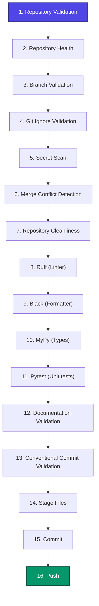
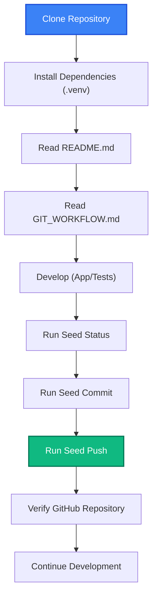

# Git Development Workflow with Seed

This document outlines the official development and release workflow for the SafeSeed-Ops platform.

Seed is the official engineering workflow for SafeSeed-Ops. Seed standardizes repository validation, quality gates, security checks, Git operations, documentation discipline and release workflows to ensure only verified code reaches the shared repository.

Note that "Repository Guardian" is the internal implementation name of this system, while "Seed" is the developer-facing public brand.

---

## Engineering Principles

SafeSeed-Ops engineering is governed by these ten core tenets:
* **Safe by Default**: The standard path is configured to be the most secure and correct way of committing code.
* **Security First**: Absolute isolation of keys, passwords, and sensitive system settings from git history.
* **Quality before Speed**: Commits are only generated if the entire codebase meets all formatting, linting, type-checking, and test suite verification gates.
* **Automation over Manual Steps**: Check gate validation is automated via pre-commit scripting instead of relying on human checks.
* **Documentation First**: New modules, configurations, or workflow adjustments must be documented before release.
* **Reproducible Development**: Build environment settings and dependencies are locked to maintain a consistent execution environment.
* **Fail Fast**: The first verification failure aborts the check sequence immediately to prevent wasteful execution.
* **Small Incremental Changes**: Promotes small, logical commits targeting single functions to ease review and maintain stability.
* **Deterministic Workflows**: Tool behaviors and gate validations yield consistent, reproducible outcomes on every system.
* **Open Source Friendly**: Structured with permissive licensing, clear contribution expectations, and standardized workflows.

---

## Seed Philosophy

Seed exists so that the easiest workflow is also the safest workflow.

Every repository operation should be:
* **Repeatable**: Run under uniform rules across all development boxes.
* **Deterministic**: Outcomes are based purely on code states and configuration files.
* **Auditable**: Commits and releases trace clearly to developer intentions via metadata.
* **Reproducible**: Operations can be re-run cleanly with identical parameters.
* **Secure**: Actively scanned for passwords, keys, and tokens.
* **Quality Gated**: Formatted, linted, type-safe, and green on tests.

---

## Complete Quality Pipeline

Before any changes are committed or exported, they are processed through the following quality gate pipeline:

> [!IMPORTANT]
> **If ANY step in the quality pipeline fails:**
> The pipeline execution will **STOP** immediately and abort. No files will be staged, no commit will be generated, and no push will be allowed. You must resolve the diagnostic error and run Seed Commit again.

---

## Contributor Onboarding Flow

Onboarding contributors must follow this path from cloning to code delivery:

---

## Checklists

### Before Every Commit
Ensure you complete this quick checklist before creating a commit:
- [ ] **Seed Status**: Run status check to scan modified/dirty files.
- [ ] **Repository Healthy**: Ensure git state and branches are clean.
- [ ] **Documentation Updated**: If application logic or parameters changed, update the relevant docs.
- [ ] **Quality Gates Pass**: Verify Ruff, Black, and MyPy report zero warnings.
- [ ] **No Secrets**: Confirm no API keys or local credentials exist in non-ignored paths.
- [ ] **Review Staged Files**: Double-check the git status staged file diff.
- [ ] **Seed Commit**: Run the commit command to enforce Conventional Commits.

### Before Every Push
Ensure you complete this quick checklist before pushing changes upstream:
- [ ] **Commit Verified**: Confirm your changes were committed via the Seed workflow.
- [ ] **Working Tree Clean**: Run a status check to verify no uncommitted changes remain.
- [ ] **Correct Branch**: Double-check that your active branch corresponds to your target feature/fix branch.
- [ ] **Review Commit Summary**: View the local commit messages to be pushed.
- [ ] **Seed Push**: Run the push command (or fallback git command) to upload changes.
- [ ] **Verify GitHub**: Confirm the code has successfully uploaded and all remote builds pass.

### Before Release
Follow this checklist to build and verify a production release:
- [ ] **All Tests Pass**: Pytest reports 100% success.
- [ ] **Ruff & Black**: Code linting and formatting are complete and compliant.
- [ ] **MyPy**: Static typing returns zero errors.
- [ ] **Documentation Complete**: Architecture manuals and README guides are updated.
- [ ] **README Verified**: Check links and instructions inside README.md.
- [ ] **LICENSE Verified**: Confirm Apache 2.0 license file is correct.
- [ ] **CHANGELOG Updated**: Record changes inside CHANGELOG.md (if present).
- [ ] **Seed Workflow Passes**: Full Seed status check returns HEALTHY.
- [ ] **GitHub Verified**: Remote tests and tagging build green.

---

## Versioning Policy

SafeSeed-Ops adheres to **Semantic Versioning (SemVer)** using the standard `MAJOR.MINOR.PATCH` format:
* **MAJOR**: incompatible API changes.
* **MINOR**: backward-compatible functionality additions.
* **PATCH**: backward-compatible bug fixes.

### Example Phase Roadmap
The project follows a phased release roadmap:
* `v0.1.0` – Initial Backend Release (Core data engines and pipelines complete)
* `v0.2.0` – Frontend MVP (Visual schema dashboard and user CLI tool)
* `v0.3.0` – Authentication (Access control and credential security)
* `v0.4.0` – Cloud Deployment (Kubernetes templates and cloud runners)
* `v1.0.0` – Production Release (Highly robust, production-ready release)

---

## Repository Standards

The repository must always contain the following structured directories and files:
* [README.md](/README.md) – Setup and quickstart guide.
* [LICENSE](/LICENSE) – Apache License 2.0.
* [.gitignore](/.gitignore) – Excluded caches, environments, and secrets.
* [.gitattributes](/.gitattributes) – Line ending attributes configurations.
* `docs/` – Design specs and platform architecture guides.
* `tests/` – Python test suite.
* `.skills/` – Custom agent skills (including the Seed Skill).
* `pyproject.toml` – Dependency definitions and tool configurations.
* [docs/architecture/ai_platform_architecture.md](/docs/architecture/ai_platform_architecture.md) – Architecture documentation.
* [docs/GIT_WORKFLOW.md](/docs/GIT_WORKFLOW.md) – Workflow documentation.

---

## Command Reference & Future Roadmap

This table includes current implementations as well as future roadmap additions:

### Active Commands
| Command | Action | Description |
| :--- | :--- | :--- |
| `seed status` | **Seed Status** | Scans Git status, active merge conflicts, and runs all quality gate diagnostics. |
| `seed commit` | **Seed Commit (Auto)** | Runs quality checks and commits with auto-generated Conventional Commit message. |
| `seed commit -m "<msg>"` | **Seed Commit** | Runs quality checks, validates message format, and commits. |
| `seed commit -f <files>` | **Seed Selective Commit** | Performs checks and commits only specific files. |
| `seed freeze -p <phase>` | **Seed Freeze** | Updates `.frozen_phases.json` registry, runs checks, commits, and tags as `phase-<phase>`. |

### Planned Commands (Roadmap)
| Command | Action | Description |
| :--- | :--- | :--- |
| `seed check` | **Seed Check** *(Planned)* | Verify the project structure against specifications without committing. |
| `seed push` | **Seed Push** *(Planned)* | Verify remote branch state and execute git push. |
| `seed release` | **Seed Release** *(Planned)* | Prepares release changelogs and pushes production tags. |
| `seed doctor` | **Seed Doctor** *(Planned)* | Auto-resolves package lock inconsistencies and system environments. |
| `seed audit` | **Seed Audit** *(Planned)* | Runs automated security dependency scan and secrets search. |
| `seed upgrade` | **Seed Upgrade** *(Planned)* | Pulls the latest version of the Seed skill components. |

---

## Emergency Workflow (Fallback)

Direct Git commands remain available **ONLY** in the following exceptional cases:
* **Merge conflict resolution** (manually editing files and staging them via `git add`).
* **Repository recovery** (performing `git reset`, `git revert`, or restoring commit states).
* **Rebase** (updating feature branch history with main).
* **Cherry-pick** (moving specific commit hashes between branches).
* **Interactive history editing** (`git commit --amend`, `git rebase -i`).
* **Debugging** (examining historical commit states or checkout tags).
* **Advanced maintenance** (managing hooks, removing bloated binaries).

Normal day-to-day development commits must always use the Seed workflow commands.
