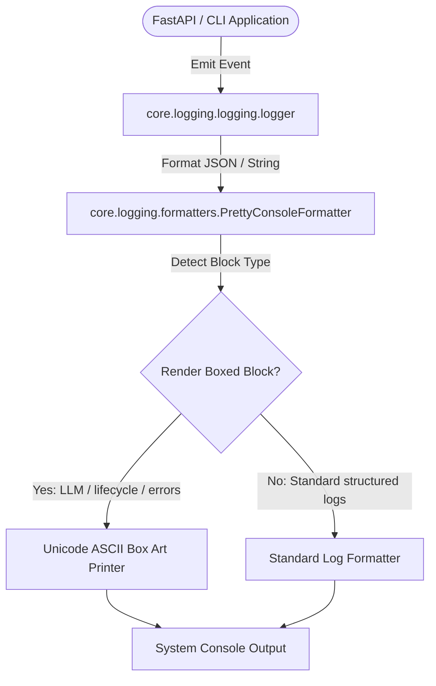

# Logging and Observability Architecture

This document describes the structured logging UX, telemetry instrumentation, and visual block format design for SafeSeed-Ops Lite.

## 1. Architecture Overview

SafeSeed-Ops Lite uses a structured logging architecture centered around the [core logger](/app/core/logging/logging.py) that propagates events containing structured diagnostic fields (Component, Correlation ID, Request ID, Environment) and outputs them to standard consoles using a custom parser.



## 2. Console Box Formats

The [`PrettyConsoleFormatter`](/app/core/logging/formatters.py) formats key developer experience events into beautiful, boxed Unicode outputs.

### LLM Call Log Block
When an AI contract execution begins or completes, the system emits an HSL-tailored boxed segment indicating LLM request details, prompts, and tokens metrics:

```
┌───────────────────────────────── LLM CALL DETAILS ──────────────────────────────────┐
│ TYPE: Request                                                                       │
│ PROMPT:                                                                             │
│ > Generate synthetic user table seeds conforming to VARCHAR constraints...          │
├─────────────────────────────────────────────────────────────────────────────────────┤
│ METRICS:                                                                            │
│ - Estimated Cost: $0.002                                                            │
│ - Latency: 120.00 ms                                                                │
└─────────────────────────────────────────────────────────────────────────────────────┘
```

### Lifecycle Lifecycle Blocks
On application Startup, Shutdown, or Generation Workflow Lifecycle transitions, the application prints a solid separator banner:

```
┌───────────────────────────────── STARTUP SUMMARY ───────────────────────────────────┐
│ VERSION: 1.0.0 (development)                                                        │
│ DB CONNECTIVITY: SQLite Active                                                      │
│ REDIS CACHE: Redis Disconnected                                                      │
│ RUNTIME PATH: app.platform.providers.runtime.MemoryRuntimeProvider                  │
└─────────────────────────────────────────────────────────────────────────────────────┘
```

## 3. Workflow Execution Summary

Upon completion of any generation run, a comprehensive summary statistics block is outputted:

| Statistic | Details |
|---|---|
| **Workflow ID** | Unique UUID representing execution lifecycle |
| **Duration** | Total milliseconds taken |
| **Tables Generated** | Count of generated target datasets |
| **Rows Generated** | Sum total of generated rows |
| **LLM Calls** | Total queries made to provider |
| **Cache Hits/Misses** | Cache lookup metrics |
| **Dataset / Export Size** | Physical storage utilization statistics |

## 4. Error Presentation Layout

Standard stack traces are suppressed at the terminal view layer. A clean visual box outlines:
1. **Component**: Name of failing subsystem.
2. **Cause**: Clear description of what went wrong.
3. **Action**: Immediate developer actionable resolution.
4. **Root Cause**: Error message from lowest layer.
