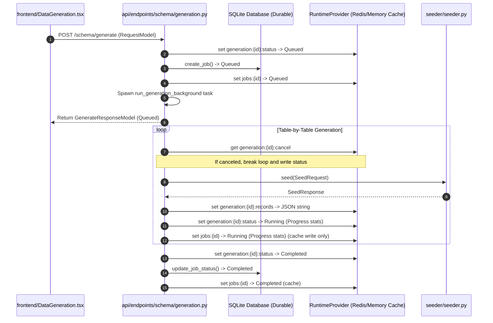
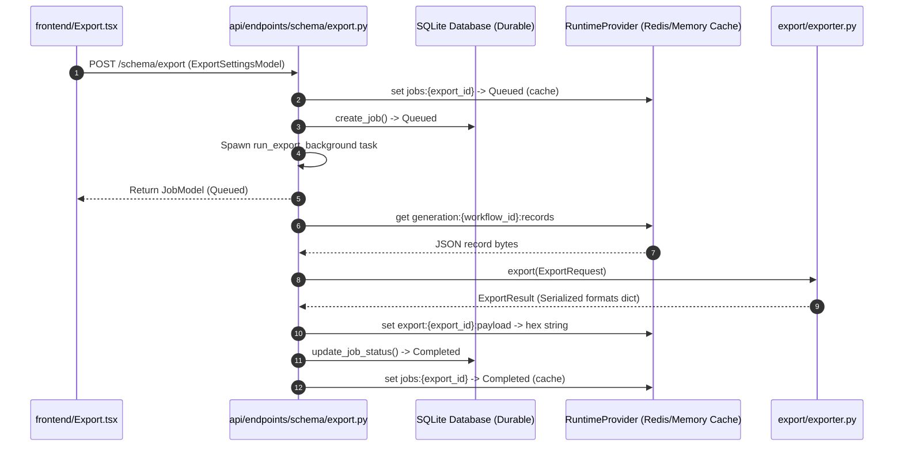
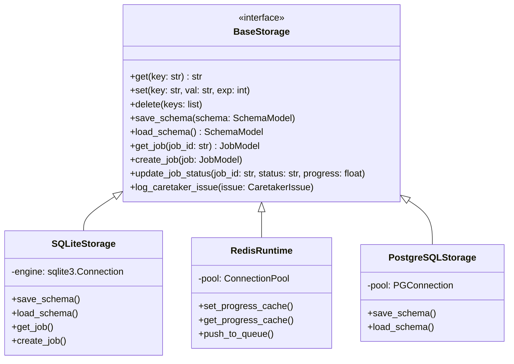
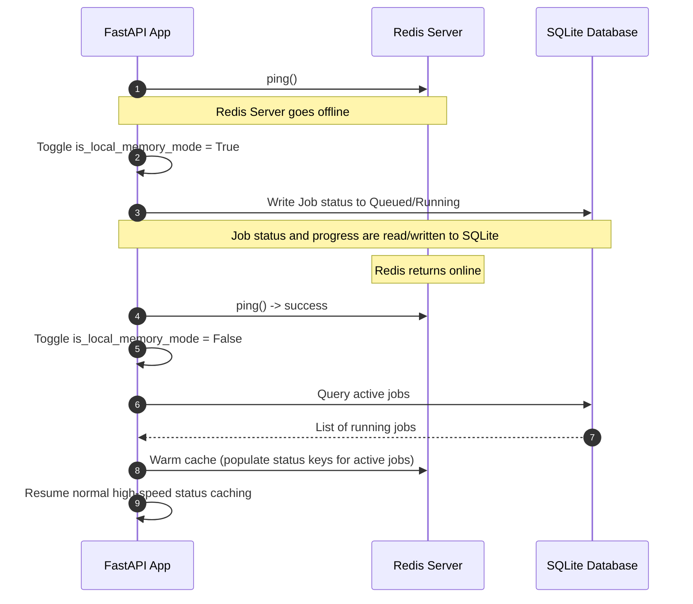
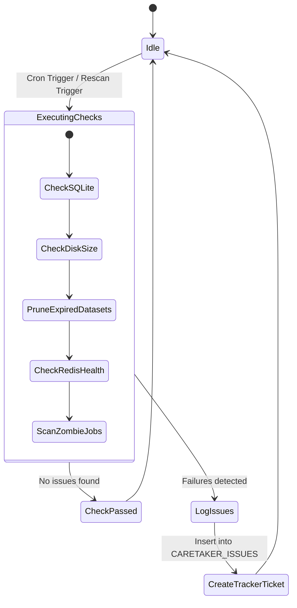
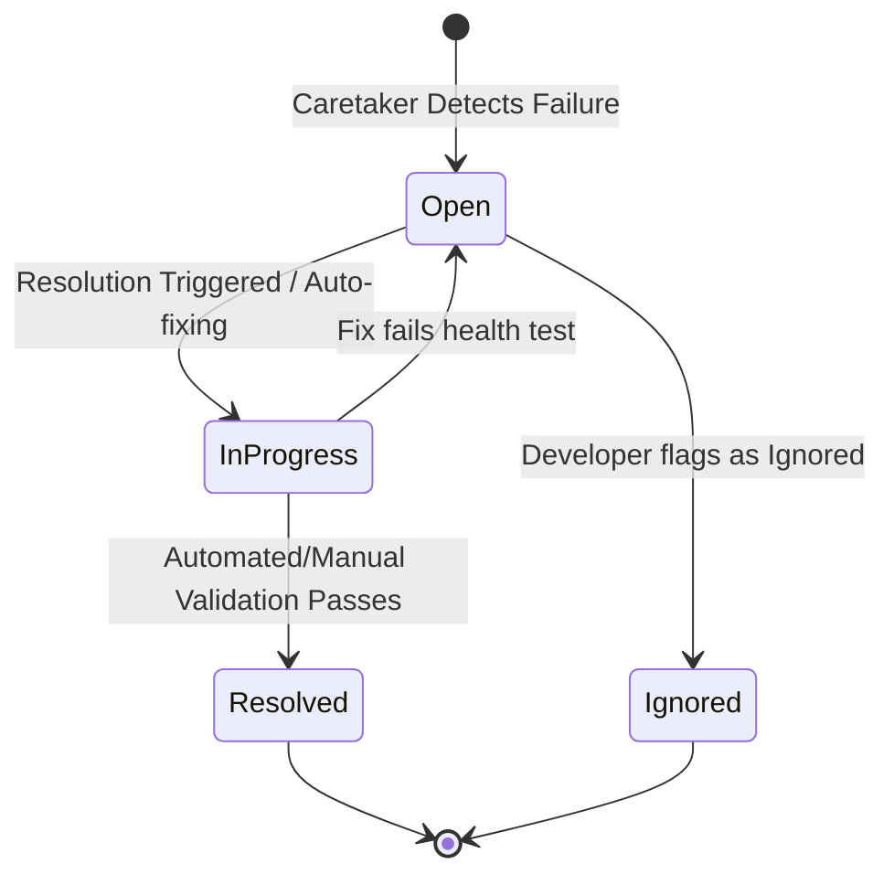
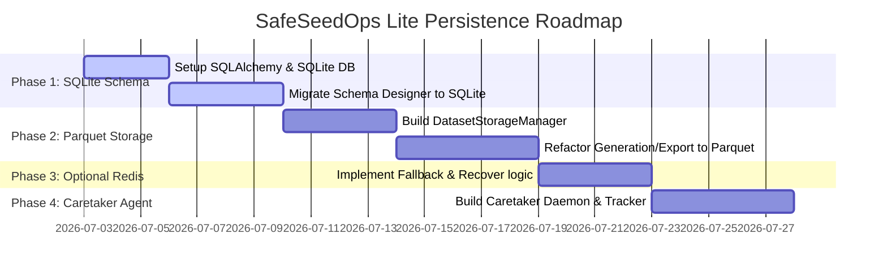

# Persistence & Runtime Architecture Specification
**SafeSeedOps Lite & Pro Next-Generation Storage Strategy**

---

## 1. Executive Summary & Goal
The next-generation persistence and runtime architecture for SafeSeedOps (supporting both Lite and Pro editions) transitions the application from a purely transient, cache-bound architecture to a resilient, enterprise-ready layered storage system. 

The storage architecture is organized under the following hierarchy:

### SQLite (Single Source of Truth)
SQLite is the **only durable persistence layer** for SafeSeedOps.
Stores:
*   Projects
*   Schemas
*   Jobs (Historical & State)
*   Job History
*   Metadata
*   Dataset Metadata
*   Export Metadata
*   Runtime Configuration

A Redis outage or database reset must NEVER cause any persistent SQLite data to be lost.

### RuntimeProvider (Transient Runtime Cache)
RuntimeProvider (Redis or Memory fallback) is **not a database**. It serves strictly as a performance-enhancing runtime cache, message broker, and real-time job progress coordinator. Everything stored here must be transient and disposable.
Stores:
*   Queue messages
*   Cancellation flags
*   Heartbeats
*   Websocket state
*   Live progress / status cache
*   Temporary preview cache
*   Temporary export payload cache

### DiskDatasetStorageManager (Parquet Storage)
DiskDatasetStorageManager handles saving synthetic datasets directly to disk in Parquet format with a `manifest.json`.
Stores:
*   Generated Datasets (Parquet files)
*   Dataset manifests

---

## 2. Current Architecture Review

### 2.1 Current Storage Architecture
The current implementation relies on `app/core/storage/base.py` which abstracts key-value and set operations.
```text
                 +---------------------------------------+
                 |            API Router                 |
                 +---------------------------------------+
                                     |
                       [Depends(get_redis)] (BaseStorage)
                                     |
                +--------------------+--------------------+
                |                                         |
    +-----------v-----------+                 +-----------v-----------+
    |     RedisStorage      |                 |    MemoryStorage      |
    | (Wraps aioredis pool) |                 | (Transient dict/set)  |
    +-----------+-----------+                 +-----------+-----------+
                |                                         |
     +----------v----------+                   +----------v----------+
     |     Redis Server    |                   |  Local RAM Buffer   |
     +---------------------+                   +---------------------+
```

### 2.2 Redis Keys and Responsibilities
The active system keys in the current codebase include:
*   `schema_designer:state`: Serialized JSON holding designer tables, columns, and relationships.
*   `generation:{workflow_id}:status`: Execution state tracker containing table-by-table counts.
*   `generation:{workflow_id}:records`: Raw dictionary of generated records (JSON array values).
*   `generation:{workflow_id}:cancel`: Flag string (`"true"`) signaling task cancellations.
*   `export:{export_job_id}:payload`: Serialized hex bytes of the formatted file for retrieval.
*   `jobs:all_ids`: Set holding active/historical job identifiers.
*   `jobs:{job_id}`: Job execution details (timers, records count, logs, status).

### 2.3 Existing Flows

#### Dataset Generation Flow


#### Export Flow


### 2.4 Current Limitations
1.  **Transient Storage**: If the Redis container crashes or memory restarts, all schemas, projects, and job logs are permanently lost.
2.  **Memory Bloating**: Storing millions of rows of mock record JSON strings inside Redis values leads to severe memory footprint inflation, triggering OOM (Out Of Memory) aborts.
3.  **Lack of Relational Queries**: Querying job statistics or searching through historical validation logs requires fetching all keys and filtering them in-memory, which degrades performance as job lists grow.
4.  **No Transactional Guarantees**: A crash midway through generation leaves orphaned keys in Redis without consistency validations.

### 2.5 Platform Domains
SafeSeedOps Lite establishes four core platform domains:
1.  **Persistence Domain**: Tracks all permanent business metadata, including Projects, Schemas, Jobs, Settings, and Validation history.
2.  **Runtime Domain**: Manages real-time status caching, temporary progress trackers, task queues, and Redis interactions.
3.  **Artifacts Domain**: Manages generated Parquet files, metadata, export bundles, zip packages, and retention policies.
4.  **Operations Domain**: Drives Caretaker agent monitoring, security checks, diagnostics, and the Issue Event tracking framework.

For detailed guidelines on decoupling and Swappable Providers, see [PLATFORM_PRINCIPLES.md](file:///C:/Users/lovea/Documents/hackathon/safeseedops-lite/docs/architecture/PLATFORM_PRINCIPLES.md).
For the complete SQLite schema design specification, see [SQLITE_SCHEMA.md](file:///C:/Users/lovea/Documents/hackathon/safeseedops-lite/docs/database/SQLITE_SCHEMA.md).

---

## 3. Layered Architecture

```text
  +-------------------------------------------------------------+
  |                      Frontend (React)                       |
  +------------------------------+------------------------------+
                                 | HTTP / REST
  +------------------------------v------------------------------+
  |                       FastAPI Router                        |
  +------------------------------+------------------------------+
                                 | Calls
  +------------------------------v------------------------------+
  |                    Application Services                     |
  |   (ValidationAgent, HybridSeeder, Exporter, Caretaker)     |
  +------------------------------+------------------------------+
                                 | Resolves
  +------------------------------v------------------------------+
  |                        Storage Layer                        |
  |    (SQLite Engine, Disk dataset writer, Redis fallback)     |
  +--------------------+--------------------+-------------------+
                       |                    |
        +--------------v-------+    +-------v--------------+
        |    SQLite Database   |    | Disk (Parquet/JSON)  |
        |  (Primary Registry)  |    |  (Dataset Registry)  |
        +----------------------+    +----------------------+
```

### 3.1 Layer Responsibilities

#### 1. Frontend
*   Renders Schema Designer canvas, generation panels, and maintenance widgets.
*   Polls health and displays system status warnings (e.g., active fallback warning alerts).
*   Coordinates debounced auto-saves and validates canvas states.

#### 2. FastAPI Router
*   Ingests requests, enforces payload contracts, and routes to correct application domains.
*   Enforces standard rate limit bounds and CORS configurations.

#### 3. Application Services
*   **ValidationAgent**: Executes structural rules checks and communicates with LLM agents.
*   **HybridSeeder**: Orders tables topologically and computes mock record allocations.
*   **Exporter**: Serializes dataset columns to raw target file types.
*   **Caretaker**: Monitors database hygiene and disk size footprints.

#### 4. Storage Layer
*   Mediates between relational queries, disk caching, and task state tracking.
*   Orchestrates warm-caching on Redis restarts and coordinates database connection fallback handlers.

---

## 4. SQLite Storage Schema (Primary Source of Truth)

SQLite will act as the relational datastore. The proposed schema design is outlined below:

```mermaid
erDiagram
    PROJECTS ||--o{ SCHEMAS : "contains"
    PROJECTS ||--o{ JOBS : "executes"
    SCHEMAS ||--o{ VALIDATION_HISTORY : "evaluated_by"
    JOBS ||--|| EXPORT_HISTORY : "delivers"
    JOBS ||--|| DATASET_METADATA : "records"
    CARETAKER_HISTORY ||--o{ CARETAKER_ISSUES : "logs"

    PROJECTS {
        text id PK
        text name
        timestamp created_at
        timestamp updated_at
    }

    SCHEMAS {
        text id PK
        text project_id FK
        integer version
        text tables_json
        text relationships_json
        integer is_active
        timestamp created_at
    }

    JOBS {
        text id PK
        text project_id FK
        text type
        text status
        real progress
        timestamp started_at
        timestamp finished_at
        real duration
        text result_summary
        text error_message
        text details_json
    }

    VALIDATION_HISTORY {
        text id PK
        text schema_id FK
        timestamp run_at
        text result_status
        text issues_json
        real duration_ms
    }

    EXPORT_HISTORY {
        text id PK
        text job_id FK
        text format
        text file_path
        text checksum
        integer file_size_bytes
        timestamp created_at
    }

    DATASET_METADATA {
        text job_id PK FK
        integer total_rows
        text table_stats_json
        text folder_path
        timestamp created_at
    }

    CARETAKER_ISSUES {
        text id PK
        text category
        text severity
        text status
        timestamp detected_at
        timestamp resolved_at
        text source
        text affected_component
        text suggested_fix
        text resolution_notes
        text history_json
    }

    CARETAKER_HISTORY {
        text id PK
        timestamp run_at
        text checked_modules_json
        integer unhealthy_count
        integer actions_taken
    }

    APP_SETTINGS {
        text key PK
        text value
        timestamp updated_at
    }
```

---

## 5. Storage Layer Decoupling

To prevent code dependencies from directly communicating with Redis or SQLite drivers, all database routines pass through the `BaseStorage` interface.



---

## 6. Dataset Storage Manager (Disk Parquet Storage)

Instead of storing generated records as serialized strings inside database tables or Redis memory strings, datasets are persisted as highly compressed, structured **Parquet** files on disk.

### 6.1 Storage Directory Structure
```text
storage/
 ├── database.sqlite
 └── datasets/
      └── dataset_689b8e91/
           ├── metadata.json
           ├── users.parquet
           └── orders.parquet
```

### 6.2 Table metadata (`metadata.json`) format
```json
{
  "workflowId": "689b8e91-1565-4836-9b8d-6229ea7cd845",
  "generatedAt": "2026-07-02T11:56:00Z",
  "schemaVersion": 3,
  "tables": {
    "users": {
      "rowCount": 5,
      "fileName": "users.parquet",
      "sha256": "8f3b2d1c..."
    },
    "orders": {
      "rowCount": 5,
      "fileName": "orders.parquet",
      "sha256": "4a1e9c2b..."
    }
  }
}
```

### 6.3 Manager Responsibilities:
*   **Write Datasets**: Ingest record batches from the generation worker, convert them to PyArrow tables, and stream write to Parquet.
*   **Metadata Sync**: Maintain the `metadata.json` layout, validating record metrics post-write.
*   **Streaming Downloads**: Stream Parquet data chunk-by-chunk to the HTTP response, converting columns to CSV text on-the-fly without keeping entire files in memory.
*   **ZIP Packaging**: Compress multiple table Parquet files into a standard ZIP archive (containing individual table CSV files, a README.md, and `metadata.json`) for multi-table exports.

---

## 7. Retention Policy

SafeSeedOps Lite configures dual lifetimes for persisted objects to optimize local disk space while maintaining historic validation audit trails.

| Persistence Level | Data Scope | Storage Medium | Default Lifecycle |
|---|---|---|---|
| **Permanent** | Projects, Schemas, Jobs, Settings, Issues Tracker, Validation Logs | SQLite Table | **Forever** (unless manual delete) |
| **Temporary** | Raw generated Parquet files, Temp exports, Preview caches | Disk `/datasets` folder | **24 Hours** (configurable) |

### Rationale:
*   Historical logs and schemas are low-overhead metadata, crucial for compliance tracking.
*   Raw generated datasets can scale to gigabytes per workspace run. Retaining them for 24 hours provides enough time for QA developers to download and inspect outputs, while automatically cleaning up old records to avoid filling up the local disk.

---

## 8. Redis Offline & Recovery Flow

SafeSeedOps Lite treats Redis as an optional accelerator. When Redis connection drops, the application falls back to SQLite-based queues and logs, and recovers gracefully when the connection is restored.



---

## 9. Caretaker Maintenance Agent

The **Caretaker Agent** is an autonomous background service executing routine health audits of the application workspace.

### 9.1 Responsibilities
1.  **Storage Health**: Verify SQLite database size, check integrity (`PRAGMA integrity_check`), and vacuum space.
2.  **Dataset Housekeeping**: Scan the `/datasets/` folder, check file creation dates against the Retention Policy (24-hour limit), and delete expired datasets.
3.  **Redis Audits**: Probe Redis connection state and trigger cache recovery checks.
4.  **Zombie Job Cleanup**: Detect jobs stuck in "Queued" or "Running" state for more than 2 hours and mark them as "Failed".
5.  **Repository Integrity**: Run dangerous code scans, search for untracked credentials, and check repository file count limits.
6.  **Auto-rescan**: Run checks on a configurable cron schedule (e.g. every 1 hour) or trigger checks after a failed API call.



---

## 10. Issue Tracker Lifecycle

The Caretaker Agent logs all detected warnings or errors directly into the `CARETAKER_ISSUES` table. The issue lifecycle is managed as follows:



### 10.1 Issue Schema Fields
*   `Issue ID`: Unique hash string.
*   `Category`: e.g. "Storage", "Memory", "Security", "JobLifecycle".
*   `Severity`: `'info' | 'warning' | 'error' | 'critical'`.
*   `Status`: `'open' | 'in_progress' | 'resolved' | 'ignored'`.
*   `Detected At`: Timestamp.
*   `Resolved At`: Timestamp (nullable).
*   `Source`: `'caretaker_daemon' | 'api_exception_middleware'`.
*   `Suggested Fix`: Actionable steps or terminal command guidelines.
*   `Resolution Notes`: Text describing how it was healed.
*   `History`: JSON list tracking state transitions.

---

## 11. Download Architecture & Streaming Pipeline

To support downloading multi-gigabyte synthetic datasets without memory starvation, data is streamed directly from disk to the client.

### 11.1 Single Table (CSV) Streaming Flow
1.  FastAPI receives download request `GET /schema/generate/{id}/download?table=users&format=csv`.
2.  The Dataset Storage Manager opens `datasets/dataset_{id}/users.parquet`.
3.  The manager reads the file in record batches (e.g. 5,000 rows at a time) using a generator function.
4.  Each batch is converted to CSV text strings.
5.  The FastAPI router yields the chunk to the HTTP response stream immediately using a `StreamingResponse`.

### 11.2 Multi-Table (ZIP) Streaming Flow
1.  Request checks for ZIP download: `GET /schema/generate/{id}/download`.
2.  FastAPI router initiates a `StreamingResponse` using a custom ZIP generator.
3.  The generator uses a file-like stream object (e.g., in-memory ZIP writer) to compress table files.
4.  For each table in `metadata.json`:
    *   Read Parquet file batches.
    *   Convert batch to CSV text.
    *   Write the CSV text directly into the target ZIP entry stream.
5.  Deliver the compressed ZIP chunks to the client on-the-fly.

---

## 12. Future Scalability (Lite vs. Pro compatibility)

The architecture is designed to support future Lite and Pro requirements with minimal changes:

*   **Standard Lite Deployment**: Works out of the box using SQLite and local disk files (`/datasets`). Requires zero external dependencies, making it ideal for local testing, students, and QA.
*   **Pro Cloud Deployment**: 
    *   Replace `SQLiteStorage` with `PostgreSQLStorage` by updating database connection parameters.
    *   Replace local disk Parquet files with an `S3DatasetStorageManager` to store Parquet datasets in Amazon S3 or Google Cloud Storage.
    *   The business logic remains unchanged because it interacts exclusively with the abstract `BaseStorage` interface.

---

## 13. Implementation Plan



### Phase 1 — SQLite Integration & Schema Design (Estimated: 7 days)
*   Integrate SQLAlchemy models for Projects, Schemas, Jobs, and Settings.
*   Update load/save schema APIs to read/write to the SQLite database.
*   Add migrations using Alembic.
*   *Test Criteria*: Run complete Schema Designer mock interactions with Redis turned off.

### Phase 2 — Dataset Parquet Manager & Streaming (Estimated: 9 days)
*   Build the `DatasetStorageManager` module using PyArrow and Parquet write protocols.
*   Update the dataset generation background worker to stream write results to disk Parquet files.
*   Implement chunk-by-chunk CSV and ZIP streaming download controllers.
*   *Test Criteria*: Verify download memory usage stays under 50MB when fetching a 500,000-row mock dataset.

### Phase 3 — Optional Redis Runtime Coordinator (Estimated: 4 days)
*   Update global dependencies to check Redis availability on startup and run in fallback mode.
*   Implement warm-caching routines for job status synchronizations when Redis returns online.
*   *Test Criteria*: Simulate Redis outages mid-generation and verify the UI switches to fallback progress tracking without crashing.

### Phase 4 — Caretaker Maintenance Agent & Issue Tracker (Estimated: 5 days)
*   Implement the background Caretaker execution loops.
*   Create the issues tracking API routes (`GET /schema/caretaker/issues`).
*   Implement automatic cleanup triggers for datasets older than 24 hours.
*   *Test Criteria*: Verify caretaker successfully moves zombie tasks to "Failed" status and prunes outdated dataset directories.

---

## 14. Phase 2.1 Implementation Details

We have successfully established the foundational package layout under `app/platform/`.

### Directory Tree:
*   `app/platform/persistence/interfaces.py`: Declares `PersistenceProvider` defining standard read/write database actions.
*   `app/platform/runtime/interfaces.py`: Declares `RuntimeProvider` defining job progress and transient cache/queue capabilities.
*   `app/platform/artifacts/interfaces.py`: Declares `ArtifactProvider` (disk operations) and `DatasetStorageManager` (Parquet serialization/streaming).
*   `app/platform/configuration/settings.py`: Consolidates `PlatformSettings` for retention policies and SQLite database paths.
*   `app/platform/container.py`: Interlinks providers with the application's `DIContainer` mapping bindings.

---

## 15. Artifact Manifest Specification

Each generated dataset is saved under a folder named `dataset_{workflow_id}/` containing a `manifest.json` file.

### 15.1 Manifest Format Example
```json
{
  "datasetId": "689b8e91-1565-4836-9b8d-6229ea7cd845",
  "projectId": "project_root",
  "jobId": "da4f5b62-c3e5-43a2-8cb5-4ceac887f504",
  "schemaVersion": 3,
  "generatorVersion": "1.0.0",
  "platformVersion": "2.0.0",
  "storageVersion": 1,
  "createdAt": "2026-07-02T11:56:00Z",
  "expirationTime": "2026-07-03T11:56:00Z",
  "totalDatasetSizeBytes": 15462,
  "files": [
    {
      "tableName": "users",
      "fileName": "users.parquet",
      "rowCount": 500,
      "sha256": "8f3b2d1c3a4b..."
    },
    {
      "tableName": "orders",
      "fileName": "orders.parquet",
      "rowCount": 200,
      "sha256": "4a1e9c2b8d7e..."
    }
  ]
}
```

### 15.2 Backward Compatibility Strategy
*   **Storage Versioning**: The `storage_version` field tracks format changes.
*   **Incremental Parsing**: Future readers must ignore unrecognized fields, allowing younger code to parse older manifests.
*   **Fallback Fallthroughs**: If a manifest is missing newer fields (like `generatorVersion`), defaults are dynamically assigned at parsing runtime.

---

## 16. Platform Configuration Specification

| Setting Name | Environment Variable Override | Purpose | Default Value |
|---|---|---|---|
| **SQLite Path** | `PLATFORM_SQLITE_DB_PATH` | Path to the SQLite database file. | `storage/database.sqlite` |
| **Dataset Location** | `PLATFORM_DATASETS_DIR` | Directory containing Parquet datasets. | `storage/datasets` |
| **Export Location** | `PLATFORM_EXPORTS_DIR` | Directory containing temporary exports. | `storage/exports` |
| **Dataset Retention** | `PLATFORM_DATASET_RETENTION_HOURS` | Lifetime before Parquet files are deleted. | `24` (hours) |
| **Export Retention** | `PLATFORM_EXPORT_RETENTION_HOURS` | Lifetime before temporary exports are deleted. | `24` (hours) |
| **Caretaker Interval** | `PLATFORM_CARETAKER_INTERVAL_SECONDS` | Delay between caretaker diagnostic sweeps. | `3600` (1 hour) |
| **Redis Retry Interval** | `PLATFORM_REDIS_RETRY_INTERVAL_SECONDS` | Delay before attempting Redis reconnection. | `30` (seconds) |
| **Compression Format** | `PLATFORM_COMPRESSION_FORMAT` | Compression format for multi-table ZIP downloads. | `ZIP_DEFLATED` |
| **Checksum Algorithm** | `PLATFORM_CHECKSUM_ALGORITHM` | Hash algorithm for validating file downloads. | `SHA256` |
| **Max Dataset Warning Size** | `PLATFORM_MAX_DATASET_WARNING_SIZE` | Threshold row count showing a warning in Lite UI. | `1,000,000` (rows) |
| **Max Artifact Dir Warning Size** | `PLATFORM_MAX_ARTIFACT_DIR_WARNING_SIZE_GB` | Threshold folder footprint showing warning. | `10.0` (GB) |

---

## 17. Lite Resource Policy & Pro Scalability

### 17.1 Lite Resource Defaults
To protect local system memory from exhaustion, the Lite edition enforces the following limits:
*   **Projects**: Unlimited (metadata remains light).
*   **Schemas**: Active + history.
*   **Validation History**: Keeps last 100 validation sweeps per project (prunes older logs).
*   **Job History**: Keeps last 100 runs (older records auto-pruned from SQLite).
*   **Dataset & Export Retention**: 24 hours.
*   **Max Recommended Dataset Size**: 1,000,000 rows cumulative per task run.
*   **Disk Warning Threshold**: Triggers warning banner if workspace folder size exceeds 10GB or disk space drops below 10%.

### 17.2 Pro Edition Enhancements
*   **Scale Limits**: Removes row generation ceilings (supports billions of rows via distributed execution).
*   **Retention**: Infinite dataset backups stored inside Cloud Object Storage (AWS S3, GCP Cloud Storage) rather than local disk.
*   **Audit Trail**: Persistent retention of validation logs.

---

## 18. Phase 2.2 Readiness Checklist

*   [x] Architecture finalized
*   [x] SQLite schema finalized
*   [x] Provider interfaces complete
*   [x] Platform principles finalized
*   [x] Dependency Injection finalized
*   [x] Artifact specification finalized
*   [x] Audit Log finalized
*   [x] Configuration finalized
*   [x] Documentation synchronized

Phase 2.2A can begin.

**Architecture Locked — Ready for Phase 2.2A Implementation.**

---

## 19. Phase 2.2A Implementation Details

The SQLite persistence infrastructure has been fully implemented under `app/platform/`:
*   **Engine & Pool Setup**: Custom `SQLiteDatabaseManager` inside `app/platform/providers/sqlite_db.py` sets connection parameters (busy_timeout=15s, pool_size=5, max_overflow=10), registers listeners to enforce foreign keys (`PRAGMA foreign_keys=ON`) and journal WAL mode, and validates file integrity on startup.
*   **Automatic Migrations**: Database initialization programmatically triggers Alembic's command interface to sync local SQLite schemas up to the latest revision.
*   **Transaction context**: Uses `sqlite_db_manager.session()` context manager to automatically rollback transactions on exception triggers and commit changes on completion.
*   **ORM mappings**: Declares all system tables inside `app/platform/providers/sqlite_models.py`.
*   **Concrete Operations**: `SQLitePersistenceProvider` in `app/platform/providers/sqlite.py` performs SQL CRUD routines matching the abstract persistence interface.
*   **Lifespan Hooks**: Lifespan startup in `app/main.py` triggers `sqlite_db_manager.initialize()` and registers `SQLitePersistenceProvider` in the DI container.

---

## 20. Phase 2.2B Implementation & Review Details

Core business persistence migrations and architectural structures have been completed:
*   **Decoupled Schema Actions**: `load_schema()` and `save_schema()` endpoints in `app/api/endpoints/schema/designer.py` have been refactored to fetch settings via `Depends(get_persistence_provider)`, using SQLite instead of raw Redis key operations.
*   **Centralized Project Resolution**: Extracted project identifiers into `ProjectResolver.get_active_project_id()` inside `app/platform/persistence/resolver.py` to support future multi-workspace scaling.
*   **Repository Decoupling**: Defined abstract repository interfaces (`ProjectRepository`, `SchemaRepository`, `JobRepository`, `ValidationRepository`, `ExportRepository`, `SettingsRepository`, `IssueRepository`, `AuditRepository`) inside `app/platform/persistence/repositories.py` and exposed them as properties on the main `PersistenceProvider` interface.
*   **Safe Database Backups & Recovery**: Before applying Redis migrations, a temporary copy of the database (`database.sqlite.backup`) is created. If verification fails or insertions throw exceptions, connection pools are shut down, the original file is restored from the backup copy, and the pool is re-established.
*   **Verification Check Loops**: Compares the written SQLite schema row counts against the original Redis values before committing and flags completion.
*   **Extended Health Diagnostics**: Health checks inside `app/api/endpoints/health.py` fetch live migration status metrics (`initialized`, `migration_status`, `pending_migrations`, `last_successful_migration_at`).
*   **Safe Test Environment redirection**: Introduced an `autouse` session fixture in `tests/conftest.py` that intercepts all database connection paths and binds them to a temporary file, isolating developer's local DB from test mutations.

---

## 21. Phase 2.2B.1 Implementation Details

The persistence layer foundation has been hardened with standard enterprise design patterns:
*   **Unit of Work**: Implemented `SQLiteUnitOfWork` inside `app/platform/providers/sqlite.py` to decouple transaction boundaries from repositories. Transaction commit, rollback, and session close actions are managed solely by UOW contexts.
*   **Decoupled Repositories**: Shifted all SQL queries out of the main provider class and into independent repository classes (`SQLiteProjectRepository`, `SQLiteSchemaRepository`, `SQLiteSettingsRepository`, etc.) which receive active SQLAlchemy sessions.
*   **Centralized Exception Model**: Intercepts raw SQLAlchemy exceptions and maps them to platform-specific types (`PersistenceError`, `DatabaseLockedError`, `ValidationError`, `ConcurrencyError`) in `app/platform/persistence/exceptions.py`.
*   **Optimistic Concurrency Control**: Added `Project.version` column to tracking structures. Update operations execute checking the version condition, incrementing version numbers on success or raising `ConcurrencyError` on conflicts.
*   **Performance Indexes**: Verified and configured Foreign Key lookup indexes (`idx_schema_project_active`, `ix_schemas_project_id`, `ix_jobs_project_id`, etc.) to speed up relational joins and queries.

---

## 22. Phase 2.2C Implementation Details

Operational business data (Jobs, Validations, Exports, Dataset Metadata, caretaker Issues, and Audit Logs) has been fully migrated:
*   **Decoupled Repositories**: Implemented `SQLiteExportRepository` and `SQLiteDatasetMetadataRepository` wrapping SQLite queries.
*   **UOW Coordination**: Operational writes flow through `SQLiteUnitOfWork` transactions.
*   **Domain Event Emission**: Implemented a lightweight `DomainEventDispatcher` to broadcast status signals on creation and modification hooks.

---

## 23. Phase 2.2.9 Platform Baseline & Stabilization

The SQLite Persistence Platform has been stabilized, validated, and baselined:
*   **Fresh Installation**: Verified migration engine on clean database creation.
*   **Restart Persistence**: Confirmed migrations are idempotent and business data is fully preserved.
*   **Redis Offline Fallbacks**: Verified application source of truth continues using SQLite when Redis is disconnected.
*   **Performance Diagnostics**: Local latencies are benchmarked at:
    *   *Startup & Migration*: ~152.75 ms
    *   *Project Creation*: ~22.97 ms
    *   *Schema Save*: ~9.18 ms
    *   *Schema Load*: ~2.62 ms

*   **Current Active Phase**: Phase 2.4 (planned).

---

## 24. Phase 2.3 Artifact Platform Implementation Details

The Artifact Storage Platform has been fully implemented:
*   **DiskArtifactProvider**: Implements abstract `ArtifactProvider` wrapping synchronous writes, reads, and purges.
*   **DiskDatasetStorageManager**: Implements local Parquet serialization using PyArrow. Writes files to `storage/datasets/dataset_{workflow_id}/{table_name}.parquet`.
*   **Manifest & Checksums**: Generates a standard JSON manifest format containing rows metadata and SHA-256 integrity checksums.
*   **Streaming Downloads**: Streams Parquet records converted on-the-fly to CSV or multi-table ZIP exports chunk-by-chunk without memory bloating.


