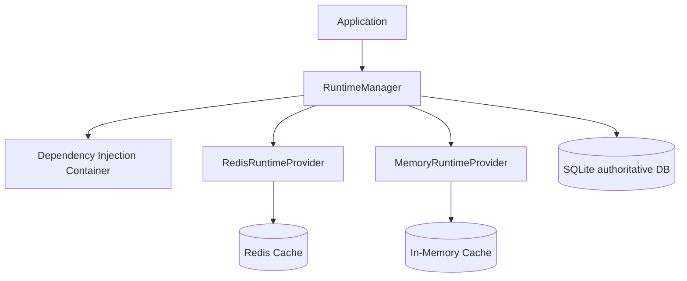
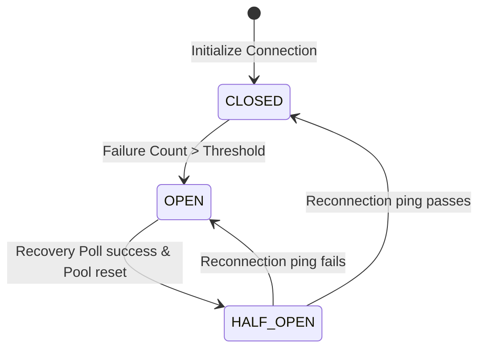
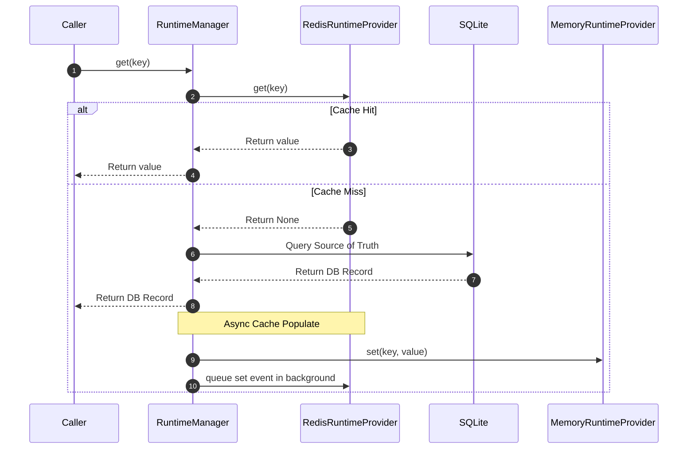
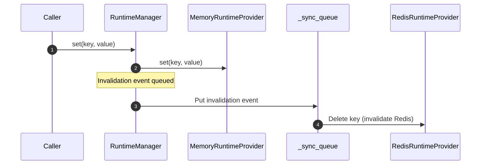
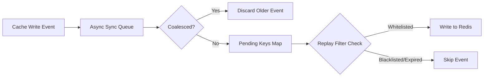
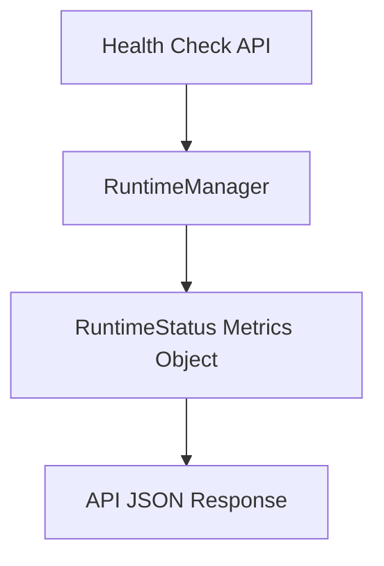
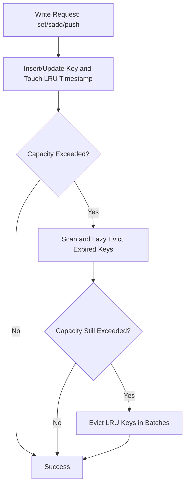

# Runtime Platform Specification
**High-Availability Caching, Queue Management, and Offline Failover**

---

## 1. Storage & Persistence Philosophy

The system implements a strict storage hierarchy where SQLite acts as the single, authoritative source of truth, and the Runtime Platform (RuntimeProvider) acts purely as a transient cache:

*   **SQLite (authoritative)**: Permanently stores Projects, Schemas, Jobs, Dataset Metadata, and System Settings. An outage of the transient cache (Redis) never causes data loss or affects historical records.
*   **RuntimeProvider (cache-only)**: Manages temporary, disposable system state (Active Queues, Progress metrics, cancellation flags, and session locks).
*   **DiskDatasetStorageManager (dataset storage)**: Stores generated synthetic datasets as Parquet files with `manifest.json`.

### Why SQLite is Authoritative
SQLite is local, transactionally safe, and guarantees durably written data. By keeping all relational schemas, jobs history, and system settings in SQLite, we guarantee consistency and prevent corruption. 

### Why Redis is Cache-Only
Redis is treated as an ephemeral caching layer to accelerate reads and manage volatile queues. If Redis fails, the system switches to in-memory fallback cache. When Redis recovers, we do **NOT** rebuild the cache from SQLite eagerly to prevent DB hammering. Instead, keys are populated lazily upon request.

---

## 2. Runtime Responsibility Matrix

| Layer | Type | Stores | Survives Redis Outage? |
|---|---|---|---|
| **SQLite** | Durable | Projects, Schemas, Jobs, Job History, Dataset Metadata, Export Metadata, Settings | ✅ Yes |
| **DiskDatasetStorageManager** | Durable | Parquet files, manifest.json | ✅ Yes |
| **RuntimeProvider (Redis/Memory)** | Cache | Queues, Progress, Cancellation Flags, Session Cache, Metadata Cache | ❌ No (Disposable) |

---

## 3. Runtime Architecture

The Runtime Platform manages transient system state using a delegated manager pattern orchestrating Redis and Memory providers.

---

## 4. Circuit Breaker & Fallback Flow

The manager wraps Redis reads and writes in a circuit breaker to shield the system from blocking on a degraded connection:

### Transition Logic & Failure Scenarios:
- **CLOSED**: All requests route to Redis. If an operation fails, the failure count increments.
- **OPEN**: If failures exceed thresholds or Redis ping fails, the breaker trips to `OPEN`. Active mode falls back to `MemoryRuntimeProvider`. A background monitor polls Redis.
- **HALF_OPEN**: When the monitor detects Redis is back online, it resets the connection pool and attempts a ping. If it succeeds, the breaker transitions to `CLOSED`.

---

## 5. Cache Strategy & Read/Write Flows

### Read Flow (Lazy Population)
On a read cache miss, the system executes a lazy population flow.

### Write Flow
Cache updates are handled with a write-through invalidation strategy.

---

## 6. Queue Flow & Coalescing

The background queue manager processes cache updates and invalidation tasks asynchronously.

### Event Coalescing:
- If a key has multiple write events pending in the queue, only the newest event is kept. Older duplicate events are discarded to prevent redundant I/O.

### Replay Filtering:
- **Whitelisted Categories (Replayed)**: Schema metadata, Templates, and Lookups (`schema:`, `metadata:`, `template:`, `lookup:`).
- **Blacklisted Categories (Discarded)**: Progress, Sessions, Expired cache, and Temporary queues (`progress:`, `generation:`, `session:`, `queue:`).
- **Expired Cache Filter**: If a cache event has a TTL expiration that has already passed, it is skipped and not replayed.

---

## 7. Worker Lifecycle

To prevent CPU/I/O churn and thread collisions, the runtime guarantees:
- **Single Sync Worker**: Exactly one background task manages the sync queue.
- **Single Recovery Monitor**: Exactly one background monitor task checks Redis status during an outage.
- **Duplicate Prevention**: Multiple invocations of `initialize()` or `start_recovery_monitor()` do not spawn duplicate workers.
- **Clean Shutdown**: Upon app termination, all running background tasks are cancelled, cleaned up, and awaited.

---

## 8. Diagnostics Flow

System metrics are collected and exposed to the diagnostics `/health` endpoint:

### Collected Metrics:
1. **Queue Size**: Current pending cache synchronization events.
2. **Queue Capacity**: Maximum sync queue size.
3. **Worker Uptime**: Continuous running duration of the background worker task.
4. **Recovery Count**: Total successful Redis reconnection cycles.
5. **Average Sync Time**: Average latency for writing cache entries to Redis.
6. **Dropped Events**: Events dropped due to queue overflow.
7. **Coalesced Events**: Saved operations via deduplication.

---

## 9. Runtime Configuration

All tuning parameters are externalized into the configuration layer (via settings and environment variables).

### Configuration Reference

#### `RUNTIME_CACHE_SYNC_QUEUE_SIZE`
* **Default Value**: `1000`
* **Purpose**: Maximum capacity of the pending cache synchronization queue.
* **Development**: `1000`
* **Production**: `5000`
* **Valid Range**: `> 0`

#### `RUNTIME_QUEUE_WARNING_PERCENT`
* **Default Value**: `80`
* **Purpose**: Utilization percentage at which warnings are logged.
* **Development**: `80`
* **Production**: `80`
* **Valid Range**: `1 - 100`

#### `RUNTIME_SYNC_BATCH_SIZE`
* **Default Value**: `50`
* **Purpose**: Target batch size for coalesced sync worker operations.
* **Development**: `50`
* **Production**: `250`
* **Valid Range**: `> 0`

#### `RUNTIME_SYNC_RETRY_INTERVAL_SECONDS`
* **Default Value**: `5`
* **Purpose**: Time to wait between retrying failed sync operations.
* **Development**: `5`
* **Production**: `5`
* **Valid Range**: `> 0`

#### `RUNTIME_SYNC_MAX_RETRIES`
* **Default Value**: `3`
* **Purpose**: Maximum retry attempts before switching to fallback mode.
* **Development**: `3`
* **Production**: `5`
* **Valid Range**: `>= 0`

#### `RUNTIME_CIRCUIT_BREAKER_FAILURE_THRESHOLD`
* **Default Value**: `1` (backward compatible) / `3` (production config)
* **Purpose**: Consecutive failures required to trip the circuit breaker.
* **Development**: `1`
* **Production**: `3`
* **Valid Range**: `>= 1`

#### `RUNTIME_CIRCUIT_BREAKER_RECOVERY_SECONDS`
* **Default Value**: `0.0` (backward compatible) / `30.0` (production config)
* **Purpose**: Cooldown duration in memory mode before entering HALF_OPEN probe state.
* **Development**: `0.0`
* **Production**: `30.0`
* **Valid Range**: `>= 0.0`

#### `RUNTIME_HALF_OPEN_MAX_PROBES`
* **Default Value**: `1`
* **Purpose**: Max number of probe requests permitted in HALF_OPEN state.
* **Development**: `1`
* **Production**: `3`
* **Valid Range**: `>= 1`

#### `RUNTIME_RECOVERY_POLL_INTERVAL_SECONDS`
* **Default Value**: `5.0`
* **Purpose**: Interval at which the recovery monitor checks Redis availability.
* **Development**: `1.0`
* **Production**: `5.0`
* **Valid Range**: `> 0.0`

#### `RUNTIME_WORKER_SHUTDOWN_TIMEOUT_SECONDS`
* **Default Value**: `10.0`
* **Purpose**: Maximum seconds to wait for background tasks to gracefully cancel.
* **Development**: `5.0`
* **Production**: `10.0`
* **Valid Range**: `> 0.0`

#### `RUNTIME_QUEUE_MAX_EVENT_AGE_SECONDS`
* **Default Value**: `86400.0` (24 Hours)
* **Purpose**: Maximum age of a queued sync event before it is expired and skipped.
* **Development**: `3600.0`
* **Production**: `86400.0`
* **Valid Range**: `> 0.0`

#### `RUNTIME_REDIS_PING_TIMEOUT_SECONDS`
* **Default Value**: `2.0`
* **Purpose**: Timeout for connection-checking ping requests.
* **Development**: `1.0`
* **Production**: `2.0`
* **Valid Range**: `> 0.0`

#### `RUNTIME_SYNC_MAX_CONCURRENT_TASKS`
* **Default Value**: `1`
* **Purpose**: Maximum concurrent background tasks executing synchronization.
* **Development**: `1`
* **Production**: `2`
* **Valid Range**: `> 0`

#### `RUNTIME_CACHE_DEFAULT_TTL_SECONDS`
* **Default Value**: `3600`
* **Purpose**: Default cache expiry TTL for fallbacked entries.
* **Development**: `3600`
* **Production**: `3600`
* **Valid Range**: `> 0`

---

## 10. In-Memory Capacity Management

To safeguard application memory limits during extended Redis outages, the `MemoryRuntimeProvider` enforces capacity limits and an eviction model.

### Eviction Flow

### Key Strategies
1. **LRU Eviction**: Records timestamps of every read (`get`, `smembers`, `keys`, `pop`) and write (`set`, `sadd`, `push`). When capacity exceeds `RUNTIME_MEMORY_CACHE_MAX_ENTRIES`, it evicts entries with the oldest timestamps first.
2. **Batch Eviction**: Evictions are performed in configurable batches of size `RUNTIME_MEMORY_EVICTION_BATCH_SIZE` to minimize CPU sorting overhead.
3. **Lazy TTL Expiration**: Expired keys are filtered out dynamically during retrieval (`get` / `keys`) and never count toward active capacity.
4. **Periodic Cleanup**: A full check cleans up expired keys periodically according to `RUNTIME_MEMORY_CLEANUP_INTERVAL_SECONDS`.

