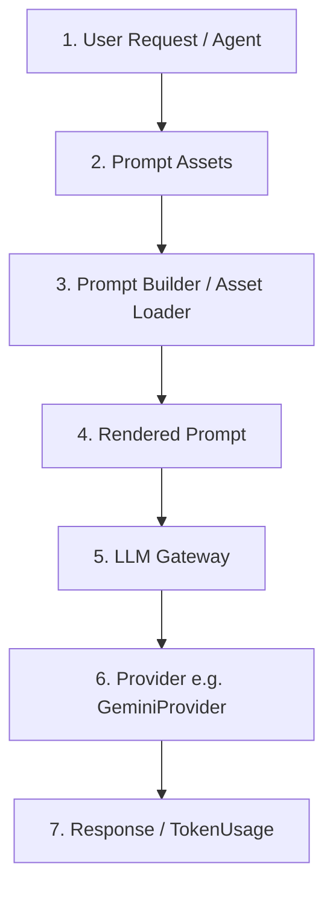

# AI Platform Architecture & Prompt Flow

This document details the architecture, request lifecycle, component responsibilities, and ownership for the SeedOps Lite AI platform layer. The system is designed to provide a highly robust, decoupled, and consistent interface for all downstream AI agents (Schema Validation, Guardian, Seeder, Tester).

## AI Request Flow

The diagram below illustrates the path of a prompt request from the user/agent layer down to the language model provider and back.

---

## Layer Descriptions & Responsibilities

### 1. User Request (Client Agent/Service)
* **Description:** The entry point. Client workflows, validations, or autonomous agents that require intelligence.
* **Responsibilities:** 
  * Initiates request targeting a specific agent task (e.g. `schema_validation`).
  * Passes execution context bindings (variables) into the prompt rendering framework.
* **Owner:** Client Agent/Workflow Service.

### 2. Prompt Assets
* **Description:** Standardized, versioned file-system prompt templates in YAML/Markdown format.
* **Responsibilities:**
  * Defines prompt properties in `metadata.yaml` (including model parameters, timeout, retries, cost tracking, tags).
  * Structure separates system instructions (`system.md`), constraints (`constraints.md`), safety guidelines (`safety.md`), output format (`output_format.md`), developer guidelines (`developer.md`), and task-specific instructions (`task.md`).
  * Supports folder-based hierarchy and inheritance under `app/prompts/templates/common/` to minimize duplication.
* **Owner:** Prompt Asset System.

### 3. Prompt Builder / Asset Loader
* **Description:** Compile-time templates loader (`PromptAssetLoader`) and step-by-step section builder (`PromptBuilder`).
* **Responsibilities:**
  * Resolves inheritance and override fallbacks (e.g. agent-specific `system.md` overrides `common/system.md`).
  * Assembles markdown parts in a strict, deterministic sequence:
    1. System Instructions
    2. Developer Instructions
    3. Task Instructions
    4. Context Bindings
    5. Constraints
    6. Safety Guidelines
    7. Expected Output
  * Renders variables using `Jinja2` within the templates.
* **Owner:** Prompt Framework.

### 4. Rendered Prompt
* **Description:** A strongly-typed container (`RenderedPrompt`) holding the final system instructions, prompt body, and metadata.
* **Responsibilities:**
  * Holds raw rendered text, system instructions, and target execution options.
  * Encapsulates a deterministic SHA-256 fingerprint hash of the final payload.
  * Captures heuristic token estimations, timestamp of rendering, and metadata tags.
* **Owner:** Prompt Framework (Built by `PromptRenderer`).

### 5. LLM Gateway
* **Description:** The single orchestration gateway (`LLMGateway`) coordinating API calls, validation, retries, and telemetry logging.
* **Responsibilities:**
  * Accepts a `RenderedPrompt` (or standard `LLMRequest` for backward compatibility).
  * Resolves dynamic timeout, retry limits, and formats (such as forcing JSON response validation).
  * Manages exponential backoff and jitter wrapper execution.
  * Outputs standardized audit logs containing both request metadata and token usage metrics.
* **Owner:** LLM Gateway Module.

### 6. Provider
* **Description:** Concrete client classes (`LLMProvider`, `GeminiProvider`) interacting with external API services.
* **Responsibilities:**
  * Formulates REST payloads targeting external API endpoints.
  * Reads API key, model names, and base timeout configurations strictly from global `Settings`.
  * Processes response payloads and handles error translation (translating client errors, server outages, rate limits to custom exception classes).
* **Owner:** Provider Layer.

### 7. Response
* **Description:** Strongly-typed return structures (`LLMResponse` & `TokenUsage`).
* **Responsibilities:**
  * Standardizes output text and usage statistics (prompt tokens, completion tokens, total tokens, latency, cost in USD).
  * Backfills request tracking IDs and correlation IDs to facilitate distributed tracing.
* **Owner:** LLM Gateway Module.
