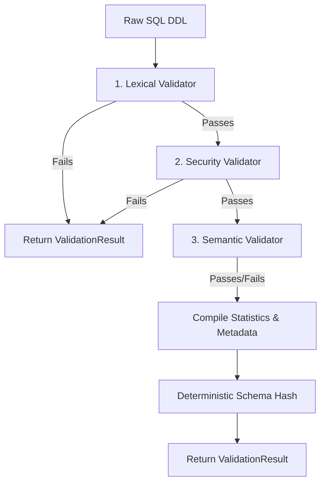

# Airlock Validation Architecture Document

This document describes the design, pipeline, metadata structures, statistics model, rule catalog, centralized versioning strategy, and deterministic hashing implementation of the Airlock Validation layer in SeedOps Lite.

---

## 1. Validation Pipeline

The Airlock Validation layer executes a sequential, multi-layered pipeline to validate incoming database schemas before they reach downstream LLM generation engines.

1. **Lexical Validation**: Scans parenthesis balance, unmatched quotation marks, and empty schema inputs.
2. **Security Validation**: Blocks malicious injection patterns, restricted statement prefixes, and dangerous operations (e.g. drop/delete statements).
3. **Semantic Validation**: Parses table structures, verifying unique names, PK/FK integrity, column name keywords, and check constraint enum quotes.

---

## 2. Validation Rule Catalog

Every validation check corresponds to a strongly-typed rule defined in the centralized `ValidationRule` registry.

| Rule ID | Rule Name | Category | Confidence | Description |
| :--- | :--- | :--- | :--- | :--- |
| `RULE-LEX-01` | Empty Schema Check | Lexical | 1.00 | Rejects empty strings or whitespace-only inputs. |
| `RULE-LEX-02` | Parenthesis Matching | Lexical | 1.00 | Asserts that every open parenthesis `(` matches a closing parenthesis `)`. |
| `RULE-LEX-03` | Quotes Matching | Lexical | 1.00 | Asserts that single quotes `'` and double quotes `"` are properly closed. |
| `RULE-LEX-04` | Table Reserved Keyword | Lexical | 0.97 | Rejects table names that use SQL reserved keywords (e.g. `SELECT`, `TABLE`). |
| `RULE-SEC-01` | Forbidden Keywords | Security | 1.00 | Blocks commands like `DROP`, `DELETE`, `TRUNCATE`, `ALTER`, `EXEC`, `CALL`, etc. |
| `RULE-SEC-02` | Comment Suspicious Payloads | Security | 1.00 | Scans single-line and multi-line comments for injection attempts and blocked words. |
| `RULE-SEC-03` | Statement Prefix Restriction | Security | 0.98 | Restricts input blocks to `CREATE TABLE` and `CREATE TYPE` statement prefixes only. |
| `RULE-SEM-01` | Duplicate Table Check | Semantic | 1.00 | Blocks schemas defining the same table name twice. |
| `RULE-SEM-02` | Duplicate Column Check | Semantic | 1.00 | Blocks tables defining duplicate column names. |
| `RULE-SEM-03` | Missing Primary Key | Semantic | 1.00 | Rejects any table that does not define at least one Primary Key (inline or table-level). |
| `RULE-SEM-04` | Column Reserved Keyword | Semantic | 0.97 | Blocks columns named after SQL reserved keywords (e.g. `KEY`, `WHERE`). |
| `RULE-SEM-05` | Foreign Key Integrity | Semantic | 0.98 | Verifies referenced tables and columns exist in the DDL. |
| `RULE-SEM-06` | Enum Literal Check | Semantic | 0.99 | Verifies check constraint enum values are properly quoted literals. |
| `RULE-GEN-01` | Generic Success Suggestion| System   | 1.00 | Standard recommendation returned when no errors are present. |

---

## 3. Rule Registry Strategy

Rather than embedding hardcoded string identifiers inside the code, the validation engine imports and references `ValidationRule` from [rules.py](/app/validation/rules.py).

* **Single Source of Truth**: All rule IDs are cataloged as enum members in `ValidationRule`.
* **Consistency**: Prevents misaligned identifiers between the validator codebase, unit tests, and metrics collectors.

---

## 4. Centralized Version Strategy

Application, validator, API, and schema hash version parameters are centralized in [version.py](/app/core/version.py):

* `APP_VERSION`: Overall version of the SeedOps Lite application.
* `VALIDATOR_VERSION`: Semantic engine version for the Airlock Validation layer.
* `SCHEMA_HASH_VERSION`: Format/logic version of the schema fingerprinting algorithm.
* `API_VERSION`: API protocol version.

By centralizing these version strings, version increments and configuration overrides are localized, preventing version string fragmentation.

---

## 5. Schema Fingerprinting (Hashing)

A deterministic schema hash is generated to uniquely and securely identify a DDL design. The calculation is defined as:

$$\text{Schema Hash} = \text{SHA-256}(\text{Normalized DDL} \mathbin{\Vert} \text{Normalized Enum Metadata} \mathbin{\Vert} \text{Validator Version} \mathbin{\Vert} \text{Schema Hash Version})$$

* **Normalized DDL**: The SQL DDL text trimmed of leading/trailing whitespaces.
* **Normalized Enum Metadata**: Postgres custom types (`CREATE TYPE ... AS ENUM`) and `CHECK IN` enum options, sorted lexicographically and joined with pipe (`|`) delimiters.
* **Validator Version**: The current `VALIDATOR_VERSION` string.
* **Schema Hash Version**: The current `SCHEMA_HASH_VERSION` string.

> [!NOTE]
> Future updates to the fingerprinting mechanism or hashing algorithm (e.g. shifting from SHA-256 to SHA-512) only require modifying `SCHEMA_HASH_VERSION` in `version.py`.

---

## 6. Validation Statistics Model

The statistics model tracks execution metrics to feed health dashboards and logging streams:

* `rule_count`: Total number of rules checked in the execution pipeline.
* `table_count`: Number of tables successfully parsed.
* `column_count`: Total number of columns processed.
* `error_count`: Number of blocking errors logged.
* `warning_count`: Number of non-blocking warning messages.
