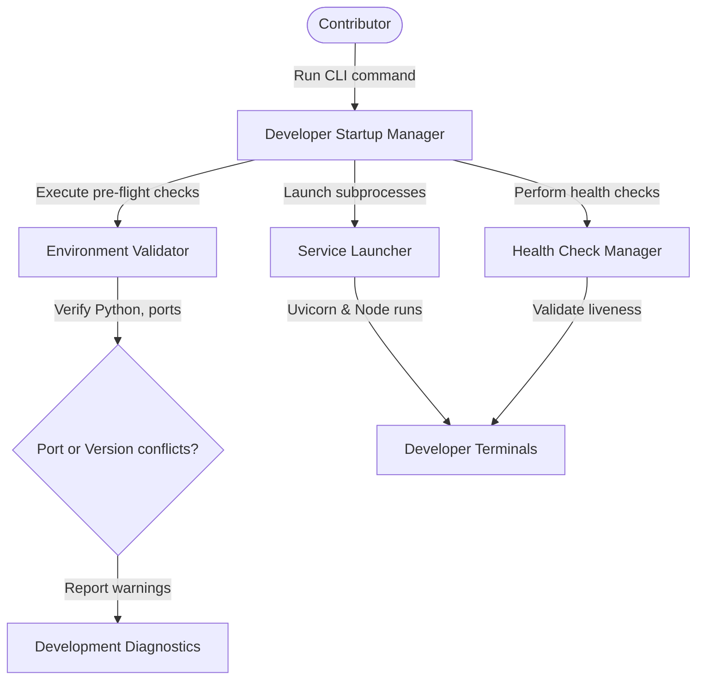

# Developer Startup & Environment Health Diagnostics

The developer startup module provisions local development servers, runs pre-flight diagnostic validation checks, manages optional Docker infrastructure, and aggregates execution logs.

---

## Architecture

The Developer Startup manager validates local runtime requirements and orchestrates service orchestrators:



---

## Configuration Settings

Options are managed in `PlatformSettings`:
- `PLATFORM_DEV_HOST` (Default: `127.0.0.1`): Host targeted for local development servers.
- `PLATFORM_DEV_PORT` (Default: `8000`): Port targeted for local backend server run.
- `PLATFORM_DEV_FRONTEND_PORT` (Default: `5173`): Port targeted for local frontend server run.
- `PLATFORM_DEV_STARTUP_TIMEOUT_SECONDS` (Default: `60` seconds): Dev server start check timeout.
- `PLATFORM_DEV_HEALTH_CHECK_INTERVAL_SECONDS` (Default: `5` seconds): Liveness check polling delay.
- `PLATFORM_DEV_AUTO_SEED` (Default: `True`): Toggles seeding sample projects on first launch.

---

## Environment & Infrastructure Orchestration Flow

Running `uv run seed dev` executes the following complete startup sequence with step-by-step progress metrics:

1. **Environment Validation [1/6]:** Evaluates Python version, uv availability, Node.js, and npm presence.
2. **Dependency Validation [2/6]:** Audits Python dependencies and checks `frontend/node_modules`, running `npm install` automatically if missing. Also checks port conflicts.
3. **Infrastructure Provisioning [3/6]:** Detects `docker-compose.yml` and starts infrastructure containers (e.g. `redis`) via `docker compose up -d`.
4. **Database Migrations [4/6]:** Performs any pending database migrations dynamically via `alembic upgrade head`.
5. **FastAPI Backend Launch [5/6]:** Runs backend and waits until the `/health` endpoint responds.
6. **Vite Frontend Launch [6/6]:** Boots React frontend and verifies TCP port responsiveness.
7. **Startup Summary:** Prints a consolidated configuration layout including runtime versions and status, then transitions into live log streaming.

---

## CLI Developer Startup

To run the unified dev startup command:
```bash
    uv run seed dev
```

### Shutdown Behavior
Pressing **Ctrl+C** triggers a clean teardown of both backend and frontend subprocesses, flushes any active log file streams, and logs exit codes to the startup log. Optional Docker infrastructure is kept running to avoid cold-start delays on subsequent development sessions.

*Note: For manual execution instructions, see the advanced alternative steps in [README.md](/README.md).*
