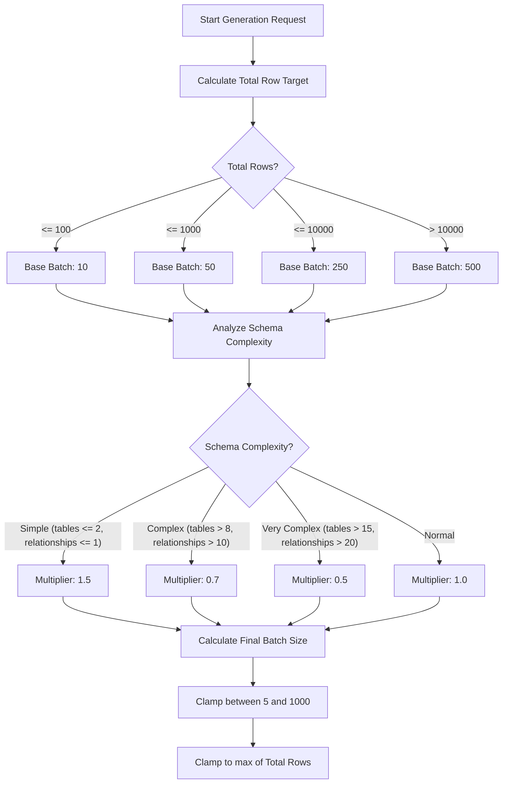

# Simplified Dataset Generation Experience (Lite Edition)

This document details the simplified dataset generation design introduced in Phase UX-1 for SafeSeedOps Lite.

---

## 1. Why Batch Size and Random Seed are Automatic

To ensure a seamless, user-friendly experience for non-technical users, SafeSeedOps Lite automates low-level parameters that previously cluttered the UI:

*   **Automatic Batch Size**: Manually tuning batch size requires understanding database transaction volumes, LLM concurrency limits, and memory usage. Automating batch size allows the system to choose the safest, most performant block size based on schema size and complexity without user intervention.
*   **Automatic Random Seed**: Developers and debuggers require deterministic seed values for reproducibility, but normal users do not want to choose or think about a numeric seed for every generation. The system now generates one automatically, uses it for deterministic generation, and stores it in the job metadata for diagnostic purposes.

---

## 2. How the Automatic Decision Engine Works

The backend uses a dedicated decision engine (`calculate_batch_size`) to select the optimal batch size before starting generation:



### Complexity Evaluation Rules:
1.  **Workload Volume**: Scales up base batch size for larger requested datasets to optimize network throughput and reduce LLM API call overhead.
2.  **Relationship Density**: Densely coupled schemas with many foreign key relationships have more strict constraints and require more validation per batch. The engine uses conservative (smaller) batches for these schemas to avoid cascading seeding failures.
3.  **Table Column Density**: Schemas with high column counts per table have higher memory footprint per row. The engine dynamically reduces batch sizes to avoid memory pressure and network timeouts.

---

## 3. How Developers Can Reproduce Datasets

Every data generation run stores full execution metadata within the Job History. This allows developers to reproduce any past dataset exactly as it was generated:

1.  Navigate to the **Job History** page or query the `/schema/jobs/{job_id}` endpoint.
2.  Retrieve the `"generatedSeed"` and `"selectedBatchSize"` from the job's `"details"` field.
3.  Submit a manual API request directly to `/schema/generate` with the target schema and targets, including the retrieved `seed` in the payload:
    ```json
    {
      "schemaState": { ... },
      "rowTargets": { ... },
      "seed": <retrieved_seed>,
      "outputFormat": "json"
    }
    ```
4.  Since the seeder uses the seed deterministically, the resulting synthetic data will match the original run record-for-record.
